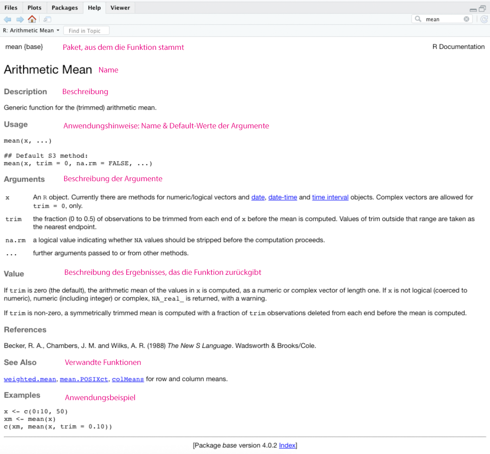

## Funktionen

Eine Funktion ist ein Befehl, den man ausführen kann, um irgendetwas bestimmtes zu erreichen. In den vorigen Kapiteln kamen auch schon vereinzelt Funktionen vor, wie z.B. die `print()`-Funktion, die dazu dient, einen Text in die Konsole zu schreiben. Wir haben auch bereits gelernt, dass R-Pakete Sammlungen von Funktionen sind. Nun werden wir uns noch etwas näher mit dem Aufbau und der Anwendung von Funktionen befassen.

### Aufbau & Argumente

Normale Funktionen haben die folgende Form:

`function_name(argument)`

Eine Funktion kann ein oder mehrere Argumente haben, muss sie aber nicht. Argumente sind Objekte, mit denen die Funktion irgendetwas tun soll. Die Funktion `print(argument)` erwartet beispielsweise als Argument ein Objekt, dessen Inhalt sie in die Konsole schreiben kann. Fehlt dieses Argument, wird ein Fehler ausgegeben.

Wenn eine Funktion mehrere Argumente hat, werden diese durch Kommas separiert:

`function_name(argument_1, argument_2, argument_3)`. 

Häufig müssen die Argumente einer bestimmten Klasse angehören, damit die Funktion ihren Zweck erfüllen kann. Die Funktion `mean()` rechnet beispielsweise das arithmetische Mittel einer Zahlenfolge aus, deshalb braucht sie auch zwingend eine Zahlenfolge als Argument. Mit Buchstaben könnte sie nichts anfangen.

```{r, mean_example}
some_numbers <- c(5, 1, 2, 2, 3, 1, 3, 3, 4, 2, 5, 1008)
mean(some_numbers)
```

Argumente können von der Funktion zwingend vorausgesetzt werden oder optional sein. Die Funktion `mean()` benötigt zwangsläufig ihre Zahlenreihe, sonst kann logischerweise kein Mittelwert berechnet werden. Sie hat aber noch zwei weitere Argumente, die `trim` und `na.rm` heißen. Diese beiden Argumente müssen nicht unbedingt mit an die `mean`-Funktion übergeben werden. Die Programmierer von R haben für beide Argumente Standardwerte (*default values*) vordefiniert, die im Normalfall sinnvoll sind. Wenn man von den Standards abweichen will, kann man die Argumente aber zusätzlich mit übergeben.

- Mit `trim` kann man statt dem normalen ein getrimmtes arithmetisches Mittel berechnen. Dabei werden die niedrigsten und höchsten x Prozent der Werte aus der Zahlenreihe entfernt. Die Berechnung wird so stabil gegenüber extremen Ausreißern.
 
- Mit `na.rm` (für *NA remove*) wird definiert, wie mit fehlenden Werten innerhalb der Zahlenfolge umgegangen werden soll. Sind fehlende Werte (`NA`) enthalten, möchte man diese wahrscheinlich vor der Berechnung entfernen, denn einen fehlenden Wert kann R nicht interpretieren. Man muss deshalb das Argument `na.rm = TRUE` setzen. Der Standardwert ist `FALSE`.

```{r, trimed_mean_example}
some_numbers <- c(5, 1, 2, 2, 3, NA, 3, 3, 4, 2, 5, 1008)
mean(some_numbers, trim = 0.1, na.rm = TRUE)
```

Es ist übrigens nicht notwendig, immer den Namen der Argumente mit anzugeben. Wenn man die Reihenfolge der Argumente kennt, kann man auch einfach die Werte in der richtigen Reihenfolge übergeben:

```{r, mean_example_no_names}
some_numbers <- c(5, 1, 2, 2, 3, NA, 3, 3, 4, 2, 5, 1008)
mean(some_numbers, 0.1, TRUE)
```
Diese Schreibweise ist aber weniger übersichtlich, man muss die Funktion schon sehr gut kennen, um zu wissen welches Argument an welcher Stelle kommt. Da Programm-Code immer auch für Menschen und nicht nur für den Computer geschrieben wird, ist es nicht empfehlenswert die Namen der Argumente wegzulassen. Zudem muss man sich auch nicht zwangsläufig an eine vordefinierte Reihenfolge halten, wenn man im Code auch die Namen angibt.

Vielleicht haben Sie bemerkt, dass ich im Code bei der `mean()`- und der `print()`-Funktion das erste Argument nicht mit seinem Namen angesprochen habe. Natürlich hat auch dieses Argument einen Namen, es heißt `x`. Jedoch ist es sehr üblich, dass Daten-Objekte in Funktionen an vorderster Stelle übergeben werden. Es ist eine Konvention in diesem Fall den Namen doch wegzulassen.

Es gibt übrigens auch einige wenige Funktionen, die gar keine Argumente benötigen, wie etwa `Sys.Date()`. Diese Funktion gibt einfach nur das aktuelle Datum aus. Da sie dazu nur auf die Systemzeit des Computers zugreifen muss, braucht sie kein Argument.

```{r, sysdate}
Sys.Date()
```

### Funktionen verschachteln

Es ist möglich, mehrere Funktionen ineinander zu verschachteln. Sie werden dann von außen nach innen abgearbeitet. Im folgenden Codebeispiel wird der durch `mean()` berechnete Mittelwert (= innere Funktion) durch die Funktion `round()` auf eine Stelle (zweites Argument `, 1`) gerundet:

```{r, round_example}
round(mean(some_numbers, na.rm = TRUE), 1)
```

Das Verschachteln ist bisweilen nützlich, jedoch kann es sehr schnell unübersichtlich werden. Deshalb sollte man sich beim Coden bemühen, maximal zwei Funktionen ineinander zu verschachteln. Wir lernen später noch eine übersichtlichere Möglichkeit, einen Code zu verketten, im Abschnitt zur [Pipe](#pipe).

### Hilfe für Funktionen

Jede Funktion aus einem offiziellen CRAN-Paket hat auch eine Dokumentation oder Hilfe. Sie können im Help-Tab nach Funktionen suchen oder aber durch ausführen von `?function_name()` die Hilfe aufrufen. Außerdem ruft RStudio die Hilfe auch auf, wenn Sie den Cursor auf einer Funktion positionieren und dann `F1` drücken.

Die Hilfe ist immer ähnlich aufgebaut und sie ist wirklich sehr nützlich, gerade, wenn man mit der Anwendung einer Funktion noch nicht so vertraut ist. Hier ein Überblick über die Hilfe zu `mean()`:




## Doppelte Funktionsnamen
Es gibt manchmal den Fall, dass es in zwei unterschiedliche Paketen zwei Funktionen gibt, die gleich heißen. Das kommt natürlich dadurch zustande, dass jeder ein R-Paket entwickeln kann. Beispielsweise gibt es sowohl im Paket `chron` als auch im Paket `tseries` jeweils eine Funktion `ìs.weekend()`, die prüft, ob eine bestimmtes Datum ein Wochenendtag ist. Die beiden Funktionen funktionieren jedoch etwas unterschiedlich. Während die `chron`-Funktion eine normale Datumsangabe als erstes Argument erwartet, benötigt die `tseries`-Funktion ein spezielles Objekt aus eben diesem Paket. Hat man beide Pakete geladen und möchte die Funktion `ìs.weekend()` benutzen, kann das natürlich zu Fehlern führen. R würde dann auf die Funktion aus dem zuletzt geladenen Paket zurückgreifen. - Es ist aber fraglich, ob das gerade die richtige ist! 

Zum Glück weist R auf gleiche Funktionsnamen hin. In der Meldung nach dem Laden eines Paketes informiert R darüber, dass verschiedene Funktionen aus zuvor geladenen Paketen "maskiert" wurden. Hier ein Beispiel:

```{r load_dplyr_warning}
library(dplyr)
```

Um Fehler zu vermeiden, bietet es sich an, nicht allzu viele Pakete gleichzeitig zu laden. Dann sind solche Konflikte weniger wahrscheinlich. Manchmal kann man sie aber nicht umgehen, weil man die beiden Pakete nun mal gleichzeitig benötigt. Deshalb kann man in R deutlich machen, aus welchem Paket eine Funktion stammen soll und zwar indem der Paketname gefolgt von zwei Doppelpunkten der Funktion vorangestellt wird, also: `package::function()`, z.B. `chon::is.weekend()` oder `stats:filter()`. Man kann diese Notation auch benutzen, um auf eine Funktion aus einem Paket zuzugreifen, dass man zwar installiert, aber in der aktuellen Session gar nicht geladen hat.


## Eigene Funktionen schreiben

Das tolle an Programmiersprachen ist, dass sie grundsätzlich nicht beschränkt sind auf die Funktionen, die sie von Haus aus mitbringen. Anwender:innen können eigene Funktionen schreiben und damit den Funktionsumfang erweitern und auf die ganz persönlichen Bedürfnisse anpassen. Natürlich ist "neue Funktionen schreiben" nicht gleich das erste, was man tut, wenn man mit dem Lernen von R beginnt. Und das ist am Anfang auch gar nicht notwendig, weil es wahnsinnig vielen Pakete bereits gibt, die auch schon einen immensen Funktionsumfang haben.

Trotzdem, eine eigene Funktion zu schreiben ist gar nicht so schwer und deshalb wird hier zum Abschluss noch kurz erläutert wie das geht. Zum Schreiben von Funktionen benötigt man auch eine Funktion, nämlich `function()`. Der grundsätzliche Aufbau ist, dass man zunächst einen Namen für die neue Funktion vergibt und dann mit dem Zuweisungsoperator `<-` zuweist, dass es sich bei dem neuen Objekt um eine Funktion handelt, die mit `function()` erstellt wird. In der Klammer von `function()` kann man noch die Argumente der Funktion und ihre Default-Werte übergeben, sofern die Funktion Argumente benötigt. Nach der schließenden Klammer folgt ein Paar geschweifte Klammern `{}` innerhalb derer die Operationen, die die Funktion durchführen soll, programmiert werden müssen. 


```{r, first_func}
function_name <- function(argument_1 = default_value_1, ...){
  # Hier die Operationen, die die Funktion durchführen soll
  }
```

Nachdem der Code ausgeführt wurde, erscheint die Funktion im Environment-Tab in RStudio. Funktionen sind in R ebenfalls Objekte.

Funktionen können in der Regel mindestens eines der folgenden Dinge:

- Eingabewerte (Argumente) in Ausgabewerte/Ergebnisse verwandeln

- Nebeneffekte haben: Z.B. eine Meldung in die Konsole schreiben

Eine Funktion gibt als Ergebnis standardmäßig das Objekt zurück, dass innerhalb des Codeblocks als letztes erzeugt wurde. Man kann kann über `return()` aber auch explizit festlegen, was die Funktion zurückgeben soll. Das ist insofern besser, als dass man sich als Coder:in dann bewusst macht, was die Funktion als Ergebnis liefert.

Zum Abschluss folgt hier ein kleines Beispiel für eine Funktion, die einfach nur den Zweck hat, eine Grußbotschaft zusammenzubauen. Man kann der Funktion optional einen Namen als Argument übergeben. Tut man dies nicht, wird ein Default-Wert eingesetzt:
```{r, hello_func}
hello <- function(name = "Unbekannte:r"){
  string <- paste0("Hallo ", name, "! Viel Spaß beim R lernen!" )
  return(string)
}
```

```{r }
hello()
```

```{r }
hello("Du")
```
Natürlich gibt es noch viel mehr über das Programmieren von Funktionen zu wissen. Für den Einstieg sollten Sie sich aber erstmal mitnehmen, dass das gar nicht so schwer ist!
