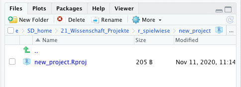

## R-Projekte

**Kurze Info vorab:** Der Abschnitt Projekte ist nur für die Arbeit auf Ihrem eigenen Rechner relevant. Wenn Sie in der RStudio-Cloud arbeiten, ist das Projekt bereits angelegt worden. Sie können dort keine eigenen Projekte anlegen. Das kann dort nur ihr Admin. 

Beginnt man die Arbeit an einem neuen Datenanalyseprojekt oder nimmt an einem Seminar teil, macht es Sinn, dafür ein neues R-Projekt anzulegen. Ein R-Projekt organisiert die Dateien in einem Ordner auf dem Computer als zusammengehörig und setzt außerdem das Arbeistverzeichnis (*working directory*) auf das Verzeichnis des Projekts. Das ist sehr praktisch, weil man so die übersicht behält und zusammengehörige .R-Dateien gemeinsam mit Daten und weiteren Dateien, wie z.B. Forschungsberichten aus RStudio heraus übersichtlich organisieren kann.

### Arbeitsverzeichnis
Wenn man Dateien oder Daten in R laden will, sucht R standardmäßig in dem Verzeichnis danach, indem es installiert ist. R arbeitet immer aus diesem "Arbeitsverzeichnis" heraus. 
Möchte man jetzt etwas (z.B. einen Datensatz) in R laden, muss man den gesamten Pfad "relativ" zu diesem Verzeichnis angeben oder aber den kompletten Dateipfad. Hier ein Beispiel:

- Windows: C:/Users/julia/documents/data/my_data.xlsx
- Unix und MacOS: /Users/julia/documents/my_data.xlsx

Standardmäßig liegt das Arbeitsverzeichnis in den *Eigenen Dateien* des Computers, auf dem R installiert wurde.

Mit dem Befehl `getwd()` kann man sich das aktuelle Arbeitsverzeichnis anzeigen lassen. Mit `setwd("mein_pfad")` kann man das Arbeitsverzeichnis bestimmen. Das ist aber in der Regel gar nicht notwendig, wenn man mit R-Projekten arbeitet, weil diese das Arbeitsverzeichnis automatisch setzen.

### R-Projekte anlegen

Um ein R-Projekt anzulegen, klicken Sie im Menü auf "File" > "New Project...". Sie werden durch den folgenden Dialog geleitet: 

Im **ersten Schritt** müssen Sie entscheiden, ob für das Projekt ein neues Verzeichnis auf Ihrem Computer angelegt werden soll oder ob Sie das Projekt in einem bereits bestehenden Verzeichnis anlegen möchten. Bei letzterer Option dürfen sich auch bereits schon Dateien in dem Verzeichnis befinden (z.B. alte R-Skripte oder Daten). Der Normalfall ist aber Ersteres:

Im **zweiten Schritt** müssen Sie auswählen, um was für eine Art von Projekt es sich handeln soll. Es gibt unterschiedliche Typen, z.B. sind auch R-Pakete R-Projekte. Der Normalfall ist vermutlich, dass Sie ein neues Projekt mit einem leeren Ordner anlegen.

Im **dritten und letzten Schritt** müssen Sie den Namen für das R-Projekt und den Ordner, in dem es erstellt werden soll, festlegen.

Nachdem Sie das Projekt angelegt haben, erzeugt RStudio die **.RProject-Datei** und öffnet das Projekt. Im Fenster "Files" können Sie die Projektdatei sehen:

Für alle R-Dateien, die angelegt werden, solange das Projekt geöffnet ist, wird  der Projektordner als Speicherort angeboten. Man kann aber davon abweichen und z.B. auch Unterordner zur besseren Organisation anlegen.
