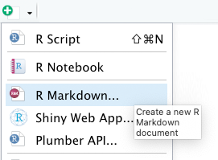
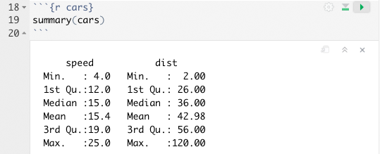

# RMarkdown

RMarkdown ist ein Dateiformat, mit dem es möglich ist, dynamische Dokumente direkt aus R heraus zu erzeugen, wie bspw. Word- oder PDF-Dateien oder auch HTML-Seiten. Dabei wird nicht nur der R-Code oder die Ergebnisse exportiert. Es ist zusätzlich möglich Text einzubetten. Ganz im Sinne des "literate programming", kann man also die den R-Code und die Dokumentation des Codes verknüpfen. Aber auch darüber hinaus kann man seine eigenen Gedanken und Interpretationen festhalten oder auch längere Texte schreiben. Mit dem fertigen RMarkdown-Dokument kann im Anschluss ganz unterschiedliche Output-Dokumente erzeugen, wie bspw. Word- oder PDF-Dateien, Präsentationen oder HTML für Webseiten.

Das ist natürlich sehr praktisch für Berichte und Hausarbeiten, aber auch Artikel in Fachzeitschriften. Auch ganze Bücher oder sogar interaktive Apps können mit RMarkdown produziert werden. Wenig überraschend: Auch dieses Buch wurde in RMarkdown geschrieben :)

Artwork by <a href="https://github.com/allisonhorst/stats-illustrations/">Allison Horst</a>
 

Bevor wir uns mit den Details der Sprache beschäftigen und ich einen ersten Einblick in die Features gebe, möchte ich noch einmal kurz deutlich machen, warum RMarkdown mehr ist, als einfach nur eine Möglichkeit, Statistiken und Grafiken aus R heraus zu exportieren: RMarkdown verknüpft folgende Elemente miteinander:

1. Die Datenanalyse, also den R-Code

2. Die Ergebnisse, die der Code erzeugt (z.B. in Form von Zahlen, Tabellen oder Grafiken)

3. Darauf bezogene menschliche Gedanken in Form von Text (dies können z.B. Einleitung, Kontextinformationen oder auch die Interpretationen sein)

Das Endresultat ist ein fertiger "Output", der leicht lesbar, schön formatiert und (hoffentlich) ansprechend gestaltet ist. Durch die Verschränkung dieser Elemente trägt RMarkdown erheblich zur *Reproduzierbarkeit* und zur Transparenz im Forschungsprozess bei. 

::: {#info_spss .box .warning}
**Die Vorteile von RMarkdown**

- Verschiedene Aufgaben im Datenanalyseprozess lassen sich in einer Datei kombinieren (insbesondere Analyse, Interpretation und Kommunikation)

- Dadurch wird der Prozess übersichtlicher. Alles liegt an einem Ort und es müssen nicht unterschiedliche Programme genutzt werden.

-  Sehr viele unterschiedliche Outputs können mit nur geringen Anpassungen aus dem gleichen Dokument erzeugt werden (z.B. Bericht und Präsentation)

- Es ist ein hervorragendes Tool für transparente und reproduzierbare Forschung.
:::

RMarkdown-Dateien wurden so gestaltet, dass Sie unterschiedlich genutzt werden können, je nach Anforderung:

- Als "Forschungslogbuch", in dem Sie nicht nur ihren Code, sondern auch ihre Gedanken festhalten können.

- In der Kollaboration mit Kolleg_innen und die nicht nur an Ihren Schlussfolgerungen und Gedanken, sondern auch am Code interessiert sind.

- Zur Kommunikation mit Entscheidungsträgern und anderem Publikum, dass keinen Code sehen und sich nur über die Ergebnisse und ihre Interpretation informieren möchte.

## RMarkdown Workflow

Der Workflow mit RMarkdown lässt sich in 3 Schritte gliedern:

1. Eine Datei mit der Dateiendung `.Rmd` anlegen.

2. Das RMarkdown mit Inhalt füllen

3. Das RMarkdown "knitten/rendern", d.h. es in ein Output-Format umzuwandeln.

### Erster Schritt: RMarkdown anlegen
Am einfachsten legt man eine RMarkdowndatei über das Menü in RStudio an, nämlich unter `File -> New File -> R Markdown`. Alternativ funktioniert es auch über das Icon für neue Dateien:

Es folgt eine Abfrage, in der man schon einmal einen Titel und den/die Autor_in des Dokuments festlegen kann. Außerdem kann man Wählen um was für ein Markdown es sich handeln soll (der Standard ist ein "Document") und den Typ des Outputs festlegen. Die meisten Einstellungen kann man aber hinterher noch verändern, deshalb ist es nciht so entscheidend, was hier eingestellt wird.

Klickt man in dem Dialog auf "okay" offnet sich eine Datei, die auch schon Beispiel-Content und damit die wesentlichen Inhalte eine RMarkdown-Datei enthält:

### Zweiter Schritt: Inhalt der RMarkdown-Datei

Diese wesentlichen Bestandteile der RMarkdown-Datei lassen sich drei Typen zuordnen:

1. Header

2. R-Code-Chunks

3. Text mit Formatierungen

Diese Bestandteile werden im Folgenden kurz beschrieben.

**Der Header** ist begrenzt durch je ein einleitendes und ein schließendes `---`. Er enthält Metainformationen zum Dokument, die entweder nicht in der Ausgabe enthalten sind oder bei der Erzeugung des Outputs zur Titelgestaltung genutzt werden.

**R-Code-Chunks: ** Nach dem Header folgt ein grau hinterlegter Block, der durch \`\`\` eingeleitet und geschlossen wird. Dies ist ein Bereich, in dem ausführbarer R-Code seinen Platz findet, eine so genannte Code-Chunk. Das `r` in der geschweiften Klammer macht dabei deutlich, dass es sich um R-Code handelt. Möglich wäre auch Code in anderen Programmiersprachen. Innerhalb der geschweiften Klammer stehen außerdem der Name der R-Chunk (hier `setup`) sowie Optionen für die Code-Chunk (hier bspw. `include=FALSE`, was bedeutet, dass dieser Block nicht in den Output integriert werden soll). Diese beiden Angaben sind optional. Nach der geschweiften Klammer folgt R-Code. In diesem Fall ist er aber nicht besonders spannend. Er setzt nur eine Optionen für das Paket `knitr`, welches am Ende dafür zuständig, ist aus dem Markdown-Dokument output zu erzeugen. Etwas interessanter sind die zweite und die dritte Code-Chunk im Beispieldokument. hier werden mit Base-R-Funktionen informationen über den `cars`- Datensatz angezeigt und ein Plot erzeugt. 

Diese Chunks können Sie auch einzeln ausführen, und zwar über die kleinen grünen Pfeil-Icons auf Hohe der Chunks. Der Output wird ihnen dann direkt unter der Chunk angezeigt:

**Text mit Formatierungsangaben:** Markdown ist eine Gruppe von einfachen Beschreibungssprachen, in denen Regeln für die Formatierung von Texten festgelegt werden. RMarkdown ist nicht nur der Name des Dateiformats `.Rmd`, sondern auch der Name der Beschreibungssprache RMarkdown. Die Regeln sind wirklich sehr einfach. in dem Beispieldokument sieht man schon auf den ersten Blick, dass das `#`-Zeichen offenbar für Überschriften zuständig ist. Die Anzahl der `#` steht dabei für die "Ordnung" der Überschriften. Hier sind jeweils zwei Hashzeichen (`##`) vor den Überschriften, es handelt sich also um Überschriften zweiter Ordnung (warum auch immer). Im Beispiel-Content kann man auch die Formatierungen sehen, mit denen Links eingebunden (durch spitze Klammern `<>`) und Text gefettet wird (durch zwei `**`). 

### Dritter Schritt: Output erzeugen

Das Beispieldokument, dass RStudio beim anlegen einer `.Rmd`-Datei generiert hat, ist ein vollwertiges RMarkdown-Dokument, aus dem ein Output erzeugt werden kann. Dies geht ganz einfach über den Button "Knit" in der Menüleiste des Skript-Bereiches. Klickt man auf diesen Button öffnet sich ein Dialog, in dem man noch einmal aussuchen kann, was für ein Output generiert werden soll (also völlig unabhängig von den Voreinstellungen, die Sie gewählt hatten),

Nach erfolgter Auswahl muss ein Speicherort und der Name des Output-Files festgelegt werden. Und wenig später wird das Dokument als Vorschau angezeigt.

::: {#info_tinytex .box .warning}
**PDF als Output**

Achtung, wenn Sie mit dem RMarkdown ein PDF erzeugen möchten, benötigen Sie dazu eine Installation von LaTeX auf Ihrem Rechner. LaTeX ist ein Softwarepaket\*, welche bei der "Übersetzung" von RMarkdown in ein PDF hilft. Es gibt verschiedene LaTeX-Distributionen. Am einfachsten ist die Installation der Distribution **TinyTex** über das R-Paket `tinytex`.

\* LaTeX ist außerdem auch noch eine Beschreibungssprache, mit der man ebenfalls Text formatieren kann, aber das ist erstmal nicht wichtig.
:::

## Formatierungen & Optionen

Natürlich gibt es noch viel mehr Formatierungsmöglichkeiten als die oben genannten. Selbstverständlich können Sie Tabellen zeichnen, Bilder einbinden, Kursivstellung oder Versalien beutzen, Farbe einsetzen usw. Außerdem können Sie über Templates oder eigene Stylesheets die Formatierung ihres Dokumentes ändern und z.B. andere Schriftarten wählen. Auch Zitationen und Literaturverzeichnisse können über Bibtex eingefügt werden.

Mit den Optionen für die Code-Chunks können Sie darüber bestimmen, ob und welche Inhalte im Output angezeigt werden sollen. Möchten sie z.B. die Informationen, die beim Laden von Paketen in der Console ausgegeben werden im Output zeigen oder lieber verbergen?

Seit Version 1.4 beinhaltet RStudio auch einen **visuellen Markdown-Editor**, den man über ein Icon im Skript-Bereich (siehe unten) oder den Shorcut `Cmd+ Shift + F4` (Mac) bzw `Alt + Shift + F4` einschalten kann. Mit diesem Editor können verschiedene Gestaltungselemente eingebaut werden, ohne dass die Syntax von RMarkdown beherrscht werden muss. Selbstverständlich empfiehlt es sich trotz allem, ein rudimentäres Verständnis für die Syntax zu entwickeln.

Dieser Bereich zu Formatierungen und Optionen im R-Kompendium soll zukünftig ausgebaut werden, aber leider kann ich das Thema RMarkdown momentan nicht vertiefen. Unten sind ein paar weiterführende Links aufgelistet, bei denen Sie mehr Informationen finden.

::: {#info_html .box .info}
**Hinweis: Weitere Beschreibungssprachen**

In `.Rmd`-Dokumnten können Sie nicht nur die Beschreibungssprache RMarkdown verwenden. Es ist auch möglich, mit HTML-Tags oder mit LaTeX zu formatieren.
:::

## Weiterführende Links

- <a href = "https://github.com/rstudio/cheatsheets/raw/master/rmarkdown-2.0.pdf" target = "_blanc">RMarkdown CheatSheet</a>

- <a href = "https://r4ds.had.co.nz/r-markdown.html" target = "_blanc">RMarkdown Kapitel aus dem Buch R4DS</a>, Wickham & Grolemund

- <a href = "https://bookdown.org/yihui/rmarkdown/" target = "_blanc">R Markdown: The Definitive Guide</a>, Xie, Allaire & Grolemund
