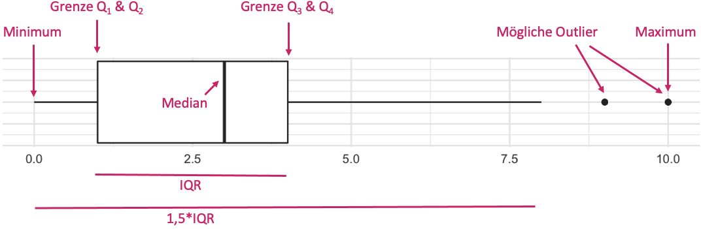

# Grafiken

```{r, echo = FALSE, warning=FALSE, message=FALSE, error=FALSE}
pacman::p_load(tidyverse, sjmisc)
# Einlesen der Daten
df <- haven::read_sav("data/ZA6738_v1-0-0_generation_z_recoded.sav") %>% 
  row_means(einstellung_politiker_verstaendlich,
            einstellung_entscheidungsprozess_undurchsichtig,
            einstellung_keine_ueberzeugende_partei,
            einstellung_politik_lebensfern,
            einstellung_parteien_macht,
            n = 1,
            var = "pol_entfremdung_ix") %>% 
  row_sums(pol_part_wahl,
           pol_part_petition,
           pol_part_sm_kommentar,
           pol_part_partei_veranstaltung,
           pol_part_demo,
           pol_part_information,
           pol_part_gespraech,
           pol_part_produktboykott,
           pol_part_parteiengagement,
           pol_part_anderes_engagement,
           n = 5,
           var = "pol_part_sx")   %>% 
  mutate(volljaehrigkeit = ifelse(alter < 18, "14 - 17 Jahre", "18 - 24 Jahre"),
         alter = haven::zap_labels(alter)) 
```

Grafiken erfüllen bei der Datenanalyse zwei sehr wichtige Funktionen: Zum einen dienen Sie der explorativen Analyse und helfen dabei, selbst ein besseres Verständnis für die eigenen Daten zu entwickeln. Zum anderen dienen Grafiken aber auch dazu, die Ergebnisse der eigenen Analyse darzustellen um sie anderen mitzuteilen.

In den vorhergehenden Kapiteln haben wir erste Grafiken bereits kennengelernt (z.B. Balkendiagramme und Streudiagramme). In diesem Kapitel möchte ich aber detaillierter darauf eingehen, wie Grafiken mit R erzeugt werden können. – Wie so oft gibt es dazu verschiedene Wege. Auch base-R bietet einige Funktionen, mit denen Grafiken schnell erzeugt und individuell angepasst werden können. Leider ist dieses Anpassen in base-R für R-Anfänger gar nicht so einfach. Da das Anpassen einer Grafik aber nahezu immer nötig ist, gehe ich hier deshalb nicht auf die Base-R-Funktionen zum Erzeugen von Grafiken ein. 

Selbstverständlich gibt es auch über das Tidyverse einen Weg, statistische Grafiken herzustellen. Das entsprechende Paket heißt `ggplot2`. Es beruht auf der *Grammar of Graphics*  (mehr zum Hintergrund finden Sie [hier](http://vita.had.co.nz/papers/layered-grammar.pdf)). Die Idee dahinter ist, dass eine Grafik aus mehreren *Layern* zusammengesetzt ist. Das kann man sich einerseits ein bisschen so wie bei einem Overhead-Projektor (kennen Sie solche Geräte noch?) vorstellen, bei dem man mehrere transparente Folien übereinanderlegt und dann ein gemeinsames Bild erzeugt – oder wie die Ebenen bei Photoshop. Andererseits sind Layer auch die „Stellschrauben“ mit denen man am Aussehen einer Grafik drehen kann.

Das Paket `ggplot2` ist sehr sensibel, was die Daten angeht, die als Input für die Grafiken dienen. Diese müssen auf jeden Fall `tidy` sein und bisweilen wird ein *long format* benötigt. Dazu später mehr.

## Drei Basis-Funktionen

Möchte man eine Grafik mit `ggplot2`erzeugen benötigt man mindestens die folgenden 3 Funktionen. Aber natürlich kann man jede Grafik noch komplexer machen und umgestalten, wenn man weitere Funktionen hinzufügt.

Die Basis-Funktionen von `ggplot2` sind:

`ggplot()`: Diese Funktion ist immer der erste Schritt. Durch die Funktion wird einen so genanntes *Plot*-Objekt angelegt, also die Grafik an sich. Die Funktion erhält als erstes Argument das Datenobjekt, auf dem die Grafik basieren soll. Zu Beginn ist der Plot leer.

`aes()`: Mit dieser Hilfsfunktion, wird das *aesthetic mapping* definiert. Über das *aesthtic mapping können wir bestimmen, wie Daten/Variablen in Formatierung übersetzt werden sollen. 

`geom_()`: Es gibt unterschiedliche `geom_()`-Funktionen. Ein Geom ist ein *geom*etisches Objekt, dass auf dem Plot platziert werden soll, z.B. ein Balkendiagramm (`geom_bar()`) oder eine horizontale Linie (`geom_hline()`). Eine statistische Grafik benötigt mindestens ein Geom, kann aber auch mehrere enthalten.

Zusätzlich gibt es in ggplot noch eine Besonderheit: Der Operator `+` wird in diesem Paket dazu eingesetzt, um die einzelnen grafischen Elemente (oder Layer) zusammenzufügen. Das Pluszeichen steht immer nach einem Befehl, wenn ein Plot noch nicht beendet ist und noch ein weiteres Element hinzugefügt werden soll (so ähnlich wie die Pipe). Das `+` steht immer am Ende der Zeile, nie am Beginn.

Im Zusammenspiel sieht das so aus (Pseudocode):

```{r echo = FALSE}
data <- tibble(
  var_1 = factor(rep(c("gruppe 1", "gruppe 2"), each = 500)),
)
```

```{r echo = FALSE, fig.show="hide"}
ggplot(data = data, mapping = aes(x = var_1)) +
  geom_bar()
```

In Tidyverse-Schreibweise auch so:

```{r echo = TRUE, fig.show="hide"}
data %>% 
  ggplot(mapping = aes(x = var_1)) +
  geom_bar()
```

Und verkürzt kann man die Namen der Argumente weglassen. Routinierte R-Anwender tun dies häufig, deshalb sollten Sie das mal gesehen haben:

```{r echo = TRUE, fig.show="hide"}
data %>% 
  ggplot(aes(var_1)) +
  geom_bar()
```

Um explizit zu machen, was jeweils passiert, werden wir hier aber die ausführliche Schreibweise nutzen.

Im Folgenden wollen wir uns natürlich ein paar Grafiken und Formatierungsmöglichkeiten anschauen. Allerdings ist `ggplot` so umfangreich, dass wir die Funktionen nicht annähernd durchgehen können. Für dieses Kapitel gilt daher im besonderen Maß: wenn Sie eine Formatierung vornehmen möchten, die hier nicht angesprochen wird, googeln Sie danach! Die Möglichkeiten der Gestaltung mit `ggplot2` sind schier unendlich.

Als Datenbeispiel benutzen wir auch in diesem Kapitel den Generation Z-Datensatz. Die erste Grafik, die wir hier erstellen wollen thematisiert die politische Partizipation der Befragten und zwar getrennt für Jugendliche und junge Erwachsene. Ich werde anhand von diesem Beispiel auch noch einmal den Einsatz der drei „Basis-Funktionen“ beschreiben.


## Erste Funktion: Plot-Objekt erstellen 

Jede `ggplot2`-Grafik beginnt immer mit dieser Funktion und der Übergabe von einem Datenobjekt als erstem Argument. Dabei ist es egal, ob wir die Base-R oder die Tidyverse-Schreibweise wählen.

```{r}
p <- df %>% 
  ggplot()
```

## Zweite Funktion: Aesthetik Mapping 

Die `ggplot()` kann noch ein zweites Argument haben, nämlich `mapping =`. Über dieses Argument wird das aesthteic mapping festgelegt. Wie bereits beschrieben, betrifft dies die Zuordnung von Daten im Datensatz zum Aussehen der fertigen Grafik. Man muss quasi beschreiben, wie die die Daten in Layout übersetzt werden sollen. 

Das Mapping geschieht über die Hilfsfunktion `aes()`. Diese Funktion benötigt Argumente, damit sie die Formatierung umsetzen kann:

```{r}
p <- df %>% 
  ggplot(mapping = aes(x = volljaehrigkeit,
                       y = pol_part_sx))
```

**Zwingende Argumente**

In unserem Beispiel möchten wir die Gruppierungsvariable „Volljährigkeit“ auf der X-Achse darstellen und die metrische Variable „politische Partizipation“ auf der Y-Achse. Die beiden Argumente für die `aes()` heißen entsprechend x und y. Diese beiden Argumente für die Achsen werden von Geomen häufig vorausgesetzt, damit das entsprechende Geom überhaupt erzeugt werden kann (zwingende Argumente). Einige Geome benötigen aber auch nur das x-Argument (z.B. ganz einfache Häufigkeitsverteilungen von einzelnen Variablen). 

**Optionale Argumente**

Die `aes()`-Funktion kann zusätzlich zu den zwingenden Argumenten für die Achsen auch optionale Argumente haben. Argumente wie `fill` (Farbe der Füllung), `color`, `size`, `shape`, `linetype` oder `group` kann man dazu benutzen, die Formatierung der Grafik zusätzlich durch Variablen zu verändern.

In unserer Grafik bietet es sich an die Gruppenzugehörigkeit nicht nur durch die Anordnung der Gruppenvariable auf der X-Achse, sondern zusätzlich noch durch Farbe zu unterstreichen.

```{r}
p <- df %>% 
  ggplot(mapping = aes(x = volljaehrigkeit,
                       y = pol_part_sx, 
                       color = volljaehrigkeit))
```

Das Mapping kann übrigens entweder gleich zu Beginn der Grafik in der Funktion `ggplot()` passieren, dann gilt es für den gesamten Plot. Oder es steht in einer `geom_()`-Funktion (nächster Schritt), dann gilt dieses Mapping nur für das spezifische Geom. Hat man nur ein Geom, ist es egal wo es steht.


## Dritte Funktion: Geom hinzufügen

Das soeben erzeugte Objekt `p` ist leer. Zwar existiert schon eine Zuordnung der Daten zu den Achsen, aber eine Grafik wurde bisher nicht erzeugt:

```{r}
# plot ausgeben
p 
```

Wie auch? Wir haben ja noch gar nicht festgelegt, um was für eine Art Grafik es sich handeln soll! Über den Operator `+` können wir dem Plot Geome hinzufügen. Wir addieren sozusagen geome zum Plot dazu: `p + geom_()`. 

### Streudiagram

Im ersten Schritt erstellen wir ein Streudiagramm mit `geom_point()`. 

Jedes Geom hat noch weitere (optionale) Argumente, die man entweder im aesthetic mapping verwenden kann um Variablen zuzuweisen oder man kann das allgemeine Layout dadurch verändern. Wir könnten beim Streudigramm z.B. zusätzlich zur Farbe auch die  Größe der Punkte über `size` verändern oder ihre Form über `shape`. 

Im Beispiel nutzen wir das zusätzliche Argument `size = 5`

```{r}
# Streudiagramm
p + geom_point(size = 5)
```

Juhu, es hat funktioniert! Die Datenpunkte sind auf der Y-Achse angeordnet und in zwei Gruppen aufgeteilt. Die Darstellung ist jedoch suboptimal, denn die Punkte überlagern sich, sie werden vielfach übereinander geplottet. Dadurch kann man nicht wirklich gut sehen, wie sie sich verteilen. 


### Jitter-Plot

Abhilfe schafft ein alternatives Geom, nämlich `geom_jitter()`. Beim Jitter-Plot wird jedem Punkt eine random Abweichung von den Achsen zugewiesen, so dass die Punkte zufällig streuen. Sie überlagern sich dadurch nicht mehr:

```{r}
# Jitter-Plot
p + geom_jitter(size = 5)
```

Mit dem Argument `width` kann man die Breite dieser Streuung bestimmen und mit `alpha` die Transparenz der Punkte. Probieren wir es aus:

```{r}
# Jitter-Plot
p + geom_jitter(size = 5, width = 0.2, alpha = 0.2)
```

Die Darstellung ist ganz schön, aber es gibt weitere Alternativen.

### Boxplot

Eine weiter Möglichkeit um die Verteilung von Variablen darzustellen ist der Boxplot.  Ein Boxplot gibt gleichzeitig Auskunft über Minimum, Maximum, die Quartilgrenzen und den Median der Verteilung einer Variablen. Das Mittlere Rechteck repräsentiert die mittleren 50 Prozent der Verteilung. Die „whiskers“ zeigen den 1,5-fachen Interquartilabstand. Ausreißer werden durch Punkte außerhalb der whiskers dargestellt.

Hier eine schematische Darstellung:


Und hier unser Boxplot:

```{r}
# Boxplot
p + geom_boxplot()
```


### Violin-Plot

Eine weitere Variante um eine Verteilung darzustellen ist der Violin-Plot. Er ähnelt dem Boxplot, er zeigt aber nicht die Quartilgrenzen sondern die „Kerndichteschätzung“. Wenn man sich den Plot anguckt, sieht man sofort, wie unterschiedlich die Variable in den Gruppen verteilt ist:

```{r}
# Violon-Plot
p + geom_violin()
```


### Balkendiagramme
Für das Balkendiagramm wechseln wir jetzt mal die Variable. Balkendiagramme eignen sich ja sehr gut zur Darstellung selbst nominaler Variablen, aber ich nehme hier trotzdem mal die Lebenszufriedenheit, gemessen auf einer vierstufigen Skala.

```{r echo = FALSE}
# für die Wertelabels
df <- df %>% 
  mutate(vorbild_codiert = haven::as_factor(vorbild_codiert)) %>% 
  mutate(zufriedenheit_leben = haven::as_factor(zufriedenheit_leben)) %>% 
  filter(!is.na(vorbild_codiert) & !is.na(zufriedenheit_leben))
```


```{r}
# Vorbereitung des Plots und des Mappings
p <- df %>% 
  ggplot(mapping = aes(x = zufriedenheit_leben))
```

Und jetzt das Geom für das Balkendiagramm hinzufügen. Weil dunkelgraue Balken so hässlich sind, färben wir sie über ´fill` in pink ein.

```{r}
# Einfaches Balkendiagramm
p + geom_bar(fill = "deeppink")
```

Das Ganze kann man natürlich auch drehen, und zwar indem man dem Plot ein zusätzliches Layer mitgibt, dass das Koordinatensystem modifiziert :

```{r}
# horizontale Balken
p + geom_bar(fill = "deeppink")+ 
  coord_flip()
```

Wenn man über `fill` eine zweite Variable mappt, bekommt man gestapelte Balken:
```{r}
# gestapelte Balken
p + geom_bar(mapping = aes(fill = volljaehrigkeit)) 
```


Und über das Zusatzargument `position = "dodge"` kann man die Balken nebeneinander anzeigen. Achtung, diese Argument wird heir außerhalb von `aes()` platziert. Es bezieht sich nämlich nicht auf das Variablen-Mapping.
```{r}
# Balken nebeneinander
p + geom_bar(mapping = aes(fill = volljaehrigkeit), position = "dodge") 
```

### Histogramme
Balkendiagramme sind prima, aber sie sind nicht für die Darstellung der Verteilung einer metrischen Variablen mit sehr vielen Ausprägungen geeignet. Nehmen wir mal als Beispiel die Mediennutzung in Minuten. Würde man für jede mögliche Ausprägung z.B. für 400 Minuten, für 401 Minuten, 402 Minuten etc. einen einzelnen Balken anfertigen, ware das sehr unübersichtlich. Es wäre schöner, würde man die Balken z.B. in Viertelstunden zusammenfassen. Ein Histogramm macht genau das.

Wir betrachten hier die Verteilung der Variable „politische Entfremdung“ (ein Mittelwertindex):

```{r}
# um Fehlermeldung zu vermeiden
df <- df %>% 
  filter(!is.na(pol_entfremdung_ix))
```

```{r}
# Plot vorbereiten
p <- df %>% 
  ggplot(mapping = aes(x = pol_entfremdung_ix))
```

Und jetzt das Geom hinzufügen:

```{r}
# Histogramm
p + geom_histogram(fill = "deeppink") 
```

Ohje, sehr "löchrig". Das ist genau das Problem, dass ich oben beschreiben hatte. Es gibt jedoch Hilfe: Mit dem Zusatzargument `binwidth`, kann man zudem festlegen, in welchen Einheiten die Werte Zusammengefasst werden sollen. Es lohnt sich in der Regel, ein wenig mit dieser Einstellung herumzuexperimentieren. 

```{r}
# Histogramm mit angepasster Balkenbreite
p + geom_histogram(fill = "deeppink", binwidth = 0.3) 
```

Sieht doch gleich viel besser aus!

### Liniendiagramme

Zum Abschluss folgt noch ein Liniendiagramm. Im Beispiel möchte ich die Nutzung unterschiedlicher Informationsquellen nach Alter darstellen. Das ist zwar keine richtige zeitliche Entwicklung, aber der Datensatz enthält ja nunmal auch keine Zeitreihen. 

Ich möchte in dem Plot die Mittelwerte für die unterschiedlichen Informationsquellen je nach Alter darstellen. Zunächst muss der Datensatz so umgeformz werden, dass er diese Mittelwerte enthält. Ich brauche also einen kleinen Mini-Datensatz, den ich mit dplyr erzeuge. 
Beginnen wir mit der Nutzung von TV-Nachrichten.

```{r warning=FALSE, message=FALSE, error=FALSE}
# Mittelwerte Datensatz erstellen
df_mean <- df %>% 
  select(alter, starts_with("infoquelle_")) %>% 
  group_by(alter) %>% 
  summarise(tv_news = mean(infoquelle_tv_nachrichten, na.rm = TRUE),
            google = mean(infoquelle_google, na.rm = TRUE),
            youtube = mean(infoquelle_internet_nachrichten, na.rm = TRUE),
            print = mean(infoquelle_print, na.rm = TRUE),
            tv_satire = mean(infoquelle_tv_satiere, na.rm = TRUE)) 
```


Und so sieht der neue Datensatz jetzt aus:

```{r}
# erste Zeilen ausgeben
head(df_mean)
```

Für das Linendiagramm benötigen wir allerdings ein *Longformat*. Das bedeutet, dass die Mittelwerte der Variablen nicht neben, sondern übereinender in dem Datensatz angezeigt werden müssen. Also alle Mittelwerte werden in eine Spalte kopiert (aus fünf wird also eine Spalte). Allerdings brauchen wir dann noch eine zusätzliche Spalte/Variable, die angibt, aus welcher ursprünglichen Variable ein Mittelwert kommt.

Diese Datenumformung erreichen wir über die `dplyr`-Funktion `pivot_longer()`. Sie benöotigt als Argument `cols` einen Vektor mit den Variablen die zusammengefasst werden sollen.

```{r}
# von wide in long konvertieren:
df_mean <- df_mean %>% 
  pivot_longer(cols = c(tv_news, google, youtube, print, tv_satire))

# erste Zeilen ausgeben
head(df_mean)
```

Genau so habe ich mir das vorgestellt. Die neuen Variablen heißen standardmäßig  `name` und `value` und die Variable `alter` ist auch noch mit dabei. Genau diese Struktur und die drei Variablen brauchen wir. Jetzt kann es losgehen mit dem Liniendiagramm:

```{r warning = FALSE}
# von wide in long konvertieren:
df_mean %>% 
  ggplot(mapping = aes(x = alter, y = value, color = name)) + 
  geom_line()
```

## Grafiken speichern

Natürlich können Sie die Grafiken über den "Plot"-Tab in RStudio exportieren um Sie in andere Programme einzufügen. Zum Abschluss möchte ich Ihnen noch eine Funktion zeigen, mit der Sie das auch direkt im Skript machen können. Dei Funktion heißt `ggsave()`. Als Argumente nimmt sie beispielsweise den Dateipfad, den Namen des Plots und weitere Angaben, wie die gewünschte Höhe und Breite oder die DPI-Zahl. Außerdem kann mit `units` die Einheit für die Abmessungen festgelegt werden (z.B. `units = cm`).

```{r message = FALSE}
# den letzten angezeigten Plot speichern
ggsave(filename = "images/my_plot.png")

# einen bestimmten Plot speichern
ggsave(filename = "images/my_plot_2.png",
       plot = p)
```
