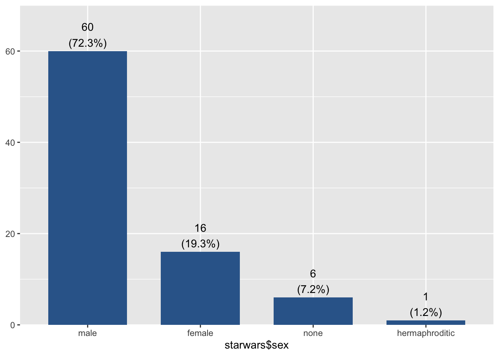
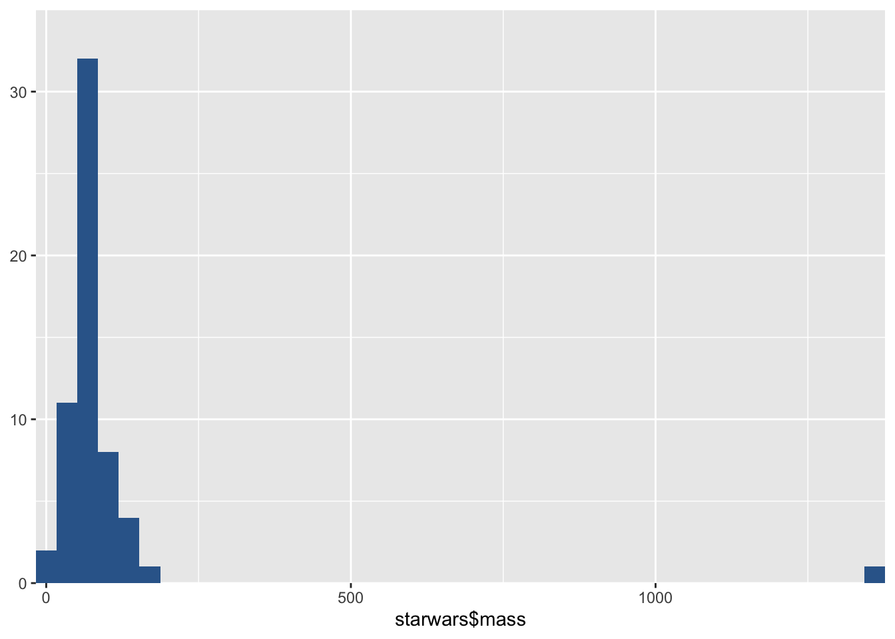

--- 
title: "R Kompendium für die kommunikationswissenschaftliche Statistik- und Datenanalyse-Ausbildung am IJK Hannover"
author: "Julia Niemann-Lenz"
date: "2020-12-02"
site: bookdown::bookdown_site
output: bookdown::gitbook
documentclass: book
bibliography: [book.bib]
biblio-style: apalike
link-citations: yes
github-repo: rstudio/bookdown-demo
description: "Dieses Buch ist als Nachschlage-Referez für die Statistik-Ausbildung in der Kommunikationswissenschaft gedacht."
header-includes:
  - \AtBeginDocument{\renewcommand{\chaptername}{Kapitel}}
---

# Herzlich Willkommen! {-}

Mit diesem Lehrbuch möchte ich Ihnen in die Programmiersprache R näher bringen. Es ist zum einen als begleitendes Lernmaterial für die Statistikausbildung am *Institut für Journalistik & Kommunikationswissenschaft der Hochschule für Musik, Theater & Medien Hannover* gedacht. Zum anderen soll es als Nachschlagewerk dienen. Aus diesen Gründen ist es nicht einem bestimmten Kurs zugeordnet, sondern enthält eine Sammlung von Erklärungen, Anleitungen und Skripten. Das Buch richtet sich sowohl an Einstieger:innen, die gerade mit der Statistik-Grundausbildung beginnen, als auch an Umsteiger:innen, die bisher mit einem anderen Statistikprogramm (vermutlich mit SPSS) gearbeitet haben. 

R hat in den letzten Jahren innerhalb der Kommunikationswissenschaft stark an Bedeutung gewonnen, da es den Erfordernissen moderner Datenanalyse sehr viel besser entgegenkommt als herkömmliche Statistiksoftware. Denn die Anforderungen haben sich geändert: Durch die Digitalisierung und die damit einhergehende Datafizierung sind heute mehr Daten verfügbar den je und auch die Struktur der Daten hat sich gewandelt. Beispielsweise rückt die automatisierte Analyse von Textdaten zunehmend in den Fokus und Kommunikationsdaten aus Social Media weisen eine Netzwerkstruktur auf.

Digitale Daten sind ein bedeutender Wirtschaftsfaktor, der oft höher eingeschätzt wird als manifeste Güter. Vielfach handelt es sich bei den nun verfügbaren Daten um Kommunikationsdaten. Deshalb sind Expert:innen, die sowohl fundiertes Domänenwissen im Bereich Kommunikation und Medien, als auch die Kompetenz Daten fachgerecht auszuwerten mitbringen, in der Kommunikationspraxis sehr gefragt. Aber auch in den Sozialwissenschaften führt der "Computational Turn" zu deutlichen Veränderungen. Die Subdisziplin "Computational Communication Science" ist mittlerweile längst kein Trend mehr, sondern eine feste Größe der Forschungslandschaft. Verfahren aus dem Bereich der Informatik und der Statistik erweitern das traditionelle Methodenspektrum. Sie werden auch als "Compuational Methods" bezeichnet. Angesichts der "Reproduktionskrise" sind zudem die Anforderungen an die Transparenz und Reproduzierbarkeit von wissenschaftlichen Erkenntnissen gestiegen. Während die bisher eingesetzte proprietäre Statistiksoftware die neuen Anforderungen nicht oder nur unzureichend erfüllen kann, kommen Programmiersprachen diesen Bedarfen flexibel entgegen. 


<!--## Features des Buches {-}
Dieses Buch ist ein *Jupyter Book*. Das bedeutet es ist in Markdown und in *Jupyter-Notebooks* geschrieben und der gesamte Code, den Sie im Buch finden wurde bei seiner Erstellung ausgeführt und wird auf github gehostet. Das Buch bietet gewisse Features, die hier kurz erläutert werden:

Die Hauptnavigation finden Sie links. 

Sie können mit den Pfeiltasten  vorwärts `→` und rückwärts  `←` durch die einzelnen Seiten blättern.
-->

## Dank {-}

Ich bedanke mich beim Bundespresseamt für die Erlaubnis den hier benutzten Datensatz zum Zweck dieses Lehrbuchs verwenden zu dürfen. 

Quellenangabe:

Presse- und Informationsamt der Bundesregierung (2020). Generation Z. GESIS Datenarchiv, Köln. ZA6738 Datenfile Version 1.0.0 (2020), [doi:10.4232/1.13446](https://dbk.gesis.org/dbksearch/sdesc2.asp?no=6738&db=e&doi=10.4232/1.13446). 

## Disclaimer {-}

Das Buch Work in Progress! Ich habe im Wintersemester 2020 mit dem Aufbau des Kompeniums begonnen. Es ist ein ganz besonderes Semester, das zweite unter Corona-Bedingungen und diese Tatsache rückt noch einmal sehr in den Vordergrund, wie wichtig gute digitale Lernressourcen sind. 

Ich bemühe mich um eine sinnhafte Gliederung, sprechende Überschriften und einen linearen Aufbau. Gerade letzteres wird jedoch an einigen Stellen kaum möglich sein. Insbesondere, wenn Sie vielleicht zu den etwas fortgeschritteneren Anwendern gehören, scheuen Sie sich nicht, Inhalte zu überspringen und querzulesen!

Die Erweiterung des Buches erfolgt schrittweise. Über Vorschläge für neue Inhalte, Hinweise auf Fehler und Anregungen, wie man diese Lernressource noch besser gestalten kann, freue ich mich!

<!--chapter:end:index.Rmd-->

# Einleitung {#intro}

In diesem Einführungs-Kapitel gebe ich einen Überblick über das R-Universum, und führe in die Hintergründe und Philosophie der Sprache ein. Dabei kommen auch die vielen Vorzüge, die der Umstieg auf R für Kommunikationswissenschaftler:innen hat zur Sprache und es werden Alternativen angesprochen.

<!--chapter:end:01_00_introduction.Rmd-->

## Einführung in R

R ist eine Programmiersprache mit einem speziellen Fokus auf der Anwendung im Bereich Statistik und Data-Science. In diesem Abschnitt werde ich kurz die Hintergründe und die Entstehungsgeschichte von R erläutern.

Die simpelste Antwort auf die Frage "Was ist eigentlich R?" lautet: "R ist ein Dialekt von S." [@Peng_2020] 
Diese Antwort ist natürlich nicht sehr befriedigend und führt direkt zur Anschlussfrage 
"Und was ist S?" Tatsächlich ist es interessant, die Entstehungsgeschichte von S und R zu kennen und etwas übr die zugrundeliegende Philosophie der Sprachen zu erfahren. 
Dadurch wird deutlich, worin die Unterschiede zu anderen Programmiersprachen liegen, warum
R von Informatikern und Programmierern häufig als "etwas seltsam" empfunden wird und weshalb R gerade 
für die Datenanalyse in der Kommunikationswissenschaft besonders gut geeignet ist.
Deshalb hole ich an dieser Stelle etwas weiter aus.

### S ist die Mutter von R


Die Programmiersprache S hat ihre Wurzeln in den 1970er Jahren und wurde von John Chambers, 
Allan R. Wilks und Kollegen als internes Tool in den "Bell Telephone Laboratories" entwickelt.
Die Bell Labs waren damals Teil der Telefongesellschaft AT&T und ein bedeutendes Forschungszentrum. 
Forscher der Bel Labs haben beispielsweise mehrere Nobelpreise und Turing-Awards gewonnen. 
Heute gehören die Bell Labs zu Nokia.

Mitte der 1960er Jahre war die Rechentechnik soweit, dass die Bel Labs gemeinsam mit anderen 
Forschungseinrichtungen an einem Projekt zur Schaffung eines Mehrprozess- und Mehrbenutzerbetriebssystems arbeiteten ("Multics System", Vorläufersystem von Unix). 
Die Möglichkeit dadurch auf Großrechnern Datenanalyse-Forschung ausführen zu können, war aus Sicht der Bel Laboratories sehr relevant und obwohl sie sich später nicht mehr an der Schaffung des Multics-Systems beteiligten, setzten sie die Entwicklung einer Statistiksprache fort. Diese Sprache nannten sie S - vermutlich für *statistic*.
Zu dieser Zeit war die Idee einer Programmiersprache für Statistik völlig neu. 
Für statistische Berechnungen war es bisher nötig, den Code direkt in FORTRAN (steht für FORmula TRANslation, das war die damals dazu genutzte Sprache) zu schreiben und zwar immer wieder aufs Neue, angepasst an die jeweilige Fragestellung.

Die erste Version von S wurde 1976 nur intern veröffentlicht. In den Folgejahren fanden einige 
Veränderungen an der Sprache statt, z.B. wurde sie nun mit C als Basis und als objektorientierte 
Programmiersprache weiterentwickelt. In den 1980er Jahren vergab AT&T erstmals Lizenzen von S für 
kommerzielle Zwecke und für Bildungseinrichtungen. 
Nach der Aufteilung von AT&T wurde S an das Unternehmen Statistical Science verkauft, welches eine kommerzielle Version von S entwickelte. 
Diese Implementierung ist auch heute noch unter dem Namen *S-Plus* verfügbar.
Ihre Verbreitung ist aber sehr gering.


### Die Philosophie von S

Die neue Sprache S sollten bei der explorativen Datenanalyse und der Erstellung von Grafiken unterstützen 
und dabei schneller und möglichst flexibel sein. 
@Chambers_2000 formuliert das Ziel von S so : 

> “S is a programming language and environment for all kinds of computing involving data. It has a simple goal: To turn ideas into software, quickly and faithfully”.

Insbesondere die schnelle, explorative Übersetzung von Forschungsideen in Ergebnisse war wichtig, während statistische Analyse am Beginn noch nicht so sehr im Fokus stand.

Zusätzlich zeichnet sich die Philosophie von S noch durch drei weitere Anforderungen aus, die 
während der Entwicklung an die Programmiersprache gestellt wurden [@Chambers_2020, S. 84:5]:

1. **Convenience:** Der Aufruf von statistischen Routinen sollte möglichst "kompakt" sein. Die Anwender sollten sich nicht mit den Details wie z.B. dem Datenmanagement beschäftigen müssen. Zudem sollte der Output graphische und formatierte Ausgaben enthalten.

2. **Completeness:** Alle Zusammenfassungen, Modellierungen und Visualisierungen die in FORTRAN möglich waren, sollten auch in S möglich sein.

3. **Extensibility:** Bereits damals verstanden sich die Entwickler von S als Teil einer Datenanalyse- und 
Forschungs-Community. 
Deshalb sollte die Sprache grundsätzlich erweiterbar sein. Neue Techniken und Methoden sollten stets in S integrierbar sein.


### Die Entwicklung von R

Parallel zur Entstehung von S-Plus entwickelten die Statistiker Ross Ihaka und Robert Gentleman 
an der Universität Auckland R nach dem Vorbild von S. Die Bezeichnung *R* nimmt zum einen Bezug auf das Vorbild und geht zum anderen auf die Vornamen der beiden Entwickler zurück.
Neben der Beseitigung einiger Mängel (z.B. bei der Speicherverwaltung) war es das Ziel der beiden Statistiker neue Verfahren schneller in die Programmiersprache implementieren zu können, ohne dabei auf das Entwicklerteam von S angewiesen zu sein. 
Zudem lies sich der Quelltext gut für Lehrzwecke einsetzen. 

Nachdem Ithaka und Gentleman R zunächst nur in der Wissenschafts-Community verbreiteten und dafür 
positives Feedback erhielten, entschieden Sie sich 1995 zur Veröffentlichung der Sprache unter einer 
*General Public License* (GNU). 
Das Basis-Paket von R (base R) wird seitdem on einem etwa 20-köpfigen Kernentwicklerteam um Ross Ihaka und Robert 
Gentleman weiterentwickelt (*R Core Team*). 
Der gemeinnützige Verein *R Foundation for Statistical Computing* mit Sitz in Wien verwaltet das Urheberrecht an R 
und dient dem Zweck, die Verbreitung der Sprache zu fördern. 
Dieses Bemühen kann als sehr erfolgreich beurteilt werden.
Trotz des eingeschränkten Anwendungsfokus ist R heute laut TIOBE-Index eine der beliebtesten Programmiersprachen überhaupt. Im Oktober 2020 belegt R Platz 9 des Rankings.

Aktuelles R-Logo:


### Weiterführende Links {-}
- [Wikipedia-Artikel zu R](https://de.wikipedia.org/wiki/R_(Programmiersprache))
- [CRAN (Comprehensive R Archive Network)](https://cran.r-project.org/)
- [R Foundation](https://www.r-project.org/foundation/)
- [TIOBE-Ranking](https://www.tiobe.com/tiobe-index/)

<!--chapter:end:01_01_into_r.Rmd-->

## Vorteile von R

Man kann natürlich fragen, warum nun gerade R die optimale Wahl für die Statistik- und Datenanalyseausbildung in der Kommunikationswissenschaft und im Medienmanagment ist. Für R sprechen aus meiner Perspektive die folgenden zehn Gründe:

1. **R ist einfach.** Als erste Programmiersprache ist R gerade für Personen, die das Interesse "Datenanalyse" verfolgen, gut geeignet.

2. **R skaliert.** Man kann mit R sowohl kurze Ad-Hoc Auswertungen machen als auch sehr komplexe Programme schreiben. Der Übergang ist fließend und so kann man vom Anwender zum Entwickler werden ohne eine große Hürde überwinden zu müssen.

3. **R ist umfangreich, aktuell und zukunftssicher.** Durch den modularen Aufbau in Pakete ist es einfach R um Funktionalität zu erweitern. Bereits jetzt existiert eine Vielzahl an Paketen, die den Funktionsumfang weit über den proprietärer Statistiksoftware hinaus erweitern. Eine aktive Entwicklercommunity arbeitet beständig daran R noch umfangreicher und besser zu machen. 

4. **R hat eine große, aktive Community.** Weil sowohl die Entwickler- als auch die Anwendercommunity groß und aktiv sind, gibt es sowohl online als auch in Form von Büchern jede Menge Hilfestellungen. Sollte sich eine Frage nicht durch Googeln lösen lassen, ist es gar nicht unwahrscheinlich, dass eine ins Netz gepostete Frage schnell und kompetent beantwortet wird.

5. **R unterstützt lösungsorientiertes Denken.** Anders als "Point-and-click"-Software rückt R den Prozess der Datenanalyse in den Mittelpunkt und hilft dabei ihn in kleine Teile herunterzubrechen. Das fördert die Problemlösekompetenz. 

6. **R begleitet den gesamten Forschungsprozess** -- von der Datensammlung über die Datenspeicherung in Datenbanken, der Datenaufbereitung und -analyse bis hin zur Visualisierung und Kommunikation.

7. **R macht Forschung transparenter und reproduzierbar.** Durch die Arbeit in einer Programmiersprache ist man quasi gezwungen die einzelnen Schritte schriftlich niederzulegen -- mindestens in Form von Code. Aber auch darüber hinaus bietet R viele weitere Funktionen und Tools zur Verbesserung der Nachvollziehbarkeit und für Open Science.

8. **R ist eine relevante Kompetenz auf dem Arbeitsmarkt.** - Das gilt auch und gerade für Sozial- und Kommunikationswissenschaftler!

9. **R macht Spaß!** Programmieren ist eine kreative Tätigkeit die durchaus auch Flow-Erlebnisse hervorrufen kann.

10. **R ist Open Source & kostenlos für viele Plattformen verfügbar.** Dadurch wird nicht nur der persönliche Geldbeutel geschont, R trägt damit auch zur Liberalisierung von Wissen insgesamt bei und bietet die Möglichkeit sich selbst an der Entwicklung der Software zu beteiligen. 

Trotz der vielen soeben herausgestellten Vorteile ist R natürlich kein Wundermittel und keine eierlegende Wollmilchsau. Eine Programmiersprache, die allen Ansprüchen genügt und dabei keine Einschränkungen hat, gibt es nicht. An dieser Stelle soll nicht unerwähnt bleiben, dass Anwender:innen die einen Hintergrund in der Informationswissenschaft oder bereits Erfahrungen mit anderen Programmiersprachen haben, R bisweilen als kompliziert, unübersichtlich oder langsam beurteilen. Zudem gilt R als "unsicher", wenn es darum geht, Webapplikationen zu bauen.

Aus Perspektive der (sozialwissenschaftlichen) Methodenlehre überwiegen dennoch die Vorzüge. 
R kann ein guter Einstieg in die Welt des Programmierens sein. Obwohl sich R in einigen Punkten von anderen Programmiersprachen unterscheidet sind viele Konzepte gleich und können übertragen werden, so dass es später leichter fällt weitere Programmiersprachen zu lernen.

<!--chapter:end:01_02_advantages.Rmd-->

## Alternativen zu R
Das R eine Programmiersprache ist, die sich besonders zur Datenanalyse und zur Berechnung von 
Statistiken eignet, kam bereits mehrfach zur Sprache. Selbstverständlich gibt es aber auch noch
andere Software die diesen Zweck erfüllen kann. 
Einerseits gibt es eine Reihe (proprietärer) Anwendungen, die ebenfalls zur statistischen Analyse verwendet werden, wie beispielsweise SAS, Stata, MatLab oder SPSS. 
Andererseits gibt es natürlich auch andere Programmiersprachen, die gut geeignet sind um statistische
Berechnungen anzustellen. 
Zu nennen sind an dieser Stelle vor allem Python und Julia.

In der Kommunikationswissenschaft war bisher SPSS von IBM das am weitesten verbreitete Tool. 
SPSS ist eine Statistiksoftware mit einer Benutzeroberfläche und man sich die Ausgabe von Statistiken quasi "zusammenklicken". 
Man muss die dahinterliegende Programmiersprache, welche SPSS-Syntax heißt, dazu nicht im Detail kennen. 
Allerdings nimmt die Verbreitung von SPSS in der Wissenschaft und in der Wirtschaft momentan 
deutlich ab. 
Gegen SPSS sprechen beispielsweise die hohen Lizenzkosten, die langsame Implementierung neuer Verfahren und die sinkende Verbreitung.
 
### Weiterführende Links {-}
- [Vergleich Statistik-Software  1](https://www.inwt-statistics.de/blog-artikel-lesen/Statistik-Software-R_Python_SAS_SPSS_STATA_im_Vergleich.html)
- [Vergleich Statistik-Software 2](https://novustat.com/statistik-blog/statistikprogramm-ueberblick.html)
- [Popularität von Statistik-Software](http://r4stats.com/articles/popularity/)

<!--chapter:end:01_03_alternatives.Rmd-->

## Tipps zum R lernen

### Der Anfang ist schwer
R unterscheidet sich deutlich von der Software, mit der Kommunikationswissenschaftler:innen bisher gearbeitet haben. Es handelt sich nicht  um  ein proprietäres Programm, sondern um eine Programmiersprache. Dadurch werden die Grenzen dessen, was möglich ist, immens erweitert. Da fällt der Ein- bzw. Umstieg am Anfang vielleicht erstmal schwer und sicherlich gehört beim Erlernen einer neuen Kompetenz immer auch eine **gewisse Frustrationstoleranz** dazu. Das nicht alles von Anfang an klappt, ist ganz normal. Es ist sehr wichtig sich diesen Umstand zu verdeutlichen. 


<div style="color:grey;text-align:right">Artwork by <a href="https://github.com/allisonhorst/stats-illustrations/">Allison Horst</a></div><br />

### Nützliche Hinweise

- **Holen Sie sich die Hilfe, die Sie brauchen!** <br />
Welche Lern-Ressourcen für Sie die richtigen sind, können Sie selbst am besten entscheiden. Eine Person lernt vielleicht leichter mit einem interaktiven Kurs, eine andere mit einem Buch. Das ist Geschmackssache. Eine besonders hilfreiche Methode kann auch "Vier Augen / ein Rechner" sein, bei dem Sie mit eine:r Kommiliton:in gemeinsam am Computer üben.

- **Lesen Sie Fehlermeldungen aufmerksam durch.** <br />
Falls ein Skript mal nicht wie erwartet funktioniert, liefert ihnen die Fehlermeldung oft einen ersten Hinweis darauf, woran es liegen könnte. Das gilt meistens - aber leider nicht immer. Denn nicht alle Autoren der unterschiedlichen R-Pakete schreiben Fehlermeldungen die auch für Einsteiger verständlich sind.

- **Schauen Sie genau hin**. <br />
Achten Sie genau auf die Syntax: Häufige Fehler sind vergessene oder doppelte Klammern `{[()]}`, Anführungszeichen `"`oder Kommata `,`.

- **Googeln ist eine Kompetenz und ausdrücklich erwünscht!** <br />
Wenn Sie bei einer Fragestellung feststecken, die Hilfe sie auch nicht weiterbringt versuchen Sie ihre Fehlermeldung oder Ihre Fragestellung zu ergoogeln. Sie sind womöglich nicht der/die erste, die vor diesem Problem steht.

- **Beachten Sie die 15-Minuten-Regel.**<br />
Wenn Sie auf ein Problem stoßen, versuchen Sie 15 Minuten lang, es zu lösen. Sollten Sie es bis dahin nicht geschafft haben, fragen Sie jemanden um Hilfe! Wenn Sie gerade an einem Seminar teilnehmen können das natürlich bevorzugt Ihre Kommiliton:innen, Tutor:innen oder Dozierenden sein. Aber auch im Internet gibt es viele Foren z.B. [stackoverflow](https://stackoverflow.com/). 


<div style="color:grey;text-align:right">Artwork by <a href="https://github.com/allisonhorst/stats-illustrations/">Allison Horst</a></div><br />

<!--chapter:end:01_04_learning_r.Rmd-->

# Benutzeroberflächen

In diesem Abschnitt finden Sie alles, was Sie zum Start über die Benutzeroberfläche von R und RStudio wissen müssen. Dabei gehe ich zu nächst auf die R-Konsole ein, ein Tool, dass bereits beim Download von R mitgeliefert wird und in dem Sie die Sprache bereits ausführen können. - Wenngleich dies wenig komfortabel ist. Die R-Konsole ist aber auch ein Teil von RStudio. Im Anschluss gehe ich deshalb auf die IDE und ein paar ausgewählte Features genauer ein. 

<!--chapter:end:02_01_interfaces.Rmd-->

## R Konsole {#konsole}

Wenn man sich R heruntergeladen und installiert hat, kann man die Sprache bereits ausführen. 
Nach einem Doppelklick auf das R-Icon öffnen sich die *R-Konsole*. 
In dem Fenster wird nach dem Öffnen direkt ein längerer in schwarz formatierter Text angezeigt.
Er enthält einige Informationen über R, wie z.B. die Versionsnummer, einen Warnhinweis und ein paar grundlegende Befehle.

Unter diesem schwarzem Text folgt ein lila-fabiges ">" hinter dem in blau ein "|" blinkt.
Dies bedeutet, das R nun bereit ist für die Eingabe von Befehlen. Nachdem ein Befehl eingegeben wurde kann man ihn mit Drücken der Eingabetaste (Enter) ausführen.

Der folgenden Screenshot zeigt, wie ich drei Befehle eingegeben und ausgeführt habe:


1. Der Befehl `print()` nimmt eine Zeichenfolge und gibt sie in der Konsole aus, in diesem Fall die Zeichenfolge `"Hello world!"`. 
Dieser als "Hello World-Programm" bezeichnete Befehl ist ein häufig gewähltes erste Programmierbeispiel in der Einführungsliteratur für Programmiersprachen. Fun-Fact: Auch die Tradition des "Hello world!"-Programms stammt ursprünglich aus den Bell Laboratories.

2. Im zweiten Befehl `2^8` habe ich R eine Berechnung durchführen lassen, nämlich 2 hoch 8. 
R liefert nach einem Druck auf Enter das Ergebnis 256 zurück.

3. Im dritten Befehl sollte ebenfalls eine Berechnung durchgeführt werden `3+x`. 
Hier kommt jedoch kein Ergebnis zurück, sondern nur die Fehlermeldung "Objekt 'x' nicht gefunden". 
R kann die Berechnung nicht durchführen, weil es den Wert für ´x´ nicht kennt. 
Ich habe es bisher nicht definiert. 

Betrachtet man den Screenshot genauer, fallen einige Eigenschaften der Formatierung auf:

- Der selbstgeschriebene Text wird in blau dargestellt. So ist er leichter von den in schwarz dargestellten Ausgaben zu unterscheiden. Fehlermeldungen erscheinen in rot und sind damit besonders auffällig.

- Vor jeder Ausgabe eines Ergebnisses findet sich eine `[1]`. Diese markiert, um das wievielte Element einer Ausgabe es sich handelt. 
Im obigen Beispiel enthält jede Ausgabe nur ein Element, aber Ausgaben können durchaus auch mehrere Teile haben oder sogar ineinander verschachtelte Elemente aufweisen.

Beim Eingeben von Befehlen in die Konsole kann man mit den Cursortasten (`↑` und `↓`) durch die bisher eingegebenen Befehle  wechseln. Drückt man bspw. `↑` wird der letzte eingegebene Befehl erneut in die Konsole geschrieben.

Manchmal erscheint nach dem Ausführen eines Befehls nicht das erwartete Ergebnis, sondern die Konsole zeigt nur ein `+` an. In diesem Fall war der Befehl unvollständig. Tatsächlich kommt es bei der Arbeit mit R recht häufig zu unvollständigen Befehlen, etwa weil eine schließende `)` oder ein `"` vergessen wurde. Man kann in diesem Fall den fehlenden Teil entweder noch ergänzen oder die Ausführung mit der Esc-Taste abbrechen.

Das ist alles schon ganz nett, aber auch ziemlich unkomfortabel. Um richtig mit R zu arbeiten, bietet es sich an auf eine Integrierte Entwicklungsumgebung (Integrated Development Environment, kurz IDE) zurückzugreifen.
So eine IDE kann bspw. bei der Organisation von Dateien unterstützen, bietet Hilfe-Funktionen beim Coden, einen Überblick über die Objekte, die sich im Arbeitsspeicher befinden und vieles mehr. 

<!--chapter:end:02_02_console.Rmd-->

## RStudio: IDE für R

Statt der Konsole benutzen die meisten Entwickler einen Editor oder eine so genannte *IDE* (= Integrated Development Environment zu deutsch Entwicklungsumgebung), die eine grafische Oberfläche bietet und das Programmieren und das Datenmanagement erheblich erleichtert. 

Die bekannteste und beliebteste IDE für R ist [RStudio](https://rstudio.com/).
Wie der Name schon vermuten lässt wurde RStudio speziell für die Arbeit mit R entwickelt. Es ist genau auf die Bedürfnisse von R-Anwender:innen angepasst. Im folgenden Abschnitt stelle ich die Entwicklungsumgebung kurz vor, beschreibe einige Features und die Benutzeroberfläche.

 
Die IDE RStudio ist seit 2011 auf dem Markt und wird von RStudio PBC entwickelt und vertrieben. 
Das Programm ist sowohl für Desktop-Rechner als auch für Server verfügbar und wird sowohl kostenlos als auch in einer kommerziellen Pro-Version vertrieben. 
Die Pro-Versionen unterscheiden sich vor allem dadurch, dass den Anwendern ein Priority-Support geboten wird.
Seit Beginn 2020 firmiert RStudio als *Public Benefit Corporation* und hat sich damit dem Gemeinwohl verpflichtet.

Das Unternehmen RStudio ist Teil des [R Consotium](https://www.r-consortium.org/), eines Zusammenschlusses von Unternehmen, die R in großem Stil einsetzen oder für ihre Geschäftsmodelle nutzen (auch Microsoft, Google und Oracle gehören dazu). 
Gerade RStudio treibt sowohl die Verbreitung der Sprache R als auch ihre Weiterentwicklung und Standardisierung enorm voran und prägt damit ihre Ausgestaltung zusehens. 

 Allen voran ist hier das *Tidyverse* zu nennen. Es handelt sich dabei um eine Gruppe von Paketen die von den RStudio-Programmierern um *Hadley Wickham* (Chief Scientist bei RStudio) entwickelt wurden und die dazu dienen R einheitlicher und verständlicher zu gestalten sowie die Sprache noch besser auf die Bedürfnisse moderner Datenanalyse anzupassen. Auch in diesem Buch wird weitestgehend auf die Pakete und Funktionen des Tidyverse zurückgegriffen.
Obwohl die Entwicklung der Vereinheitlichung von R mit dem Tidyverse viele Anhänger gefunden hat und enorm zur Popularität der Sprache beigetragen haben dürfte, sei dennoch erwähnt, dass es auch Stimmen gibt, die diese Entwicklung kritisch betrachten [@Matloff_2019; @McChesney_2020].


### RStudio-Cloud
Wie oben erwähnt, gibt es sowohl eine Server- als auch eine Desktopversion von RStudio. 
Für den Zweck der Statistik-Ausbildung arbeiten wir hier am IJK mit einer Serverversion, nämlich der [RStudio Cloud](https://rstudio.cloud/).
Dies hat die Vorteile, dass die Studierenden zunächst nichts auf ihren Rechnern installieren müssen und dass die Entwicklungsumgebung mit allen Übungsskripten bereits vorliegt. 
Sie können sich sehr leicht selbst eine eigene Version der Verwendeten Skripte erstellen und so an den Übungen teilnehmen.
Der/die Dozierende kann sich Ihre Versionen ansehen und so bei Fehlern und Fragen leicht helfen.


### Installation von RStudio
Obwohl die RStudio-Cloud im Rahmen der Statistikausbildung sehr praktisch sein wird, brauchen Sie (später) eine eigene Instanz von R und RStudio auf Ihrem persönlichen Rechner. Zum einen für den Zweck des Übens, zum Anderen weil Sie es später zur Arbeit an eigenen (Studien-)Projekten benötigen werden.
Die Anleitung zur Installation finden Sie im [nächsten Kapitel](#intallation). 
Sie ist getrennt nach Windows und MacOS aufgeführt, da sich die Schritte die zur Installation nötig sind leicht unterscheiden.

<!--chapter:end:02_03_rstudio.Rmd-->

### RStudio Benutzeroberfläche 
Die Benutzeroberfläche von RStudio gliedert sich in verschiedene Bereiche.
Wenn Sie RStudio zum ersten Mal öffnen, sieht sie in etwa so aus:
  


#### Console

Links finden Sie die bereits bekannte **K/Console**, sie schreibt sich hier mit "C", weil die Benutzeroberfläche von RStudio nur in Englisch verfügbar ist. Hier werden die Ergebnisse von Berechnungen ausgegeben und man kann auch wie bereits im Abschnitt [Konsole](#konsole) beschreiben Befehle eingeben. Der linke Bereich enthält neben der Console noch weitere Tabs (*Terminal* und *Jobs*). Diese benötigen wir jedoch momentan nicht. 

#### Environment

Der Bereich rechts ist zweigeteilt. Oben findet sich die **Environment**, zu deutsch Arbeitsumgebung. 
Hier werden die Objekte angezeigt, die während der aktuellen R-Session erzeugt wurden. Ein Objekt kann dabei alles Mögliche sein, z.B. ein Datensatz oder das Ergebnis einer Berechnung. Im Moment ist die Arbeitsumgebung natürlich noch leer. Auch dieser obere rechte Bereich hat mit *History*, *Connections* und *Git* oder auch *Build* weitere Tabs. Unter **History** werden alle Befehle der aktuellen R-Session protokolliert. Die anderen Bereiche sind zunächst nicht interessant für uns. 
  
#### Files, Plots, Packages, Help & Viewer

Im unteren rechten Bereich finden sich ebenfalls verschiedene Tabs.
  
Der erste heißt **Files**. Wenig überraschend findet sich dort ein Dateibrowser, in dem Ihr Arbeitsverzeichnis und die sich darin befindlichen Dateien angezeigt werden. 
Mit den Icons im Bereich können Sie durch Ihr Filesystem navigieren. 
Sind im Arbeitsverzeichnis bereits Dateien abgelegt, können Sie diese durch Doppelklick auch direkt in RStudio öffnen.
  
Im zweiten Tab **Plots** werden Grafiken, die Sie mit R erzeugt haben angezeigt. 
Auch der letzte Tab Im **Viewer** dient zur Anzeige von in R erzeugten Inhalten.
  
Im Tab **Packages** sehen sie die R-Pakete, die auf Ihrem Rechner bereits installiert sind. 
Über den Button *Install* können Sie CRAN nach weiteren Packeten suchen und diese installieren. 
Um ein Paket in einer Session benutzen zu können muss es aber nicht nur installiert sein, es muss auch "aktiviert" bzw. geladen werden. Wie das genau geht behandeln wir später noch einmal im Detail. 
Im Tab Packeges kann man an dem Kästchen vor den einzelnen Paketen sehen, ob ein Paket in der aktuellen Arbeitssession bereits geladen wurde (dann würde hier ein Häkchen angezeigt werden).
  
Der Tab **Help** beinhaltet die Hilfe und Anleitungen für die einzelnen Funktionen von R. 
Man kann die Hilfe aufrufen indem man ein Suchwort in das Suchfeld ganz links eingibt. Alternativ kann man auch innerhalb des Quelltextes den Cursor auf eine Funktion setzen und dann die Funktionstaste *F1* drücken. 
Außerdem kann man die Hilfe einer Funktion auch über den Befehl `?name_der_funktion()` aufrufen. Gibt man diesen Befehl ein, öffnet sich automatisch der Help-Tab mit dem gesuchten Inhalt.
  

### R-Skripte
Mit RStudio kann man natürlich nicht nur Befehle in der Konsole ausführen, sondern seine Arbeit auch in Dateien speichern. Das Basis-Dateiformat von R hat die Dateiendung *.R*. Es gibt drei Möglichkeiten eine neue R-Datei anzulegen:
- Über das Menü "File > New File > R Skript"
- Über das kleine Icon mit dem weißen Rechteck und dem grünen Pluszeichen links oben unter im Menü.
- Über das Tastenkürzel `Strg/Cmd + Shift + N`
  
Sobald die erste R-Datei angelegt oder geöffnet wurde öffnet sich in RStudio auch ein neuer Bereich, der die R-Datei enthält. Dieser Bereich kann in unterschiedlichen Tabs auch verschiedene R-Skripte beinhalten. Er sieht in etwa so aus:
    

    
Wenn Sie ein neues R-Skript angelegt haben, empfiehlt es sich, dieses zunächst einmal unter einem sinnvollen Namen zu speichern. Das geht ebenfalls entweder über das Menü, das Speicher-Icon oder die übliche Tastenkombination `Strg/Cmd + S`. Der Name eines gespeicherten Skripts wird im Tab oben übrigens in schwarz dargestellt. Skripte, die Änderungen enthalten, welche noch nicht abgespeichert wurden werden in rot angezeigt.

Genau wie in der Konsole, können Sie im R-Skript Befehle eintippen. Allerdings werden sie nicht ausgeführt, wenn man `Eingabe/Enter` drückt - dann springt der Cursor lediglich in die nächste Zeile (genau wie in jeder anderen Textverarbeitungs-Software). Zum Ausführen des R-Skriptes können Sie entweder oben den Button *Run* benutzen oder den Shortcut `Strg/Cmd + Eingabe/Enter`. R führt dann die Zeile aus, in der sich der Curser befindet oder auch mehrere Code-Teile, die Sie zuvor gemeinsam markiert haben. 
  
**Tipp!**

Am besten Sie gewöhnen sich die Tastenkombi `Strg/Cmd + Eingabe/Enter` zum Ausführen von Befehlen direkt an. Das spart sehr viel Zeit!

<!--chapter:end:02_05_rstudio_interface.Rmd-->

### Features von RStudio
  
RStudio ist eine umfangreiche IDE, die die Anwender:innen mit umfangreichen Funktionen unterstützt. Ein paar davon möchte ich an dieser Stelle explizit hervorheben.
  
**Autovervollständigen**

Während man in RStudio Text schreibt, macht die IDE Vorschläge, wie sich das bisher geschriebene sinnvoll vervollständigen lässt. Dieses Feature ist besonders hilfreich, wenn man von einem Befehl nur den Anfang kennt und nicht genau weiß, wie er geschrieben wird und welche Elemente er beinhaltet.
  

    
Der Screenshot zeigt, wie nach Tippen der Buchstaben `prin` Funktionen angezeigt werden, die mit diesen Buchstaben beginnen. Aus den Vorschlägen kann man mit der Maus oder über die Pfeiltasten und Drücken der Entertaste den richtigen auswählen, ohne dass man den Befehl selbst zu Ende schreiben müsste. Das spart viel Zeit und ist außerdem gerade dann hilfreich, wenn man die Befehle noch nicht auswendig kennt. Neben dem Autocomplete wird außerdem in gelb ein Hinweis zur Syntax und der Beginn der entsprechenden Hilfe-Datei angezeigt. Zu beachten ist, dass über das Autocomplete nur Funktionen aus Paketen angezeigt werden, welche während der aktuellen Session bereits geladen wurden.
  
  
**Aufrufen der Hilfe-Funktion**

Der Tab "Help", der weiter oben bereits vorgestellt wurde ist bei RStudio direkt in die Entwicklungsumgebung integriert. 
Dieser Umstand ist erwähnenswert, denn bei anderen IDEs öffnet sich bei Aufruf der Hilfefunktion häufig ein externer Browser. 
Das die Hilfe bei RStudio direkt integriert ist nimmt zwar etwas Platz auf dem Bildschirm weg, ist jedoch auch sehr anwenderfreundlich, gerade für Programmiereinsteiger:innen.
  
  
**Automatisches Einrücken**

Wenn Codes länger werden und über mehrere Zeilen gehen bietet es sich an, diesen durch Einrückungen übersichtlich zu formatieren. Es kann so leicht kenntlich gemacht werden welche Teile einer längeren Kette von Befehlen unmittelbar zusammengehören.
Bei einigen Programmiersprachen gehören solche Einrückungen sogar unmittelbar zur Syntax dazu (z.B. bei Python). Aber selbst wenn sie nicht unmittelbar Bestandteil einer Sprache sind (wie bei R), sind Einrückungen für die menschliche Anwender:in nützlich, um den Überblick zu behalten.
RStudio schlägt während des Programmierens selbst sinnvolle Einrückungen vor, sodass die Anwender:in damit meist keine Arbeit hat.
  
  
**Syntaxhighlighting**

Syntaxhighlighting bedeutet, dass unterschiedliche Bestandteile des Codes in unterschiedlichen Farben dargestellt werden. Der folgende Screenshot demonstriert dies:
    

Auch Syntaxhighlighting dient der Übersichtlichkeit für die menschlichen Anwender:in. 

<!--chapter:end:02_06_rstudio_features.Rmd-->

### RStudio anpassen

Über das Menü **Tools > Global Options** können Sie RStudio Ihren Vorlieben entsprechend anpassen. 


An dieser Stelle kann ich nicht auf alle Möglichkeiten eingehen (ich kenne auch gar nicht alle), aber ich möchte auf ein paar sinnvolle Anpassungen hinweisen:

1. Im Bereich **General** unter **Workspace**: Entfernen Sie bitte das Häckchen bei *Restore .RData into workspace at startup* und stellen Sie die Option *Save workspace to .RData on exit* auf *Never*. Diese Optionen sorgen dafür, dass die Arbeitsumgebung von R bei jedem Schließen gespeichert wird und beim neuen Öffnen wieder geladen wird. Das betrifft zum Beispiel alle Objekte, die Sie in einer R-Session erstellt haben. Es hört sich zwar erstmal nach einer tollen und zeitsparenden Idee an, die ganzen Objekte nicht erneut erstellen zu müssen und direkt an der Stelle weitermachen zu können, an der man aufgehört hat. In der Praxis ist das aber eine ganz furchtbare Idee! Zwischen zwei R-Sessions hat man sehr wahrscheinlich vergessen, wo genau man aufgehört hat, welche Transformationen mit einem R-Objekt bereits durchgeführt wurden und welche noch folgen sollen. Das kann in totalem Chaos enden! Es ist daher besser mit einem frischen, leeren Workspace zu starten und ggf. das Skript – welches man natürlich abspeichern sollte – von oben nach unten erneut auszuführen. <br /><br /> 

2. Unter **Appearance** können Sie das Farbschema für das Syntaxhighlighting anpassen. Sie können zwischen sehr vielen unterschiedlichen Varianten wählen. Einige davon haben einen dunklen Hintergrund. So ein *Dark Mode* hilft beim Energiesparen und ist vielleicht auch angenehmer für die Augen. Probieren Sie es ruhig aus!


3. Ich habe über **Code > Display > General > Show margin** noch eine senkrechte Linie bei 80-Zeichen eingeblendet. Sie erinnert mich daran, nicht zu lange Codezeilen zu produzieren und lieber den Code an sinnvollen Stellen zu umbrechen oder ihn ggf. umzuschreiben. Das dient der Übersichtlichkeit.

<!--chapter:end:02_07_rstudio_options.Rmd-->

# Installation {#installation}

R ist für viele verschiedene Betriebssysteme verfügbar, man kann es sogar auf einem Android-Smartphone installieren. RStudio gibt es für Windows, MacOS und Linux sowie in einer Variante für Server.

Auf den folgenden Seiten finden Sie Installationsanleitung für MacOS und Windows.
Da die Installation auf beiden Betriebssystemen etwas unterschiedlich ist (insbesondere beim Download von R), sind die Wege auf zwei getrennten Seiten aufgeteilt. 

<!--chapter:end:03_01_installation.Rmd-->

## Installationsanleitung Windows

Wie auf den vorhergehenden Seiten beschrieben, handelt es sich bei R und RStudio um zwei unterschiedliche Dinge:

1. R, die Programmiersprache

2. RStudio, die Entwicklungsumgebung

Zur Installation müssen Sie deshalb auch **beides nacheinander** installieren. 

### Erster Schritt: R
Die aktuelle Version von R können Sie über das CRAN downloaden. Die Webadresse lautet:  [https://cran.r-project.org/](https://cran.r-project.org). Gleich auf der Startseite finden Sie die Links zu den jeweils aktuellsten R-Versionen:


Klicken Sie auf "Download R for Windows" und klicken Sie im sich öffnenden Fenster auf „install R for the first time“.


Während diese Dokumentation geschrieben wurde, war die aktuellste Version 4.0.3, wie der nachfolgende Screenshot zeigt:


Nun klicken Sie auf den Download-Link für die aktuelle Version. Doppelklicken Sie anschließend die heruntergeladene Datei und folgen der Installationsanleitung. Die Einstellungsoptionen brauchen Sie dabei nicht anzupassen.

### Zweiter Schritt: RStudio

RStudio, die Entwicklungsumgebung für R können Sie unter https://rstudio.com/products/rstudio/download/ herunterladen.
Wählen Sie die Version “RStudio Desktop - Free”.


Nun werden sie weitergeleitet und klicken auf „Download RStudio for Windows“.


Nachdem der Download abgeschlossen ist, doppelklicken Sie die Datei und folgen erneut der Installationsanleitung. Nach der Installation können Sie das Programm RStudio öffnen. Es greift automatisch auf die zuvor installierte Version von R zu.

<!--chapter:end:03_02_installation_windows.Rmd-->

## Installationsanleitung MacOS

Wie auf den vorhergehenden Seiten beschrieben, handelt es sich bei R und RStudio um zwei unterschiedliche Dinge:

1. R, die Programmiersprache

2. RStudio, die Entwicklungsumgebung

Zur Installation müssen Sie deshalb auch **beides nacheinander** installieren. 

### Erster Schritt: R
Die aktuelle Version von R können Sie über das CRAN downloaden. Die Webadresse lautet:  [https://cran.r-project.org/](https://cran.r-project.org). Gleich auf der Startseite finden Sie die Links zu den jeweils aktuellsten R-Versionen:


Klicken Sie auf der [Homepage des CRAN](https://cran.r-project.org) auf "Download R for (Mac) OSX" und scrollen Sie bis zu den "Latest Releases". Unter dieser Überschrift wird Ihnen die aktuellste "stable" Version von R angezeigt. 

Während diese Dokumentation geschrieben wurde, war dies die Version 4.0.2, wie der nachfolgende Screenshot zeigt:


Rechtsklicken Sie auf die Version und laden Sie sie herunter.

Doppelklicken Sie auf die heruntergeladene Datei und folgen Sie der Installationsanleitung.


### Zweiter Schritt: RStudio

RStudio, die Entwicklungsumgebung für R können Sie unter [https://rstudio.com/products/rstudio/download/](https://rstudio.com/products/rstudio/download/) herunterladen.

Wählen Sie die Version "RStudio Desktop - Free" und laden Sie die Datei herunter.


Nachdem der Download abgeschlossen ist, doppelklicken Sie die Datei und ziehen Sie sie in Ihre Applications.


Nach der Installation können Sie das Programm RStudio öffnen. Es greift automatisch auf die zuvor installierte Version von R zu.

<!--chapter:end:03_03_installation_mac.Rmd-->

# Einführung in R

Nachdem nun die ersten Details zum Hintergrund von R geklärt sind und Sie vermutlich auch bereits R und RStudio installiert haben, kann es losgehen. Wir starten mit R. Ich gehe im folgenden davon aus, dass Sie noch keinerlei Programmierkenntnisse haben. 

Eine Programmiersprache zu lernen hat gewisse Ähnlichkeit damit, eine Fremdsprache zu erlernen. Man muss die Grammatik kennen und Vokabeln pauken um sich verständigen zu können. Und verständigen wollen Sie sich ja auch beim Schreiben von Code, nur eben nicht mit anderen Menschen, sondern mit einem Computer. 

Leider sind Computer bisweilen ganz besonders pingelige Gesprächspartner. Sie beharren z.B. sehr genau auf korrekte Ausdrucksweisen und haben auch bei der Grammatik nur einen gewissen Spielraum. Zum Glück unterstützt RSTudio das Lernen von R mit einigen Features, die uns die Verständigung leichter machen! Dadurch muss man z.B. nicht alle Vokabeln und die Syntax auswendig kennen um sich verständigen zu können. Trotzdem sollte man natürlich den grundlegenden Aufbau -- die Syntax der Sprache -- kennen.

<!--chapter:end:04_01_programming.Rmd-->

## R-Syntax

Bevor wir tiefer in die Arbeit mit R und RStudio einsteigen, ist es jetzt an der Zeit, ein erstes eigenes R-Skript zu schreiben. Bereits im [Abschnitt](#konsole) haben Sie erste Syntax-Beispiele kennengelernt und gesehen, dass R ein passabler Taschenrechner ist. Jetzt möchten wir R genauer kennenlernen. Wenn Sie mögen, öffenen Sie ein neues R-Skript und übertragen Sie die Schritte.

### Rechnen mit R

OK, als *Taschen*rechner ist R vielleicht etwas unpraktisch. Trotzdem, rechnen ist natürlich eine der ureigensten Funktionen von R und selbstverständlich beherrscht es alle Grundrechenarten und alle Rechen- und Klammerregeln:


```r
1 + (2 - 3 * 4) / 5 
```

```
## [1] -1
```

Wenn Sie diese Zeile ausführen, z.B. über den Button "Run" oder durch den Shortcut `Cmd/Ctrl + Enter/Eingabe` erhalten Sie umgehend das Ergebnis.

### Zuweisungsoperator
Das man mit R rechnen kann, mag zwar im Einzelfall ganz nützlich sein, aber natürlich kann R viel mehr. Es würde z.B. Sinn machen, das Ergebnis von so einer Berechnung abzuspeichern, so dass wir zu einem späteren Zeitpunkt wieder darauf zugreifen können. Dazu gibt es in R den Zuweisungsoperator `<-` Mit diesem Pfel, der aus der spitzen Klammer und dem Bindestrich besteht, kann man einem Objekt einen Wert zuweisen. Den Namen des Objektes muss man selbst festlegen. Ich habe im folgenden ein Objekt erzeugt, dass ich `x` genannt habe und ihm den Wert der Berechnung `1 + 2` zugewiesen:


```r
x <- 1 + 2
```

Führt man diesen Code aus, wird in der Console nicht das Ergebnis ausgegeben. Stattdessen gibt es aber oben rechts im Tab "Environment" ein neues Objekt x, das den Wert 3 enthält:


Um das Objekt auch in der Console auszugeben kann man... 

1. Den Befehl entweder in Klammern schreiben. - So wird er gleichzeitig ausgeführt und ausgegeben. -- Man muss außerdem natürlich keine Rechenoperation auf die rechte Seite des Zuweisungsoperators schreiben, sondern kann direkt den Wert "3" zuweisen, wenn man ihn kennt ;)


```r
(x <- 3)
```

```
## [1] 3
```

2. Einfach nach der Zuweisung nochmal ein x schreiben. Der Name des Objekts bewirkt immer das R versucht diesen in der Console darzustellen.


```r
x
```

```
## [1] 3
```

3. Das Objekt x dem `print()`-Befehl übergeben. 


```r
print(x)
```

```
## [1] 3
```

Der Ausgabe in der Konsole stellt R immer eine eckige Klammer `[]` mit einer `1` voran. Dies bedeutet, dass es sich um das erste (und im obingen Beispiel auch jeweils das einzige) Element einer Ausgabe handelt. Ausgaben können aber durchaus auch aus mehreren Teilen bestehen und sogar ineinander verschachtelt sein, wie wir später noch sehen werden.

### Objektnamen

Die Namen von Objekten kann man im Prinzip frei bestimmen, natürlich bietet es sich an, sprechende Namen zu verwenden, die man sich einigermaßen gut merken kann, die aber trotzdem einigermaßen kurz sind. Außerdem ist es schlau, bei Variablen die zusammengehörig sind das selbe Präfix zu verwenden (z.B. bei einer Skala zur Einstellung alle Variablen mit `attitude_` beginnen zu lassen).

Außerdem gibt es einige Regeln, an die man sich bei der Benennung halten muss:

- Objektnamen können große und kleine Buchstaben, Zahlen und Punkte (.) und Unterstriche (_) enthalten. Andere Zeichen sind nicht erlaubt, insbesondere keine Leerzeichen.

- Zahlen, Punkte und Unterstriche dürfen nicht am Anfang stehen.

- Umlaute (z.B. ä, Ö oder ß), Sonderzeichen (z.B. %, & oder =) und Leerzeichen sind nicht erlaubt.

- Objektnamen sind ein-eindeutig, d.h. es kann nur ein Objekt mit einem Namen geben und nicht zwei Objekte die bei "x" heißen.

- Objektnamen sind "case sensitiv". Das bedeutet es kommt genau darauf an ob große oder kleine Buchstaben verwendet werden. Die Namen x und X sind unterschiedlich und deshalb kann es beide Objekte gleichzeitig geben. - Aber das wäre natürlich sehr verwirrend.

- Man sollte keine Namen verwenden, die in R schon belegt sind (z.B. nicht "mean" für einen Mittelwert, weil es in R auch eine Funktion `mean()`gibt).

Über diese Regeln hinaus gibt es Konventionen, an die man sich halten sollte, weil sie der Übersichtlichkeit dienen. Ich verwende z.B. gerne den snake_case, bei dem alle Objektnamen kleingeschreiben werden und unterschiedliche Namensbestandteile durch einen Unterstrich voneinander getrennt werden. Welcher Konvention man folgt ist natürlich Geschmackssache. 


<div style="color:grey;text-align:right">Artwork by <a href="https://github.com/allisonhorst/stats-illustrations/">Allison Horst</a></div><br />

<!--chapter:end:04_02_calculator.Rmd-->

## Kommentare

### Einfache Kommentare

Bisher waren unsere R-Skripte noch nicht so wahnsinnig lang, aber Sie können sich vorstellen, dass es schnell komplexer werden kann. Damit wir den Überblick behalten, kann man in R auch Kommentare schreiben. Solche Kommentare werden durch ein `#` gekennzeichnet. Alles was in einer Zeile nach dem `#` steht wird von R nicht interpretiert.

Da Code nicht nur für Computer gemacht ist, sondern auch für menschliche Leser gehören Kommentare unbednigt dazu, wenn man R-Skripte schreibt. Man kann darin festhalten, warum man einen bestimmten Code wie geschreiben hat und gerade beim Lernen von R können Kommentare als Gedächtnisstütze dienen.  

Hier ein paar Anwendungsbeispiele:


```r
# Dem Objekt x den Wert 3 zuweisen:
x <- 3

print("Hello World!") # muss noch übersetzt werden...
```

Man kann Kommentare auch dazu benutzen Code, der noch nicht funktioniert (Bugs hat) auszukommentieren. Dabei setzt man einfach das `#` vor den fehlerhaften Code. Optimalerweise errgänzt man noch eine Notiz, die möglichst präziese beschreibt, was das (vermutete) Problem ist.


```r
# Der folgende Code ist irgendwie buggy, muss noch repariert werden! 
#print("Hello World!)
```

Leider kann man in R bisher keine mehrzeiligen Kommentare machen. Man muss also in jeder Zeile das `#` voranstellen.

**Tipp!**

Grundsätzlich gilt: Kommentieren Sie lieber zu viel als zu wenig und schreiben Sie Ihre Kommentare so, dass alle Personen, mit denen Sie ihr R-Skript teilen den Code verstehen können. Denken Sie dabei vor allem an sich selbst! Werden Sie den Code nachvollziehen können, wenn Sie in 2 Jahren daraus etwas für Ihre Bachelorarbeit wiederverwenden wollen?

### Sections

In R Studio kann man neben normalen Kommentaren über das Tastenkürzel `Cmd/Ctrl + Shift + R` Abschnitte (Sections) einfügen mit denen man den Code gliedern kann. In R Studio kann man solche Abschnitte auch durch den kleinen Pfeil neben der Zeilennummer ein- und ausklappen. Das steigert die Übersichtlichkeit erheblich.


```r
# Hier beginnt ein neuer Abschnitt ----------------------------------------
print("Hello World!")
```

```
## [1] "Hello World!"
```


<!--chapter:end:04_03_comment.Rmd-->

## R-Pakete 
Die Programmiersprache R ist modular aufgebaut. Den Kern bildet das Basispaket "base R". Es enthält die grundsätzlichen Funktionen bereits, aber richtig spannend und komfortabel wird es erst, wenn man sich weitere Pakete dazuholt. 

Ein Packet ist eine Sammlung von Funktionen zu einem bestimmten Thema. Das Paket `ggplot2 ein Paket zur Ausgabe von statistischen Diagrammen. Neben den Funktionen kann ein Paket außerdem eine Dokumentation und Datensätze enthalten.

Im Prinzip kann jeder ein R-Paket schreiben und im Internet teilen. Für Pakete, die in CRAN gehostet werden, gelten aber besondere Anforderungen und Qualitätsstandards. Sie müssen z.B. zwingend eine Dokumentation enthalten. Dennoch, auch die Pakete auf CRAN variieren sehr stark in ihrem Umfang und ihrer Aktualität und darin wie professionell sie weiterentwicklet werden. Hinter einigen Paketen stehen nur einzelne Entwickler:innen, ander werden von ganzen Teams freiwilliger Helfer entwickelt und wieder andere werden von Firmen wir z.B. von RStudio selbst entwickelt. Ein Beispiel für letzteres ist die Paket-Gruppe "Tidyverse". 

### R-Pakete anzeigen
Welche Pakete bereits auf Ihrem System installiert sind, können Sie ganz leicht in RStudio, links unten im Tab "Packages" nachsehen.

Bei mir sieht das im Moment so aus:


Der Tab Packages zeigt eine Tabelle mit mehreren Spalten: 

- Ganz vorne ist ein Kästchen, das anzeigt, ob ein Paket momentan nur installiert ist (= leeres Kästchen) oder ob es zusätzlich auch geladen ist (= Häkchen im Kästchen). Was das genau bedeutet, erläutere ich weiter unten. Auf jeden Fall sieht man in dem Screenshot, das momentan nur eins der angezeigten Pakete geladen ist, namlich "base", also das Kernpaket von R.

- In der zweiten Spalte wird der Name des Paketes angezeigt. Er ist sogar verlinkt. Klickt man darauf, wird im Help-Tab die Hilfe zum entsprechenden Paket angezeigt. 

- Nach dem Namen folt eine kurze Beschreibung, die erklärt, was das Paket macht. 

- Dahinter folgt die Versionsnummer. Jedes Paket hat eine eigene Versionsnummer, weil es ganz unabhängig von R gepflegt und upgedatet wird. 

- Am Ende der Tabelle stehen zwei Icons, wobei das erste einen Link beinhaltet, der zur entsprechenden Seite des Paketes auf dem CRAN führt. 

- Mit dem X-Icon kann man ein Paket deinstallieren.


### R-Pakete installieren
Oben im Tab "Packages" sind mehrere Icons und ein Suchfeld.

- Wenn Sie das Icon "Install" klicken, öffnet sich ein Popup, mit dem Sie das CRAN nach Paketnamen durchsuchen und die gefundenen Pakete auch direkt installieren können. Es gibt noch weitere Möglichkeiten Pakte zu installieren, auf die ich später hinweisen werde. Für das erste können Sie Pakete hier installieren.

- Bei "Update" öffnet sich ebenfalls ein Pop-Up. Es zeigt an von welchem der installierten Pakete es bereits eine neuere Version gibt und bietet auch gleich die Möglichkeit diese upzudaten.

- Das Icon "Packrat" ist zunächst nicht wichtig für uns.

- Ganz hinten in der Leiste befindet sich noch ein Suchfeld, mit dem Sie die Liste der installierten Pakete durchsuchen können.


### Pakete laden
Damit man ein Paket einsetzen kann, muss es nicht nur installiert, sondern während einer R-Session auch geladen werden. Der Sinn dahinter ist, dass es durch die hohe Anzahl an Paketen sonst schnell zu überschneidungen kommen kann, weil 

Es gibt zwei Möglichkeiten ein Paket zu laden:

1. Durch anhaken in der Liste im Package-Tab

2. Durch den Befehl `library(package_name)`. 


**Tipp!**

Wenn Sie ein längeres R-Skript schreiben und dazu die Befehle aus bestimmten Paketen verwenden, macht es sehr viel Sinn, die zweite Option zu nutzen. Am besten Sie schreiben die `library()`-Befehle gleich nach ganz oben in Ihr Skript.

Das ist guter Stil, denn es macht gleich am Anfang deutlich, welche Pakete für ein Skript benötgt werden. Außerdem bewaht es Sie auch davor, dass Sie beim nächsten Öffnen Ihres Skriptes nicht mehr wissen, welche Pakete Sie anhakeln müssen.


### Dokumentation
Jedes Paket das über das CRAN gehostet wird, verfügt über eine Dokumentation. Sie kann durch Klick auf den Paketnamen in der Liste im Package-Tab aufgerufen werden oder durch den Befehl `?package_name`. Sie öffnet sich dann im Help-Tab.

Außerdem haben manche Pakete eine Vignette. Das ist eine ausführlichere Dokumentation, häufig mit einführenden Worten und Anwendungsbespielen. Die Vignette kann durch den Befehl `vignette("name")` aufgerufen werden, allerdings müssen Sie dazu den Namen der Vignette kennen. Beachten Sie außerdem dabei die Anführungszeichen. Häufig heißen die Vignetten wie die Pakete. Mit `browseVignettes("suchwort")` können Sie außerdem nach Vignetten suchen.


### Pakete finden
Durch die schier unübersichtliche Anzahl an Paketen fällt es schwer, den Durchblick zu erlangen, welches Paket gerade für eine Aufgabe besonders gut geeignet ist. In vielen Fällen gibt es mehrere Pakete, die die gleichen Aufgaben erfüllen. Welches Paket das beste ist oder ob die Funktionalität immer exakt die gleiche ist, ist oft gar nicht so leicht herauszufinden. Ganz schön verwirrend am Anfang!

In einem R-Kurs werden Ihnen die Dozierenden natürlich immer die erforderlichen Pakete nennen. Wenn Sie nach bestimmten Anwendungen suchen hilft ihnen neben googeln auch [MetaCRAN](https://www.r-pkg.org/), eine Suchmaschine für R-Pakete. Es kann ein Kriterium bei der Auswahl sein, sich anzusehen, wann die letzte Version eines Paketes erscheinen ist. Mit der Zeit werden Sie sich einen Stamm nützlicher Pakete zusammensammeln.

<!--chapter:end:04_04_packages.Rmd-->

## Funktionen

Eine Funktion ist ein Befehl den man ausführen kann, um irgendetwas bestimmtes zu erreichen. In den vorigen Kapiteln kamen auch schon vereinzelt Funktionen vor, wie z.B. die `print()`-Funktion, die dazu dient, einen Text in die Konsole zu schreiben. Wir haben auch bereits gelernt, dass R-Pakete Sammlungen von Funktionen sind. Nun werden wir uns noch etwas näher mit dem Aufbau und der Anwendung von Funktionen befassen.

### Aufbau & Argumente

Normale Funktionen haben die folgende Form:

`function_name(argument)`

Eine Funktion kann ein oder mehrere Argumente haben, muss sie aber nicht. Argumente sind Objekte, mit denen die Funktion irgendetwas tun soll. Die Funktion `print(argument)` erwartet beispielsweise als Argument ein Objekt, dessen Inhalt sie in die Konsole schreiben kann. Fehlt dieses Argument, wird ein Fehler ausgegeben.

Wenn eine Funktion mehrere Argumente hat, werden diese durch Kommas separiert:

`function_name(argument_1, argument_2, argument_3)`. 

Häufig müssen die Argumente einer bestimmten Klasse angehören, damit die Funktion ihren Zweck erfüllen kann. Die Funktion `mean()` rechnet beispielsweise das arithmetische Mittel einer Zahlenfolge aus, deshalb braucht sie auch zwingend eine Zahlenfolge als Argument. Mit Buchstaben könnte sie nichts anfangen.


```r
some_numbers <- c(5, 1, 2, 2, 3, 1, 3, 3, 4, 2, 5, 1008)
mean(some_numbers)
```

```
## [1] 86.58333
```

Argumente können von der Funktion zwingend vorausgesetzt werden oder optional sein. Die Funtion `mean()` benötigt zwangsläufig ihre Zahlenreihe, sonst kann logischerweise kein Mittelwert berechnet werden. Sie hat aber noch zwei weitere Argumente, die `trim` und `na.rm` heißen. Diese beiden Argumente müssen nicht unbedingt mit an die `mean`-Funktion übergeben werden. Die Programmierer von R haben für beide Argumente Standardwerte (*default values*) vordefiniert, die im Normalfall sinnvoll sind. Wenn man von den Standards abweichen will, kann man die Argumente aber zusätzlich mit übergeben.

- Mit `trim` kann man statt dem normalen ein getrimmtes arithmetisches Mittel berechnen. Dabei werden die niedrigsten und höchsten x Prozent der Werte aus der Zahlenreihe entfernt. Die Berechnung wird so stabil gegenüber extremen Ausreißern.

- Mit `na.rm` (für *NA remove*) wird definiert, wie mit fehlenden Werten innerhalb der Zahlenfolge umgegangen werden soll. Sind fehlende Werte (`NA`) enthalten, möchte man diese wahrscheinlich vor der Berechnung entfernen, denn einen fehlenden Wert kann R nicht interpretieren. Man muss deshalb das Argument `na.rm = TRUE` setzen. Der Standardwert ist `FALSE`.


```r
some_numbers <- c(5, 1, 2, 2, 3, NA, 3, 3, 4, 2, 5, 1008)
mean(some_numbers, trim = 0.1, na.rm = TRUE)
```

```
## [1] 3.222222
```

Es ist übrigens nicht notwendig, immer den Namen der Argumente mit anzugeben. Wenn man die Reihenfolge der Argumente kennt, kann man auch einfach die Werte in der richtigen Reihenfolge übergeben:


```r
some_numbers <- c(5, 1, 2, 2, 3, NA, 3, 3, 4, 2, 5, 1008)
mean(some_numbers, 0.1, TRUE)
```

```
## [1] 3.222222
```
Diese Schreibweise ist aber weniger übersichtlich, man muss die Funktion schon sehr gut kennen, um zu wissen welches Argument an welcher Stelle kommt. Da Programm-Code immer auch für Menschen und nicht nur für den Computer geschrieben wird, ist es nicht empfehlenswert die Namen der Argumente wegzulassen. Zudem muss man sich auch nicht zwangsläufig an eine vordefinierte Reihenfolge halten, wenn man im Code auch die Namen angibt.

Vielleicht haben Sie bemerkt, dass ich im Code bei der `mean()`- und der `print()`-Funktion das erste Argument nicht mit seinem Namen angesprochen habe. Natürlich hat auch dieses Argument einen Namen, es heißt `x`. Jedoch ist es sehr üblich, dass Daten-Objekte in Funktionen an vorderster Stelle übergeben werden. Es ist eine Konvention in diesem Fall den Namen doch wegzulassen.

Es gibt übrigens auch einige wenige Funktionen, die gar keine Argumente benötigen, wie etwa `Sys.Date()`. Diese Funktion gibt einfach nur das aktuelle Datum aus. Da sie dazu nur auf die Systemzeit des Computers zugreifen muss, braucht sie kein Argument.


```r
Sys.Date()
```

```
## [1] "2020-12-02"
```

### Funktionen verschachteln

Es ist möglich, mehrere Funktionen ineinander zu verschachteln. Sie werden dann von außen nach innen abgearbeitet. Im folgenden Codebeispiel wird der durch `mean()` berechnete Mittelwert (= innere Funktion) durch die Funktion `round()` auf eine Stelle (zweites Argument `, 1`) gerundet:


```r
round(mean(some_numbers, na.rm = TRUE), 1)
```

```
## [1] 94.4
```

Das Verschachteln ist bisweilen nützlich, jedoch kann es sehr schnell unübersichtlich werden. Deshalb sollte man sich beim Coden bemühen, maximal zwei Funktionen ineinander zu verschachteln. Wir lernen später noch eine übersichtlichere Möglichkeit kennen Code zu verketten, im Abschnitt zur [Pipe](#pipe).

### Hilfe für Funktionen

Jede Funktion aus einem offiziellen CRAN-Paket hat auch eine Dokumentation oder Hilfe. Sie können im Help-Tab nach Funktionen suchen oder aber durch ausführen von `?function_name()` die Hilfe aufrufen. Außerdem ruft RStudio die Hilfe auch auf, wenn Sie den Cursor auf einer Funktion positionieren und dann `F1` drücken.

Die Hilfe ist immer ähnlich aufgebaut und sie ist wirklich sehr nützlich, gerade, wenn man mit der Anwendung einer Funktion noch nicht so vertraut ist. Hier ein Überblick über die Hilfe zu `mean()`:


## Doppelte Funktionsnamen
Es gibt manchmal den Fall, dass es in zwei unterschiedliche Paketen zwei Funktionen gibt, die gleich heißen. Das kommt natürlich dadurch zustande, dass jeder ein R-PAket entwickeln kann. Beispielsweise gibt es sowohl im Paket `chron` als auch im Paket `tseries` jeweils eine Funktion `ìs.weekend()`, die prüft, ob eine bestimmtes Datum ein Wochenendtag ist. Die beiden Funktionen funktionieren jedoch etwas unterschiedlich. Während die `chron`-Funktion eine normale Datumsangabe als erstes Argument erwartet, benötigt die `tseries`-Funktion ein spezielles Objekt aus eben diesem Paket. Hat man beide Pakete geladen und möchte die Funktion `ìs.weekend()` benutzen, kann das natürlich zu Fehlern führen. R würde dann auf die Funktion aus dem zuletzt geladenen Paket zurückgreifen. - Es ist aber fraglich, ob das gerade die richtige ist! 

Zum Glück weist R auf gleiche Funktionsnamen hin. In der Meldung nach dem Laden eines Paketes informiert R darüber, dass verschiedene Funktionen aus zuvor geladenen Paketen "maskiert" wurden. Hier ein Beispiel:


```r
library(dplyr)
```

```
## 
## Attaching package: 'dplyr'
```

```
## The following objects are masked from 'package:stats':
## 
##     filter, lag
```

```
## The following objects are masked from 'package:base':
## 
##     intersect, setdiff, setequal, union
```

Um Fehler zu vermeiden bietet es sich an, nicht allzu viele Pakete gleichzeitig zu laden. Dann sind solche Konflikte weniger wahrscheinlich. Manchmal kann man sie aber nicht umgehen, weil man die beiden Pakete nun mal gleichzeitig benötigt. Deshalb kann man in R deutlich machen, aus welchem Paket eine Funktion stammen soll und zwar indem der Paketname gefolgt von zwei Doppelpunkten der Funktion vorangestellt wird also: `package::function()`, z.B. `chon::is.weekend()` oder `stats:filter()`. Man kann diese Notation auch benutzen, um auf eine Funktion aus einem Paket zuzugreifen, dass man zwar installiert, aber in der aktuellen Session gar nicht geladen hat.


## Eigene Funktionen schreiben

Das tolle an Programmiersprachen ist, dass sie grundsätzlich nicht beschränkt sind auf die Funktionen, die sie von Haus aus mitbringen. Anwender:innen können eigene Funktionen schreiben und damit den Funktionsumfang erweitern und auf die ganz persönlichen Bedürfnisse anpassen. Natürlich ist "neue Funktionen schreiben" nicht gleich das erste, was man tut, wenn man mit dem Lernen von R beginnt. Und das ist am Anfang auch gar nicht notwendig, weil es wahnsinnig vielen Pakete bereits gibt, die auch schon einen immensen Funktionsumfang haben.

Trotzdem, eine eigene Funktion zu schreiben ist gar nicht so schwer und deshalb wird hier zum Abschluss noch kurz erläutert wie das geht. Zum Schreiben von Funktionen benötigt man auch eine Funktion, nämlich `function()`. Der Grundsätzliche Aufbau ist, dass man zunächst einen Namen für die neue Funktion vergibt und dann mit dem Zuweisungsoperator `<-` zuweist, das es sich bei dem neuen Objekt um eine Funktion handelt, die mit `function()` erstellt wird. In der Klammer von `function()` kann man noch die Argumente der Funktion und ihre Default-Werte übergeben, sofern die Funktion Argumente benötigt. Nach der schließenden Klammer folgt ein paar geschweifte Klammern `{}` innerhalb derer die Operationen, die die Funktion durchführen soll, programmiert werden müssen. 


```r
function_name <- function(argument_1 = default_value_1, ...){
  # Hier die Operationen, die die Funktion durchführen soll
  }
```

Nachdem der Code ausgeführt wurde erscheint die Funktion im Environment-Tab in RStudio. Funktionen sind in R ebenfalls Objekte.

Funktionen können in der Regel mindestens eines der folgenden Dinge:

- Eingabewerte (Argumente) in Ausgabewerte/Ergebnisse verwandeln

- Nebeneffekte haben: Z.B. eine Meldung in die Konsole schreiben

Eine Funktion gibt als Ergebnis standardmäßig das Objekt zurück, dass innerhalb des Codeblocks als letztes erzeugt wurde. Man kann kann über `return()` aber auch explizit festlegen, was die Funktion zurückgeben soll. Das ist insofern besser, als dass man sich als Coder:in dann bewusst macht, was die Funktion als Ergebnis liefert.

Zum Abschluss folgt hier ein kleines Beispiel für eine Funktion, die einfach nur den Zweck hat eine Grußbotschaft zusammenzubauen. Man kann der Funktion optional einen Namen als Argument übergeben. Tut man dies nicht, wird ein Default-Wert eingesetzt:

```r
hello <- function(name = "Unbekannte:r"){
  string <- paste0("Hallo ", name, "! Viel Spaß beim R lernen!" )
  return(string)
}
```


```r
hello()
```

```
## [1] "Hallo Unbekannte:r! Viel Spaß beim R lernen!"
```


```r
hello("Du")
```

```
## [1] "Hallo Du! Viel Spaß beim R lernen!"
```
Natürlich gibt es noch viel mehr über das Programmieren von Funktionen zu wissen. Für den Einstieg sollten Sie sich aber erstmal mitnehmen, dass das gar nicht so schwer ist!

<!--chapter:end:04_05_functions.Rmd-->

## R-Projekte

**Kurze Info vorab:** Der Abschnitt Projekte ist nur für die Arbeit auf ihrem eigenen Rechner relevant. Wenn Sie in der RStudio-Cloud arbeiten, ist das Projekt bereits angelegt worden. Sie können dort keine eigenen Projekte anlegen. Das kann dort nur ihr Admin. 

Beginnt man die Arbeit an einem neuen Datenanalyseprojekt oder nimmt an einem Seminar teil, macht es Sinn, dafür ein neues R-Projekt anzulegen. Ein R-Projekt organisiert die Dateien in einem Ordner auf dem Computer als zusammengehörig und setzt außerdem das Arbeistverzeichnis (*working directory*) auf das Verzeichnis des Projekts. Das ist sehr praktisch, weil man so die übersicht behät und zusammengehörige .R-Dateien gemeinsam mit Daten und weiteren Dateien, wie z.B. Forschungsberichten aus RStudio heraus übersichtlich organisieren kann.

### Arbeitsverzeichnis
Wenn man Dateien oder Daten in R laden will, sucht R standardmäßig in dem Verzeichnis danach, indem es installiert ist. R arbeitet immer aus diesem "Arbeitsverzeichnis" heraus. 
Möchte man jetzt etwas (z.B. einen Datensatz) in R laden muss man den gesamten Pfad "relativ" zu diesem Verzeichnis angeben oder aber den kompletten Dateipfad. Hier ein Beispiel:

- Windows: C:/Users/julia/documents/data/my_data.xlsx
- Unix und MacOS: /Users/julia/documents/my_data.xlsx

Standardmäßig liegt das Arbeitsverzeichnis in den *Eigenen Dateien* des Computers auf dem R installiert wurde.

Mit dem Befehl `getwd()` kann man sich das aktuelle Arbeitsverzeichnis anzeigen lassen. Mit `setwd("mein_pfad")` kann man das Arbeitsverzeichnis bestimmen. Das ist aber in der Regel gar nicht notwendig, wenn man mit R-Projekten arbeitet, weil diese das Arbeitsverzeichnis automatisch setzen.

### R-Projekte anlegen

Um ein R-Projekt anzulegen klicken Sie im Menü auf "File" > "New Project...". Sie werden durch den folgenden Dialog geleitet: 

Im **ersten Schritt** müssen Sie entscheiden ob für das Projekt ein neues Verzeichnis auf Ihrem Computer angelegt werden soll oder ob Sie das Projekt in einem bereits bestehenden Verzeichnis anlegen möchten. Bei letzterer Option dürfen sich auch bereits schon Dateien in dem Verzeichnis befinden (z.B. alte R-Skripte oder Daten). Der Normalfall ist aber ersteres:


Im **zweiten Schritt** müssen Sie auswählen, um was für eine Art von Projekt es sich handeln soll. Es gibt unterschiedliche Typen, z.B. sind auch R-Pakete R-Projekte. Der Normalfall ist vermutlich, dass Sie ein neues Projekt mit einem leeren Ordner anlegen.


Im **dritten und letzten Schritt** müssen Sie den Namen für das R-Projekt und den Ordner, in dem es erstellt werden soll, festlegen.


Nachdem Sie das Projekt angelegt haben erzeugt RStudio die **.RProject-Datei** und öffnet das Projekt. Im Fenster "Files" können Sie die Projektdatei sehen:


Für alle R-Dateien, die anleget werden solange das Projekt geöffnet ist, wird  der Projektordner als Speicherort angeboten. Man kann aber davon abweichen und z.B. auch Unterordner zu besseren Organisation anlegen.

<!--chapter:end:04_06_project.Rmd-->

## Daten-Im- und -Export

Um mit R Statistiken berechnen zu können müssen natürlich zunächst die Daten in R geladen werden. Mit R kann man ganz unterschiedliche Datenformate öffnen, darunter natürlich das R-eigene Datenformat .RData, aber auch .csv-Dateien und Dateien aus anderen Programmen wie Excel oder SPSS. 

Gerade beim Import dieser für SPSS "fremden" Dateiformate gibt es unterschiedliche Pakete, die beim Import unterstützen können. 


### CSV-Dateien importieren

Das CSV-Format (CSV für comma-separated values) ist ein sehr übliches Dateiformat das von vielen Programmen gelesen werden kann. Die Daten werden dabei so gespeichert, dass jede Zeile einen Fall darstellt und jede Spalte eine Variable. Die einzelnen Werte werden  durch ein Trennzeichen separiert. Im Englischen ist das Komma, im Deutschen meist ein Semikolon. Die erste Zeile der Datei enthält die Namen der Variablen. Würde man eine CSV-Datei in einem Texteditor öffnen würde sie in etwa so aussehen: 

`id;last_name;first_name;age;...`<br />
`1;Apel;Susanne;56;...`<br />
`2;Becker;Fritz;67;...`<br />
`3;Coşkun;Ediz;24;..`<br />

Es gibt zwar auch in base-R die Möglichkeit, CSV-Dateien zu laden, etwas zuverlässiger funktioniert es aber mit dem Paket `readr` aus dem Tidyverse. Es gibt in dem Paket gleich zwei Funktionen zum Laden von CSV-Daten. Mit `read_csv()` können Daten eingelesen werden in denen das Komma als Trennzeichen benutzt wurde. Das ist in der Regel bei Dateien, die aus dem englischen Sprachraum stammen, der Fall. Im Deutschen benutzen wir jedoch das Komma als Dezimaltrenner. Gerade bei zahlenlastigen Datensätzen wäre es daher ungünstig, das Komma zusätzlich auch noch als Trennzeichen in einer Daten-Datei zu verwenden. Deshalb wird hier das Semikolon als Trenner verwendet. Die Funktion `read_csv2()` geht von einer durch Semikolons separierten CSV-Datei aus.

Im folgenden Beispielskript wird zunächst das Paket geladen, dann die Datei eingelesen und im Anschluss angezeigt:


```r
# Laden des Paketes
library(tidyverse)

# Einlesen der Daten
data <- read_csv2("data/ZA6738_v1-0-0_generation_z.csv", na = "99")
```


```r
# Ausgabe der ersten 5 Zeilen und 7 Spalten (Beschränkung aus Darstellungsgründen)
head(data, n = c(5, 7))
```

```
## # A tibble: 5 x 7
##   za_nr version  doi     lfdn zufriedenheit_l… zukunftsperspek… zukunftsperspek…
##   <dbl> <chr>    <chr>  <dbl>            <dbl>            <dbl>            <dbl>
## 1  6738 1.0.0 (… doi:1…  1634                1                2                2
## 2  6738 1.0.0 (… doi:1…  1636                3                2                3
## 3  6738 1.0.0 (… doi:1…  1637                2                2                3
## 4  6738 1.0.0 (… doi:1…  1638                4                4                3
## 5  6738 1.0.0 (… doi:1…  1639                2                2                3
```


Die Funktion `read_csv2()` erhält dabei zwei Argumente:

1. Den Pfad zum Datensatz inklusive des Dateinamens und zwar relativ zum aktuellen Arbeitsverzeichnis von R.

2. Das Argument `na = "99"`, weil fehlende Werte im vorliegenden Datensatz mit "99" gekennzeichnet wurden. Dieser Wert wird jetzt zu `NA` umcodiert.

Neben diesen Argumenten könnten wir noch weitere übergeben, welche Sie in der Hilfe zur Funktion nachsehen können. Weitere Argumente sind bei diesem Datensatz aber gar nicht nötig.

Der Befehl `head()` gibt die ersten paar Zeilen des Datensatzes aus. So kann man kontrollieren, ob der Import funktioniert hat.


### Excel-Dateien importieren

Zum Einlesen einer Excel-Datei benötigen wir ein anderes Paket, es gibt auch hier wieder unterschiedliche Möglichkeiten. Ich habe mich hier für das Paket `readxl` entschieden, da es ebenfalls aus dem Tidyverse stammt und in der Funktionalität an das soeben genutzte `readr`-Paket angelehnt ist. Die Funktion `read_excel()` funktioniert dementsprechend genauso wie die Funktion `read_csv2()`:


```r
# Laden des Paketes
library(readxl)

# Einlesen der Daten
data <- read_excel("data/ZA6738_v1-0-0_generation_z.xlsx", na = "99")

# Ausgabe der ersten 5 Zeilen und 7 Spalten
head(data, n = c(5, 7))
```

```
## # A tibble: 5 x 7
##   za_nr version  doi     lfdn zufriedenheit_l… zukunftsperspek… zukunftsperspek…
##   <dbl> <chr>    <chr>  <dbl>            <dbl>            <dbl>            <dbl>
## 1  6738 1.0.0 (… doi:1…  1634                1                2                2
## 2  6738 1.0.0 (… doi:1…  1636                3                2                3
## 3  6738 1.0.0 (… doi:1…  1637                2                2                3
## 4  6738 1.0.0 (… doi:1…  1638                4                4                3
## 5  6738 1.0.0 (… doi:1…  1639                2                2                3
```

### SPSS-Dateien importieren

Mit CSV und Excel haben wir zwei sehr übliche Datenaustauschformate bereits abgedeckt. Daten können aber natürlich auch in ganz anderen Formaten gespeichert sein. Ein Format, dass in der Kommunikationswissenschaft noch recht häufig vorkommen dürfte ist das Format mit der Dateiendung .sav aus dem Programm SPSS. Auch für den Import von SAV-Dateien gibt es natürlich verschiedene Möglichkeiten, z.B. das Paket `haven` un die Funktion `read_sav()`:


```r
# Laden des Paketes
library(haven)

# Einlesen der Daten
spss_data <- read_sav("data/ZA6738_v1-0-0_generation_z.sav", user_na = TRUE)

# Ausgabe der ersten 5 Zeilen und 7 Spalten
head(spss_data, n = c(5, 7))
```

```
## # A tibble: 5 x 7
##   za_nr version      doi          lfdn               F1          F2           F3
##   <dbl> <chr>        <chr>       <dbl>        <dbl+lbl>   <dbl+lbl>    <dbl+lbl>
## 1  6738 1.0.0 (2020… doi:10.423…  1634 1 [Sehr zufried… 2 [Gut]     2 [Gut]     
## 2  6738 1.0.0 (2020… doi:10.423…  1636 3 [Weniger zufr… 2 [Gut]     3 [Weniger …
## 3  6738 1.0.0 (2020… doi:10.423…  1637 2 [Zufrieden]    2 [Gut]     3 [Weniger …
## 4  6738 1.0.0 (2020… doi:10.423…  1638 4 [Gar nicht zu… 4 [Schlech… 3 [Weniger …
## 5  6738 1.0.0 (2020… doi:10.423…  1639 2 [Zufrieden]    2 [Gut]     3 [Weniger …
```

Aus SPSS importierte Daten unterscheiden sich etwas von denen aus CSV oder Excel. SPSS bietet die Möglichkeit Variablen mit Labels zu versehen. Dabei handelt es sich um textliche Beschreibungen der Variablen. Auch die einzelnen Ausprägungen einer Variable können mit Werte-Lables versehen sein (z.B. 1 = "sehr gut", 2 = "gut", ...). Solche Labels bleiben beim Import in R erhalten, sie stehen bei der Arbeit in R aber weniger im Vordergrund. Mehr zur Arbeit mit gelabelten Daten [hier](#work_labelled).


### Daten exportieren (abspeichern)

In R kann man natürlich nicht nur Daten importieren. Wenn man einen Datensatz erzeugt oder verändert hat, z.B. eine Variable umcodiert oder hinzugefügt hat, kann man dies natürlich auch exportieren bzw. abspeichern. Das geht mit den vorgestellten Paketen als CSV- oder als SPSS-Datei (mit Excel geht es nicht).

Hier das Beispiel für eine CSV-Datei mit dem Befehl `write_csv2()`:


```r
library(tidyverse)

# Erzeugt einen Mini-Beispieldatensatz mit 2 Variablen und 3 Fällen
new_data <- new_tibble(list(var_a = 1:3, var_b = 4:6), nrow = 3)

# Speichert den Datensatz
write_csv2(new_data, "data/example_file.csv")
```


### Arbeit mit gelabelten Daten {#work_labelled}

Hat man fürher mit SPSS gearbeitet und versucht jetzt alte Datensätze nach R zu migrieren, kann man dazu das Paket `expss` benutzen. Das Paket beinhaltet auch eine Funktion zum öffnen von SPSS-.sav-Dateien. Allerdings kann man dazu ebensogut die oben gezeigte Funktion aus dem Tidyverse-Paket `haven` verwenden. Möchte man allerdings seine Daten als CSV-File speichern und dabei auch die Informationen über Variablen und Wertelabels erhalten, bittet das Paket `expss` eine interessante Funktion. Mit `write_labelled_csv2()` kann man eine CSV-Datei speichern, die vor den eigentlichen Daten zusätzlich auch die Informationen zu den Labels enthält. Eine so abgespeicherte Datei muss man natürlich auch über das `expss`-Paket einlesen, nämlich mit der Funktion `read_labelled_csv()`, damit auch nach dem Öffnen die Label-Informationen weiterhin vorhanden sind.

Wenn man mit gelabelten Daten arbeitet ist außerdem die Funktion `view_df()` aus dem Paket `sjPlot` recht nützlich. Darüber kann man sich eine Übersicht über den Datensatz anzeigen lassen, die dann im Viewer-Tab von RSTudio angezeigt wird. Man kann über zusätzliche Argumente sogar noch weitere Informationen anziegen lassen, wie z.B. den Anteil an fehlenden Werten.

<!--chapter:end:04_07_import_data.Rmd-->

## Datenstrukturen

Dieser Abschnitt beschäftigt sich mit den grundsätzlichen Datenstrukturen in R. Dabei fangen wir bei der größten Struktur (dem Datensatz oder auch Dataframe) an und arbeiten uns bis zur kleinsten, dem "atomic vector type" vor. Wir werden uns auch damit beschäftigen wie man zwischen verschiedenen Formaten konvertieren kann und auf fehlende Werte eingehen. Im Anschluss gibt es noch ein paar "Spezial"-Formate nämlich Faktoren und Listen.

### Dataframes
Wenn man einen Datensatz in R importiert, wie im letzten Kapitel besprochen, liegt dieser als Objekt vor. Wir haben das Datenobjekt Objekt im letzten Kapitel `data` genannt.

Hier nochmal der Code zum einlesen der Daten:


```r
# Laden des Paketes
library(tidyverse)

# Einlesen der Daten
data <- read_csv2("data/ZA6738_v1-0-0_generation_z.csv", na = "99")
```


Nach dem Import finden sie das `data`-Objekt im Environment-Tab von RStudio. Sie können darauf doppelklicken, dann wird Ihnen die Datentabelle angezeigt und Sie können durch die Daten scollen.

Es gibt aber noch andere Möglichkeiten etwas mehr über den Datensatz zu erfahren. Hier kommen ein paar nützliche Funktionen:


```r
# Anzeigen der ersten 10 Variablen-Namen (Beschränkung aus Darstellungsgründen)
names(data)[1:10]
```

```
##  [1] "za_nr"                           "version"                        
##  [3] "doi"                             "lfdn"                           
##  [5] "zufriedenheit_leben"             "zukunftsperspektive_persoenlich"
##  [7] "zukunftsperspektive_generation"  "eltern_verhaeltnis"             
##  [9] "eltern_unterstuetzung"           "eltern_ratgeber"
```


```r
# Wieviele Spalten (Variablen) hat der Datensatz?
ncol(data)
```

```
## [1] 194
```

```r
# Wieviele Zeilen (Fälle) hat der Datensatz?
nrow(data)
```

```
## [1] 1006
```


Mit der `class()` Funktion kann man sich die Klasse eines Objekts anzeigen lassen.


```r
# Klasse ausgeben
class(data)
```

```
## [1] "spec_tbl_df" "tbl_df"      "tbl"         "data.frame"
```

Unser Datensatz gehört gleich zu mehreren Klassen. Wenig überraschend ist er ein `data.frame` (Dataframe). Das ist die Klasse, in der in R Datensätze abgespeichert werden. Der Datensatz gehört aber noch weiteren Klassen an. Unter anderem der Klasse `tbl_df`, die auch *Tibble* heißt. Es handelt sich dabei um eine spezielle Version eines R-Dataframes aus dem Tidyverse. Tibbles unterscheiden sich leicht von dem normalen Dataframes in R. Um Fehler beim Datenmanagement zu vermeiden gibt ein Tibble viel z.B. schneller Fehlermeldungen aus und er hat bewusst weniger Funktionen als der herkömmliche Dataframe von base-R. Unser Datensatz ist ein Tibble, weil wir ihn über ein Paket, das ebenfalls zum Tidyverse gehört, geladen haben.


### Aufbau von Dataframes

Ein Dataframe in R hat auf den ersten Blick Ähnlichkeiten zu einer Datentabelle in Excel und tatsächlich kann man eine Excel- oder CSV-Datei ja einfach nach R importieren. Es gibt jedoch einige Unterschiede und um zu verstehen, wie R diese Daten behandelt, ist es wichtig zu wissen, wie die Daten in Dataframe-Objekten organisiert sind:

- Ein Dataframe in R besteht aus Variablen. Die Variablen werden in der Datenansicht als Spalten dargestellt.
- Die Variablen sind in R "Vektoren" (*vector*). Ein Vektor ist eine Liste von Elementen, die alle den gleichen Typ haben. Z.B. sind alle Elemente eines Vektors Zahlen **oder** Texte. Einen Vektor in dem Zahlen **und** Texte gemeinsam vorkommen kann es nicht geben.
- Die Vektoren sind alle gleich lang und sie sind gleich sortiert.
- Jeder Vektor hat einen eigenen Namen. 

Die folgende Abbildung veranschaulicht die Struktur:


Im folgenden Skript wird ein kleiner Beispieldatensatz erstellt. Mit der Funtion `c()` (für *c*ombine) werden zunächst 4 Vektoren mit unterschiedlichen Datentypen erstellt. Es ist dabei genau darauf zu achten, dass alle Vektoren gleich lang und alle Daten jeweils in der richtigen Reihenfolge sind.


```r
# 4 Vektoren gleicher Länge definieren
title        <- c("The Mandalorian", "The Good Fight", "Stranger Things", 
                  "How To Sell Drugs Online (Fast)", "Game of Thrones",
                  "Westworld", "Bad Banks", "The Handmaid's Tale")
year         <- c(2019, 2017, 2016, 2019, 2011, 2017, 2018, 2017)
imdb_rating  <- c(8.7, 8.3, 8.8, 7.9, 9.3, 8.7, 8.0, 8.5)
on_netflix   <- c(FALSE, FALSE, TRUE, TRUE, FALSE, FALSE, TRUE, FALSE)

# Vektoren in einem neuen Tibble zusammenfügen
series_data <- new_tibble(list(title = title, 
                          year = year, 
                          imdb_rating = imdb_rating, 
                          on_netflix = on_netflix),
                          nrow = 8) 

# Tibble anzeigen
series_data
```

```
## # A tibble: 8 x 4
##   title                            year imdb_rating on_netflix
##   <chr>                           <dbl>       <dbl> <lgl>     
## 1 The Mandalorian                  2019         8.7 FALSE     
## 2 The Good Fight                   2017         8.3 FALSE     
## 3 Stranger Things                  2016         8.8 TRUE      
## 4 How To Sell Drugs Online (Fast)  2019         7.9 TRUE      
## 5 Game of Thrones                  2011         9.3 FALSE     
## 6 Westworld                        2017         8.7 FALSE     
## 7 Bad Banks                        2018         8   TRUE      
## 8 The Handmaid's Tale              2017         8.5 FALSE
```

Mit der Function `str()` (für *str*ucture) kann man sich Strukturinformationen über den Datensatz anzeigen lassen. Die Funktion listet oben die Dimensionen des Datensatzes (Fallzahl x Variablenzahl) und die Klasse auf und dann folgt für jede Variable der Typ (z.B. `num`oder `chr`), dann folgt die Länge des Vektors (z.B. `[1:52]`) und zuletzt werden die ersten (bis zu zehn) Elemente des Vektors ausgegeben. So erhält man einen guten ersten Einblick in die Daten.


```r
# Informationen über die Vektoren im Datensatz anzeigen
str(series_data)
```

```
## tibble [8 × 4] (S3: tbl_df/tbl/data.frame)
##  $ title      : chr [1:8] "The Mandalorian" "The Good Fight" "Stranger Things" "How To Sell Drugs Online (Fast)" ...
##  $ year       : num [1:8] 2019 2017 2016 2019 2011 ...
##  $ imdb_rating: num [1:8] 8.7 8.3 8.8 7.9 9.3 8.7 8 8.5
##  $ on_netflix : logi [1:8] FALSE FALSE TRUE TRUE FALSE FALSE ...
```

Man kann die einzelnen Variablen/Vektoren über über ihren Namen ansprechen, dazu benutzt man die folgende Syntax: `data$var_name`


```r
# Beispiel: Einen einzelnen Vektor ausgeben
series_data$title
```

```
## [1] "The Mandalorian"                 "The Good Fight"                 
## [3] "Stranger Things"                 "How To Sell Drugs Online (Fast)"
## [5] "Game of Thrones"                 "Westworld"                      
## [7] "Bad Banks"                       "The Handmaid's Tale"
```

Über die Ordnungszal kann man auch auf die einzelnen Elemente innerhalb des Vektors zugreifen:


```r
# Beispiel: Das dritte Element eines Vektors ausgeben
series_data$title[3]
```

```
## [1] "Stranger Things"
```
Man kann auch auf mehrere Elemente zugreifen. Dazu verwendet man den Doppelpunkt `:`:

```r
# Beispiel: Das dritte bis fünfte Element eines Vektors ausgeben
series_data$title[3:5]
```

```
## [1] "Stranger Things"                 "How To Sell Drugs Online (Fast)"
## [3] "Game of Thrones"
```

Auch bei Dataframes/Tibbles kann man mit Indices arbeiten, z.B. wenn man den Variablennamen nicht kennt, aber weiß, dass es sich um die erste Variabele handelt. Die Syntax lautet dann wie folgt: [[Spalte, Zeile]]


```r
# Beispiel: Das dritte Element des ersten Vektors in einem Dataframe ausgeben.
series_data[[3, 1]]
```

```
## [1] "Stranger Things"
```

Die doppelten eckigen Klammern `[[]]` dienen hier dazu, dass tatsächlich nur das Element und nicht ein Tibble zurückgegeben wird, der dieses eine Element enthält. Also: Nutzt man `[[]]` ist das zurückgegebene Element einfach ein Objekt mit dem Wert. Nutzt man hingegen `[]` ist das zurückgegebene Element ein Dataframe/Tibble mit nur einer einzigen Zelle, die das Objekt mit dem Wert enthält. Im letzteren Fall ist der Wert quasi in einem Dataframe eingepackt. Der Unterschied ist klein aber fein und eine beliebte Fehlerquelle. An dieser Stelle ist der Unterschied jedoch nicht bedeutend.

### Atomare Datentypen {#atomic_vector_types}
Nun wissen wir schon, woraus Dataframes bestehen, nämlich aus Vektoren. Aber woraus bestehen Vektoren? Aus gleichartigen Elementen, die offenbar unterschiedliche Typen haben können. Auf unterster Ebene unterscheidet R sechs dieser Typen, so genannte *atomic vector types*. Sie heißen:

| Atomic Vector Type | Beschreibung                                      |
|--------------------|---------------------------------------------------|
| integer            | ganze Zahlen                                      |
| double             | Fließkommazahlen                                  |
| character          | Textvariablen                                     |
| logical            | Logische Ausdrücke, entweder `TRUE` oder `FALSE`  |
| complex            | komplexe Zahlen                                   |
| raw                | "rohe" Bites z.B. einer Datei                     |

Die wichtigsten werden im Folgenden erläutert (das sind die ersten vier).


#### Numerische Werte

Die Typen `ìnteger` und `double` werden zusammengefasst auch als numerische Werte (`numeric`) bezeichnet. Mit `typeof()`kann man sich den Typ eines Vektors bzw. eines jeden Objekts ausgeben lassen. Probieren wir das mal aus:


```r
my_numeric <- c(3, 3, 5, 1, 5)
typeof(my_numeric)
```

```
## [1] "double"
```

Das ist jetzt ein wenig überraschend, schließlich sind 1, 3 und 5 ja ganze Zahlen! Allerdings kommen Fließkommazahlen so häufig vor, das R Zahlen im Speicher standardmäßig als `double` verwaltet und abspeichert.  
Wenn man in R den Typ `ìnteger` zuweisen will muss man die explizit tun: Entweder, indem man bei der Zuweisung ein `L` hinter die Zahl schreibt, oder indem man den Wert durch die Funktion `as.integer()` in ein integer konvertiert:


```r
my_integer <- 3L
typeof(my_integer)
```

```
## [1] "integer"
```

```r
my_integer <- as.integer(3)
typeof(my_integer)
```

```
## [1] "integer"
```

Das Dezimaltrennzeichen ist in R übrigens standardmäßig ein Punkt und kein Komma. Klar, die ganze Programmiersprache basiert ja auf dem Englischen.


```r
my_double <- 3.14
typeof(my_double)
```

```
## [1] "double"
```


#### Text

Der nächste Typ ist `character`, wird auch manchmal als "String" bezeichnet. Hiermit sind alle Objekte gemeint, die aus Text bestehen. Wenn man so ein Objekt zuweisen möchte, muss man den Text in Anführungszeichen schreiben, damit R weiß, dass es sich hier nicht um Programmcode, sondern um den Inhalt eines character-Objektes handelt. Man kann dabei entweder doppelte `"` oder  einfache `'` Anführungszeichen verwenden (aber nicht mixen!).


```r
my_string <- "Hallo Welt!"
typeof(my_string)
```

```
## [1] "character"
```


#### Logical

Der letzte für uns interessante Typ heißt `logical` und wird manchmal auch boolean genannt. Es handelt sich dabei um logische Werte die entweder `TRUE` oder `FALSE` sein können. 

Es gibt verschiedene "relationale Operatoren" mit denen man testen kann ob eine Bedingung entweder wahr oder falsch ist, z.B. ` 1 == 3` (1 ist gleich drei) ist `FALSE` und das Ergebnis eines solchen Tests kann mann natürlich auch in einem Objekt speichern und das wäre dann ein Objekt vom typ logical.


```r
my_logical <- 1 == 2
my_logical
```

```
## [1] FALSE
```

Hier ist eine Übersicht über die relationalen Operatoren:

| Operator | Bedeutung               |Beispiel `TRUE` |Beispiel `FALSE`|
|----------|-------------------------|----------------|----------------|
| ==       | ist gleich              | `1 == 1`       |`1 == 2`        |
| !=       | ist ungleich            | `1 != 2`       |`1 != 1`        |
| <        | ist kleiner             | `1 < 2`        |`1 > 2`         |
| <=       | ist kleiner oder gleich | `1 <= 2`       |`2 <= 1`        |
| >        | ist größer              | `2 > 1`        |`1 > 2`         |  
| >=       | ist größer oder gleich  | `1 >= 1`       |`1 >= 2`        |


### Fehlende Werte

Objekte können auch leer sein, also keinen Wert haben. Es gibt in R unterschiedliche Arten solcher "Missing Values". `NA` für "not available" ist davon der gebräuchlichste. Natürlich kann man einem Objekt auch einen fehlenden Wert zuweisen. Mit der Funktion `is.na()` kann man prüfen, ob ein Wert fehlend ist. Sie gibt `TRUE` zurück wenn dies der Fall ist und `FALSE` wenn das Objekt doch einen Wert hat.


```r
my_na <- NA
my_na
```

```
## [1] NA
```

```r
is.na(my_na)
```

```
## [1] TRUE
```

In SPSS ist es üblich, verschiedenen Arten von fehlenden Werten die Werte `98`, `99`, `-99` oder ähnlich zuzuweisen. Mit diesen Werten kann R von Haus aus nichts anfangen. Man muss R beim Import der Daten mitteilen, welche Werte als Fehlend gelten sollen. - In SPSS würde man diese ja auch über die Oberfläche als fehlend definieren. Auch der Wert `""` ist nicht per se ein fehlender Wert (sondern ein einfach ein leeres Character-Objekt).

### Objekttypen konvertieren

Manchmal muss man zwischen den verschiedenen Objekttypen hin und her konvertieren, z.B. weil ein Objekt im falschen Datenformat abgespeichert wurde. Beispielweise kann R die Addition `1 + "2"` nicht durchführen, weil der Wert `"2"` hier als Text eingegeben wurde und mit Texten kann man nun mal nicht rechnen. Es gibt aber Funktionen, mit denen man zwischen den einzelnen Typen hin und her konvertieren kann, z.B. die oben schon vorgestellte Funktion `as.integer()`. 


```r
x <- "2"
1 + as.integer(x)
```

```
## [1] 3
```

Analog dazu gibt es auch die Funktionen `as.numeric()`, `as.double()`, `as.character()` und `as.logical()`. Das funktioniert aber natürlich nur, wenn der Inhalt, der der Funktion übergeben wird auch tatsächlich sinnvoll umgewandelt werden kann. Folgendes wird kaum funktionieren: `as.numeric("Text Text Text")`.

Bei der Konvertierung zwischen numerischen und logischen Werten wird die `0` übrigens als `FALSE` interpretiert und alle anderen Warte (auch negative) als `TRUE`. Das kann z.B. bei dichotomen 0/1-codierten Variablen sehr nützlich sein. 


### Faktoren

Es gibt noch eine spezielle Form von Variablen, die nicht zu den atomic vectors types gehört, aber dennoch sehr gebräuchlich ist. Es handelt sich um numerische Variablen, bei denen den Zahlenwerten Labels zugeordnet werden. Sie heißen in R Faktoren (*factor*). Ein Beispiel wäre eine Variable, die eine Skala repräsentiert, z.B. von 1 = "stimme überhaupt nicht zu" bis 5 = "stimme voll und ganz zu". 

Der Vorteil des Faktors ist, dass man die Wertelabels direkt im Dataframe speichert und nicht in einem Codebuch oder im Fragebogen nachsehen muss, wenn man sie nicht auswendig gelernt hat. Auch bei der Erstellung von Grafiken und Berichten kann es hilfreich sein.

Mit der Funktion `factor()`kann man einen Zahlen-Vektor in einen gelabelten Faktor umwandeln. Die Funktion benötigt dazu folgende Argumente:

1. Den Zahlenvektor der umgewandelt werden soll.

2. Eine Angabe darüber, welche Levels (= mögliche Ausprägungen) der Faktor haben soll.

3. Die zu den Levels gehörigen Werte-Labels (Benennung der Ausprägungen), in der gleichen Reihenfolge  

4. Optional: Angabe, ob R die Levels als geordnet behandeln soll oder nicht. Diese Angabe bezieht sich auf das Datenniveau: Ordinale und quasi-metrische Variablen haben eine Ordnung (`ordered = TRUE`), nominale nicht (`ordered = FALSE`). 


```r
# einen Vektor mit Zahlen anlegen
vec_of_numbers <- c(2, 4, 2, 1, 1, 5, 4, 5, 5, 3, 2, 4, 5, 1, 2, 5, 4, 3, 1)

# den Vektor in einen Faktor konvertieren, die Levels festlegen und Labels zuweisen
my_factor <- factor(vec_of_numbers, 
             levels=c(1,2,3,4,5),
             labels=c("stimme überhaupt nicht zu", 
                      "stimme nicht zu", 
                      "teils/teils", 
                      "stimme zu", 
                      "stimme voll und ganz zu"),
              ordered = TRUE)
                      
# Faktor ansehen:
str(my_factor)
```

```
##  Ord.factor w/ 5 levels "stimme überhaupt nicht zu"<..: 2 4 2 1 1 5 4 5 5 3 ...
```

```r
typeof(my_factor)
```

```
## [1] "integer"
```

Wie im Beispiel zu sehen, weiß R nun, dass es sich um einen geordneten Faktor mit 5 Stufen handelt. Der atomic vector type ist aber nicht character, sondern bleibt integer.

### Listen

Zum Abschluss muss hier noch ein weiterer Objekttyp erwähnt werden: Die Liste (*list*). Oben wurde ja ziemlich darauf herumgeritten, dass ein Vektor immer nur *einen* Datentyp haben kann. Aber natürlich sind auch Datenformate Denkbar, bei denen dass nicht so ist. Beispielsweise könnten unsere Daten ja in einem zeilenweisen Format vorliegen, etwa so:

`1;Apel;Susanne;NA;1.68;56...`<br />
`2;Becker;Fritz;67;1.82;89...`<br />
`3;Coşkun;Ediz;24;1.70,71..`<br />

Diese zeilenweise Struktur, kann R natürlich auch abbilden und zwar als Liste:

```r
# eine Liste anlegen
person_1 <- list(1, "Apel", "Susanne", NA, 1.68, 56)

# Liste ausgeben
person_1
```

```
## [[1]]
## [1] 1
## 
## [[2]]
## [1] "Apel"
## 
## [[3]]
## [1] "Susanne"
## 
## [[4]]
## [1] NA
## 
## [[5]]
## [1] 1.68
## 
## [[6]]
## [1] 56
```


```r
# Welchen Typ hat die Liste?
typeof(person_1)
```

```
## [1] "list"
```


```r
# Welchen Typ haben einzelne Elemente der Liste?
typeof(person_1[[2]])
```

```
## [1] "character"
```

```r
typeof(person_1[[5]])
```

```
## [1] "double"
```


Genau wie bei einem Datensatz kann man die Elemente einer Liste auch benennen (das nennt man *named list*):

```r
# eine Liste anlegen
person_1 <- list(id = 1, last_name = "Apel", first_name = "Susanne", age = NA, height = 1.68, weight = 56)

# Liste ausgeben
person_1
```

```
## $id
## [1] 1
## 
## $last_name
## [1] "Apel"
## 
## $first_name
## [1] "Susanne"
## 
## $age
## [1] NA
## 
## $height
## [1] 1.68
## 
## $weight
## [1] 56
```

Natürlich kann man auch mehrere Listen zu einem Dataframe kombinieren. Das geht z.B. mit der Funktion `rbind()`(für *row bind*). 

<!--chapter:end:04_08_data_types.Rmd-->

## Wichtige Funktionen aus diesem Kapitel {-}

| Funktion              | Paket        | Beschreibung                     | Wichtige Argumente      |
|-----------------------|--------------|----------------------------------|-------------------------|
| **Grundsätzliches**                                                                               |
| `+`, `-`, `*`,`/`, `^` | base         | einfache Rechenoperationen       |                        |
| `<-`                   | base         | einem Objekt einen Wert zuweisen |                        |
| `$`                    | base         | Über den Namen auf ein Element zugreifen  | z.B. `df$var` |
| `[]`, `[[]]`           | base         | Über den Index auf ein Element zugreifen  | z.B. `[1, 4]` |
| `#`                    | base         | Kommentare schreiben             |                        |
| `?`, `help()`          | base         | Hilfe aufrufen                   |                        |
| `vignette()`           | base         | Vignette aufrufen                |                        |
| `getwd()`              | base         | Arbeitsverzeichnis ausgeben      |                        |           
| `setwd()`              | base         | Arbeitsverzeichnis setzen        |                        |
| **Pakete**                                                                                        |
|`install.packages()`    | base         | Pakete installieren              |                        |
|`library()`             | base         | Pakete laden                     |                        |
| **Funktionen**                                                                                    |
| `function()`           | base         | Funktionen schreiben             |                        |
| **Daten importieren**                                                                             |
| `read_csv2()`          | tidyverse    | Deutsche CSV-Dateien laden       | Pfad, na               |
| `write_csv2()`         | tidyverse    | Deutsche CSV-Dateien speichern   | Datenobjekt, Pfad      |
| `read_csv()`           | tidyverse    | Englische CSV-Dateien laden      | Pfad, na               |
| `write_csv()`          | tidyverse    | Englische CSV-Dateien speichern  | Datenobjekt, Pfad      |
| `read_excel()`         | readxl       | Excel-Dateien laden              | Pfad, na               |
| `read_sav()`           | haven        | SPSS-Dateien laden               | Pfad, na               |
| `write_sav()`          | haven        | SPSS-Dateien speichern           | Datenobjekt, Pfad      |
| **Daten erkunden**                                                                                |
| `head()`               | utils        | Kopf eines Dataframes ausgeben   |                        |
| `names()`              | base         | Namen untergeordneter Objekte    |                        |
| `ncol()`               | base         | Anzahl der Spalten               |                        |
| `nrow()`               | base         | Anzahl der Zeilen                |                        |
| `class()`              | base         | Klasse eines Objekts             |                        |
| `typeof()`             | base         | Typ eines Objekts                |                        |
| **Sonstiges**                                                                                     |
| `c()`                  | base         | Argumente kombinieren            |                        |
| `new_tibble()`         | tidyverse    | Tibble erstellen                 | Liste von Vektoren, n  |
| `factor()`             | base         | Argumente kombinieren            |                        |
| `list()`               | base         | Eine Liste anlegen               |                        |
| `is.na()`              | base         | Prüft, ob ein Wert fehlend ist   |                        |

<!--chapter:end:04_95_important_functions.Rmd-->

# Datenaufbereitung


Datenaufbereitung (*data wrangling*) bezeichnet den Prozess, in dem Rohdaten so verändert, sortiert, umstrukturiert und ausgewählt werden, dass man sie für die anvisierte Analyse verwenden kann. 

Im einzelnen werden in diesem Kapitel die folgenden Funktionen erklärt:

- `filter()` zur Auswahl von Fällen

- `arrange()` zur Sortierung von Fällen

- `rec()` zum Umcodieren von Variablen

- `row_means()` und `row_sums()` sowie `mutate()` zum Anlegen und Berechnen neuer Variablen

- `select()` zur Auswahl von Variablen

- `summarize()` um Daten zu verdichten 

Die letzte Funktion entfaltet besondere Stärken im Zusammenhang mit `group_by()`. Dadurch kann man Auswertungen oder bestimmte Datentransformationen nach Gruppen aufteilen. 

Fast alle der hier vorgestellten Funktionen gehören zum Paket `dplyr` aus dem Tidyverse. Die einzige Ausnahme bildet `rec()` aus dem Paket `sjmisc`. Obwohl sie aus unterschiedlichen Paketen stammen folgen alle dem Tidyverse-Konzept und funktionieren auf ähnliche Weise [vgl. @Wickham_2017, Kap. 5.1.3]:

- Das erste Argument ist immer der Dataframe.

- Die folgenden Argumente beschreiben, wie der Dataframe umgeformt werden soll (ohne Anführungsstriche).

- Soll innerhalb der Funktionen auf Variablen aus dem Dataframe zugegriffen werden, kann man diese direkt ansprechen (also einfach nur `var_name` und **nicht** `data$var_name` oder `"var_name"`).

- Das Ergebnis ist immer ein Dataframe.


## Datensatz für dieses Kapitel

Als Datensatz dient in diesem Kapitel der "starwars"-Datensatz, der im Paket dplyr enthalten ist. Er enthält verschiedene Merkmale von Starwars-Figuren:


```
## # A tibble: 87 x 14
##    name  height  mass hair_color skin_color eye_color birth_year sex   gender
##    <chr>  <int> <dbl> <chr>      <chr>      <chr>          <dbl> <chr> <chr> 
##  1 Luke…    172    77 blond      fair       blue            19   male  mascu…
##  2 C-3PO    167    75 <NA>       gold       yellow         112   none  mascu…
##  3 R2-D2     96    32 <NA>       white, bl… red             33   none  mascu…
##  4 Dart…    202   136 none       white      yellow          41.9 male  mascu…
##  5 Leia…    150    49 brown      light      brown           19   fema… femin…
##  6 Owen…    178   120 brown, gr… light      blue            52   male  mascu…
##  7 Beru…    165    75 brown      light      blue            47   fema… femin…
##  8 R5-D4     97    32 <NA>       white, red red             NA   none  mascu…
##  9 Bigg…    183    84 black      light      brown           24   male  mascu…
## 10 Obi-…    182    77 auburn, w… fair       blue-gray       57   male  mascu…
## # … with 77 more rows, and 5 more variables: homeworld <chr>, species <chr>,
## #   films <list>, vehicles <list>, starships <list>
```


## Die Pipe {#pipe}

Bevor es mit den einzelnen Schritten der Datenaufbereitung losgeht, wird an dieser Stelle noch ein neuer Operator eingeführt, die *Pipe*. In R geschrieben durch die Zeichenfolge `%>%`. Eine Pipe kann man auch durch den Shortcut `Ctrl/Strg + Shift + m` einfügen. Merken Sie sich diesen Shortcut gut. Sie werden ihn oft brauchen!

Die Pipe macht etwas, das für Sie zunächst tendenziell unsinnig klingen muss: Sie leitet das Ergebnis einer Funktion als Argument an die nächste Funktion weiter. Gerade bei der Datenaufbereitung ist das jedoch sehr praktisch, weil man häufig mehrere Funktionen hintereinanderschalten muss: Man möcht z.B. zunächst ein paar Fälle herausfiltern, dann eine neue Variable bilden, alte Variablen löschen, andere Variablen umcodieren, dann Variablen auswählen, den Datensatz neu sortieren und schließlich nochmal ein paar Fälle herausfiltern und zum Schluss eine Analyse machen. Zusammengefasst: Es sollen sehr viele Transformationen eines Datensatzes hintereinander geschaltet werden. 


### Der Aufbau im Detail
Hier der schematische Aufbau einer Datentransformation mit Pipe, damit Sie nachvollziehen können, wie der Pipe-Operator funktioniert:


```r
new_data <- data %>% 
  transformation_1("do something") %>%
  transformation_2("do something else") %>%
  transformation_3("do something else else") 
```
Schauen wir uns mal zeilenweise an, was hier passiert:

1. Erste Zeile: Der Start

    - Zunächst wird ein neues Objekt `new_data` erzeugt, indem das alte Objekt `data` - also unser Datensatz - kopiert wird. Dieser Schritt ist immer dann nötig, wenn man mit dem Datensatz weiterarbeiten möchte. 

    - Nachdem die Operation durchgeführt wurde, wird das Ergebnis dieser Operation (also das neue Objekt `new_data`) mit der Pipe `%>%` an die nächste Zeile übergeben.

2. Zweite Zeile: Wo landet das Objekt `new_data`? Ich habe eben geschrieben, dass das Objekt an die nächste Zeile übergeben wurde. Es ist vielleicht etwas irritierend, das es gar nicht mehr zu sehen ist. Also wo ist es?

    - Es steckt in der Funktion dieser Zeile, also im `transformation_1()` und zwar als erstes Argument. Durch die Pipe ist es quasi unsichtbar. Gedanklich kann man sich den Befehl in dieser Zeile so vorstellen: `transformation_1(new_data, "do something")` - nur, dass man `new_data` dort nicht extra erwähnen muss, weil durch die Pipe in der vorhergehenden Zeile klar ist, dass dieses Objet das erste Argument ist.
  
    - Die Funktion `transformation_1` wird also mit den beiden Argumenten `new_data` und `"do something"` ausgeführt. Der Datensatz verändert sich entsprechend. Er behält aber den gleichen Namen.
  
    - Am Ende der Zeile steht wieder eine Pipe `%>%`. Auch sie leitet das Ergebnis der vorhergehenden Transformation an die nächste Zeile weiter.

3. Dritte Zeile: ...same procedere as every pipe...

    - Wieder landet der (nun einmal transformierte) Dataframe `new_data` als erstes Argument in einer Funktion, diesmal in `transformation_2()`.
  
    - Wieder wird der Dataframe irgendwie transformiert und heiß noch immer gleich.
  
    - Wieder wird er durch die Pipe am Ende der Zeile an die nächste Zeile übergeben.
  
4. Vierte Zeile: Das Ende naht.

    - Auch hier wieder das selbe Spiel wie zuvor: Der Datensatz landet als erstes Argument in der Funktion `transformation_3()`, die irgendwelche Operationen mit ihm durchführt.
  
    - Nach der Transformation ist allerdings Schluss, denn da ist keine weitere Pipe. Der nun dreifach transformierte Datensatz ist jetzt fertig und liegt als neues Objekt `new_data` vor. Sie finden es im Environment-Tab.


Insgesamt ist die Pipe-Schreibweise sehr übersichtlich, weil die einzelnen Transformationen schön untereinander aufgeführt werden. Man kann also sehr schnell erkennen, was mit dem Dataframe passiert.

Noch eine kleine Anmerkung zur ersten Zeile: Dort habe ich durch `new_data <- data` ein neues Objekt erzeugt. Das ist immer dann sinnvoll, wenn man nach der Transformation die Daten als Objekt vorliegen haben möchte, um damit z.B. verschiedene statistische Berechnungen durchzuführen. Manchmal benötigt man aber gar kein neues Objekt. Vielleicht möchte man nur temporär etwas ausgeben. In diesem Fall könnte man auch direkt mit `data %>%` starten. In diesem Kapitel werde ich beides benutzen, da es mir hier auch nicht immer darum geht, den Datensatz tatsächlich zu transformieren.

### Schlechtere Alternativen zur Pipe

Schauen wir uns einmal an, was die Alternativen zur Arbeit mit der Pipe wären. Es gibt 3:

- Selbstverständlich könnte man alle Datentransformationen nacheinander machen und dabei den Dataframe, den es zu bearbeiten gilt, immer wieder überschreiben. Das ist jedoch keine saubere Arbeitsweise, es ist sehr anfällig für Fehler. 

- Eine andere Option wäre es, jedes Mal ein neues Objekt zu erzeugen und die Objekte dann durchzunummerieren oder zu benennen (`data_1`, `data_2`, `data_3` oder `data_filtered`, `data_sorted`, `data_with_var_x`). Auch nicht sehr übersichtlich und ebenfalls fehleranfällig. 

- Die dritte Möglichkeit wäre es, Funktionen ineinander zu verschachteln, etwa so: `fun1(fun2(fun3(arg1, arg2)), arg1, arg2)`. R würde diese dann von innen nach außen abarbeiten. Das ist zwar sehr kompakt, allerdings ist es sehr schwer hier den Überblick zu behalten und auch hier sind Fehler (etwa bei der Klammersetzung) vorprogrammiert.

Besser sie gewöhnen sich die Arbeit mit der Pipe direkt an. Gerade für den Bereich Datenaufbereitung macht die Pipe sehr viel Sinn, weil in den Funktionen das Datenargument immer an der ersten Stelle steht. Das kommt der Pipe sehr entgegen, weil man den Dataframe so quasi von oben nach unten durch die Pipe leiten und in jedem Schritt ein bisschen weiter umformen kann. Auch wenn die Pipes in diesem Kapitel noch nicht besonders lang sein werden verwende ich diese Schreibweise, einfach, damit Sie sich daran gewöhnen.


## Filter: Fälle auswählen
Mit Filtern kann man die Fallzahl eines Datensatzes nach bestimmten Kriterien verringern, also Fälle herausfiltert, die man nicht benötigt bzw. momentan nicht berücksichtigen möchte.

- Fälle entfernen, die man grundsätzlich nicht im Datensatz haben wollte, z.B. Minderjährige, wenn man nur Erwachsene befragen wollte.

- Dubletten entfernen (falls aus Versehen ein Fall doppelt eingegeben wurde)

- Einen Datensatz für eine bestimmte Analyse erstellen, die sich nur auf eine Teilstichprobe bezieht: 

    - alle Folgen von Serien die länger als 60 Minuten sind 
    
    - nur nicht-männliche Befragte
    
    - alle Personen die YouTube oder Instagram regelmäßig nutzen 


<div style="color:grey;text-align:right">Artwork by <a href="https://github.com/allisonhorst/stats-illustrations/">Allison Horst</a></div><br />

Im folgenden Beispiel möchte ich einen Starwars-Datensatz erstellen, der nur Fälle von Figuren enthält, deren Körpergröße mindestens bei 200 cm liegt. Bevor man einen Filter anwendet, sollte man sich aber zunächst einen Überblick über die Ausgangslage verschaffen. Ich lasse mir deshalb einmal die Anzahl der Zeilen im Datensatz ausgeben und schaue mir die ersten paar Fälle an:


```r
nrow(starwars)
```

```
## [1] 87
```

```r
head(starwars)
```

```
## # A tibble: 6 x 14
##   name  height  mass hair_color skin_color eye_color birth_year sex   gender
##   <chr>  <int> <dbl> <chr>      <chr>      <chr>          <dbl> <chr> <chr> 
## 1 Luke…    172    77 blond      fair       blue            19   male  mascu…
## 2 C-3PO    167    75 <NA>       gold       yellow         112   none  mascu…
## 3 R2-D2     96    32 <NA>       white, bl… red             33   none  mascu…
## 4 Dart…    202   136 none       white      yellow          41.9 male  mascu…
## 5 Leia…    150    49 brown      light      brown           19   fema… femin…
## 6 Owen…    178   120 brown, gr… light      blue            52   male  mascu…
## # … with 5 more variables: homeworld <chr>, species <chr>, films <list>,
## #   vehicles <list>, starships <list>
```

Okay, der ursprüngliche Datensatz hat 87 Zeilen (Starwars-Charactere) und bei der Körpergröße "height" gibt es gemischte Werte (über und unter 200 cm).

Als nächstes muss eine Filterbedingung festgelegt werden. Die Filterbedingung ist nach den Daten das zweite und zwingende Argument, dass die `filter()`-Funktion benötigt. Hier kommt der Datentyp "logical" ins Spiel, den wir [hier](#atomic_vector_types) besprochen haben. Anhand der Filterbedingung prüft die Funktion `filter()` für jeden Fall im Datensatz, ob eine zuvor von uns definierte Bedingung `TRUE` oder `FALSE` ist. Ist das Ergebnis der Prüfung `TRUE` verbleibt der Fall im Datensatz. Ist es `FALSE` wird der Fall aus dem Datensatz entfernt. Die Prüfung erfolgt anhand der relationalen Operatoren (z.B. `==` für "ist gleich", `!=` für "ist ungleich" oder `<` für "ist kleiner als").

Im Beispiel wollen wir Starwarsfiguren die eine Mindestgröße von 200 überschreiten in einem Datensatz abspeichern. Wir müssen also die Bedingung "Die Größe ist mindestens 200 cm" so formulieren, dass R sie versteht. Das geht mit der Bedingung `height >= 200`:


```r
data_tall <- starwars %>% 
  filter(height >= 200)
```

Gar nicht so schwer, aber hat das auch funktioniert? Schauen wir uns nochmal die Fallzahl und den Datensatz genauer an:


```r
nrow(data_tall)
```

```
## [1] 11
```

```r
head(data_tall)
```

```
## # A tibble: 6 x 14
##   name  height  mass hair_color skin_color eye_color birth_year sex   gender
##   <chr>  <int> <dbl> <chr>      <chr>      <chr>          <dbl> <chr> <chr> 
## 1 Dart…    202   136 none       white      yellow          41.9 male  mascu…
## 2 Chew…    228   112 brown      unknown    blue           200   male  mascu…
## 3 IG-88    200   140 none       metal      red             15   none  mascu…
## 4 Roos…    224    82 none       grey       orange          NA   male  mascu…
## 5 Rugo…    206    NA none       green      orange          NA   male  mascu…
## 6 Yara…    264    NA none       white      yellow          NA   male  mascu…
## # … with 5 more variables: homeworld <chr>, species <chr>, films <list>,
## #   vehicles <list>, starships <list>
```

Tatsächlich! Im Datensatz sind jetzt nur noch n = 14 Fälle und in der Variable `height` haben alle den Wert 200 oder einen höheren Wert.

Natürlich kann man in R auch auf nominale Variablen filtern, z.B. auf eine bestimmte Augenfarbe. Im folgenden Datensatz speichere ich alle Starwars-Figuren ab, die orangene Augen haben. Dafür benötige ich die Filterbedingung: `eye_color == "orange"`. Man braucht hier zwingend doppelte Gleichzeichen. Dies ist nötig, weil das einfache Gleichzeichen von R als Zuweisungsoperator `<-` verstanden würde. Hier soll aber nichts zugewiesen sondern lediglich etwas verglichen werden. Beachten Sie außerdem die Anführungszeichen. Wir brauchen Sie, weil es sich um eine Text-Variable (character) handelt.


```r
data_orange <- starwars %>% 
  filter(eye_color == "orange")
```

Und Kontrolle:


```r
nrow(data_orange)
```

```
## [1] 8
```

```r
head(data_orange)
```

```
## # A tibble: 6 x 14
##   name  height  mass hair_color skin_color eye_color birth_year sex   gender
##   <chr>  <int> <dbl> <chr>      <chr>      <chr>          <dbl> <chr> <chr> 
## 1 Jabb…    175  1358 <NA>       green-tan… orange           600 herm… mascu…
## 2 Ackb…    180    83 none       brown mot… orange            41 male  mascu…
## 3 Jar …    196    66 none       orange     orange            52 male  mascu…
## 4 Roos…    224    82 none       grey       orange            NA male  mascu…
## 5 Rugo…    206    NA none       green      orange            NA male  mascu…
## 6 Sebu…    112    40 none       grey, red  orange            NA male  mascu…
## # … with 5 more variables: homeworld <chr>, species <chr>, films <list>,
## #   vehicles <list>, starships <list>
```

Perfekt! Jetzt machen wir es komplizierter. Wir möchten jetzt alle Personen haben die orange oder gelbe Augen haben und größer als 200 cm sind. Um eine so komplexe Bedingung zu formulieren braucht man neben den relationalen Operatoren auch noch logische Operatoren und Klammer-Regeln.

Mit logischen Operatoren kann man Bedingungen verknüpfen oder gegenseitig ausschließen. Die Wichtigsten sind: 

- `&` für “und”

- `|` für “oder”

- `!` für “nicht”

Die Bedingung "orange oder gelbe Augen und von Tatooine" lässt sich also wie folgt formulieren: `(eye_color == "orange" | eye_color == "yellow") & height > 200`. Hier kommt es haargenau auf die Klammern an. Wären sie nicht gesetzt würde R möglicherweise orange-äugigen (egal welche Körpergröße) und alle gelb-äugigen mit Körpergröße über 200 cm in den Dataframe packen.

```r
data_filter <- starwars %>% 
  filter((eye_color == "orange" | eye_color == "yellow") & height > 200)

nrow(data_filter)
```

```
## [1] 4
```

```r
head(data_filter)
```

```
## # A tibble: 4 x 14
##   name  height  mass hair_color skin_color eye_color birth_year sex   gender
##   <chr>  <int> <dbl> <chr>      <chr>      <chr>          <dbl> <chr> <chr> 
## 1 Dart…    202   136 none       white      yellow          41.9 male  mascu…
## 2 Roos…    224    82 none       grey       orange          NA   male  mascu…
## 3 Rugo…    206    NA none       green      orange          NA   male  mascu…
## 4 Yara…    264    NA none       white      yellow          NA   male  mascu…
## # … with 5 more variables: homeworld <chr>, species <chr>, films <list>,
## #   vehicles <list>, starships <list>
```

Ein häufiger Use-Case für Filter, der bisher noch nicht angesprochen wurde, ist es, fehlende Werte aus den Daten herauszufiltern. Das folgende Codebeispiel sortiert Fälle aus, die in der Variable `height` einen fehlenden Wert (NA) haben:


```r
data_filter_na <- starwars %>% 
  filter(!is.na(height))

nrow(data_filter_na)
```

```
## [1] 81
```

```r
head(data_filter_na)
```

```
## # A tibble: 6 x 14
##   name  height  mass hair_color skin_color eye_color birth_year sex   gender
##   <chr>  <int> <dbl> <chr>      <chr>      <chr>          <dbl> <chr> <chr> 
## 1 Luke…    172    77 blond      fair       blue            19   male  mascu…
## 2 C-3PO    167    75 <NA>       gold       yellow         112   none  mascu…
## 3 R2-D2     96    32 <NA>       white, bl… red             33   none  mascu…
## 4 Dart…    202   136 none       white      yellow          41.9 male  mascu…
## 5 Leia…    150    49 brown      light      brown           19   fema… femin…
## 6 Owen…    178   120 brown, gr… light      blue            52   male  mascu…
## # … with 5 more variables: homeworld <chr>, species <chr>, films <list>,
## #   vehicles <list>, starships <list>
```


## Arrange: Fälle sortieren
Mit ´arrange()` lassen sich Fälle in einem Datensatz sortieren. Die Sortierung sollte zwar auf statistische Analysen keinen Einfluss haben, aber dennoch ist dieses Feature nützlich, wenn man z.B. Tabellen hübsch formatieren möchte.

Der Einsatz von `arrange()` ist sehr simpel. Man muss der Funktion nach dem Datensatz lediglich die Variable übergeben nach der sortiert werden soll, hier z.B. nach der Körpergröße:

```r
# aufsteigend sortieren
starwars %>% 
  arrange(height) %>% 
  head()
```

```
## # A tibble: 6 x 14
##   name  height  mass hair_color skin_color eye_color birth_year sex   gender
##   <chr>  <int> <dbl> <chr>      <chr>      <chr>          <dbl> <chr> <chr> 
## 1 Yoda      66    17 white      green      brown            896 male  mascu…
## 2 Ratt…     79    15 none       grey, blue unknown           NA male  mascu…
## 3 Wick…     88    20 brown      brown      brown              8 male  mascu…
## 4 Dud …     94    45 none       blue, grey yellow            NA male  mascu…
## 5 R2-D2     96    32 <NA>       white, bl… red               33 none  mascu…
## 6 R4-P…     96    NA none       silver, r… red, blue         NA none  femin…
## # … with 5 more variables: homeworld <chr>, species <chr>, films <list>,
## #   vehicles <list>, starships <list>
```

Die Daten sind jetzt aufsteigend sortiert. Um eine absteigende Sortierung zu erreichen benötigen wir die Hilfe von `desc()`. Das sieht dann so aus:


```r
# absteigend sortieren
starwars %>% 
  arrange(desc(height))%>% 
  head()
```

```
## # A tibble: 6 x 14
##   name  height  mass hair_color skin_color eye_color birth_year sex   gender
##   <chr>  <int> <dbl> <chr>      <chr>      <chr>          <dbl> <chr> <chr> 
## 1 Yara…    264    NA none       white      yellow            NA male  mascu…
## 2 Tarf…    234   136 brown      brown      blue              NA male  mascu…
## 3 Lama…    229    88 none       grey       black             NA male  mascu…
## 4 Chew…    228   112 brown      unknown    blue             200 male  mascu…
## 5 Roos…    224    82 none       grey       orange            NA male  mascu…
## 6 Grie…    216   159 none       brown, wh… green, y…         NA male  mascu…
## # … with 5 more variables: homeworld <chr>, species <chr>, films <list>,
## #   vehicles <list>, starships <list>
```


Selbstverständlich kann man auch nach mehreren Variablen sortieren und dabei aufsteigende und absteigende Sortierung nach Belieben mischen:


```r
# nach mehreren Variablen sortieren
starwars %>% 
  arrange(sex, hair_color, desc(height))%>% 
  head()
```

```
## # A tibble: 6 x 14
##   name  height  mass hair_color skin_color eye_color birth_year sex   gender
##   <chr>  <int> <dbl> <chr>      <chr>      <chr>          <dbl> <chr> <chr> 
## 1 Mon …    150  NA   auburn     fair       blue              48 fema… femin…
## 2 Lumi…    170  56.2 black      yellow     blue              58 fema… femin…
## 3 Barr…    166  50   black      yellow     blue              40 fema… femin…
## 4 Shmi…    163  NA   black      fair       brown             72 fema… femin…
## 5 Zam …    168  55   blonde     fair, gre… yellow            NA fema… femin…
## 6 Beru…    165  75   brown      light      blue              47 fema… femin…
## # … with 5 more variables: homeworld <chr>, species <chr>, films <list>,
## #   vehicles <list>, starships <list>
```

## Select: Variablen auswählen

Die Funktion `select()` dient genau wie `filter()` dazu, den Datensatz zu verkleinern. Jedoch geht es bei `select()` darum, Variablen auszuwählen. Dazu muss man die Variablen, die im Datensatz verbleiben sollen einfach an die Funktion übergeben. Alle anderen Variablen, die nicht vorkommen, werden gelöscht.


```r
# Variablen auswählen
starwars %>% 
  select(name, homeworld, species) %>% 
  head()
```

```
## # A tibble: 6 x 3
##   name           homeworld species
##   <chr>          <chr>     <chr>  
## 1 Luke Skywalker Tatooine  Human  
## 2 C-3PO          Tatooine  Droid  
## 3 R2-D2          Naboo     Droid  
## 4 Darth Vader    Tatooine  Human  
## 5 Leia Organa    Alderaan  Human  
## 6 Owen Lars      Tatooine  Human
```


Will man nur einzelne Variablen löschen, so geht dies mit einem `-` vor dem Variablennamen `select(data, -birth_year)` löscht also das Alter, alle anderen Variablen würden aber erhalten bleiben.

Es gibt auch die Möglichkeit, Variablen auszuwählen, die einem bestimmten Schema entsprechen, z.B. deren Name mit "vertrauen_medien_" beginnt. Die Syntax dafür ist `starts_with("vertrauen_medien_")`. Ähnlich kann man auch Variablen in einem bestimmten Bereich auswählen, also alle von `var_name_1` bis `var_name_x`. Dafür müsste man bspw. `height:eye_color` eingeben.

Zudem kann `select()` auch dazu verwenden, die Variablen im Datensatz umzusortieren. Dazu schreibt man die Variablen einfach in der neuen Reihenfolge in die Funktion. Beim umsortieren gibt es ebenfalls einige nützliche Helfer. Einer ist bspw. die Funktion `everything()` - quasi ein Alias für alle Variablen die bis dahin noch nicht genannt wurden.


```r
# Variablen neu sortieren
starwars %>% 
  select(name, homeworld, everything()) %>% 
  head()
```

```
## # A tibble: 6 x 14
##   name  homeworld height  mass hair_color skin_color eye_color birth_year sex  
##   <chr> <chr>      <int> <dbl> <chr>      <chr>      <chr>          <dbl> <chr>
## 1 Luke… Tatooine     172    77 blond      fair       blue            19   male 
## 2 C-3PO Tatooine     167    75 <NA>       gold       yellow         112   none 
## 3 R2-D2 Naboo         96    32 <NA>       white, bl… red             33   none 
## 4 Dart… Tatooine     202   136 none       white      yellow          41.9 male 
## 5 Leia… Alderaan     150    49 brown      light      brown           19   fema…
## 6 Owen… Tatooine     178   120 brown, gr… light      blue            52   male 
## # … with 5 more variables: gender <chr>, species <chr>, films <list>,
## #   vehicles <list>, starships <list>
```

## Variablen umcodieren
Eine häufige Aufgabe bei der Datenaufbereitung ist das Umcodieren. Beim Umcodieren wird das Wertespektrum einer Variable verändert oder verdichtet. Ein Anwendungsfall wäre es, stetige Variable damit in Kategorien einteilen (z.B. Altersgruppen bilden). Ein weiterer Anwendungsfall sind Variablen die "falsch herum" codiert wurden zu drehen: In dem Generation-Z-Datensatz sind beispielsweise die Variablen zu "Verbundenheit" unintuitiv codiert: Ein niedriger Zahlenwert entspricht einer hohen Verbundenheit. Der Wert 1 hat das Werte-Label "sehr verbunden", der Wert 5 ist hingegen mit "überhaupt nicht verbunden" codiert. Sie können das im Codebuch sehen, aber das folgende Skript verdeutlicht diesen Umstand an der Variable `verbundenheit_europa`.


```r
library(sjlabelled)

# einen Vektor mit den Werten einer Variable erzeugen
values = get_values(data$verbundenheit_europa) 
# einen Vektor mit den Labels einer Variable erzeugen
labels = get_labels(data$verbundenheit_europa) 

cbind(values, labels) # beide Vektoren zusammenbinden
```

```
##      values labels                     
## [1,] "1"    "Sehr verbunden"           
## [2,] "2"    "Ziemlich verbunden"       
## [3,] "3"    "Nicht sehr verbunden"     
## [4,] "4"    "Überhaupt nicht verbunden"
## [5,] "99"   "Weiß nicht"
```

Intutiver währe es, wenn mit einem hohen Zahlenwert auch eine große Verbundeheit einher ginge. Bei den gepabelten Daten, die hier vorliegen, geht das Umcodieren sehr gut über den Befehl `rec()` aus dem Paket `sjmisc`. Der Befehl ist sehr stark an die Logik von SPSS angelehnt. 

Der `rec()`-Befehl fügt sich in die Tidyverse-Logik ein und erwartet als erstes Argument genau wie die `dplyr`-Funktionen den Dataframe. Deshalb kann man den Befehl ebenfalls sehr gut in der Pipe einsetzen. Das zweite Argument ist die Variable, die umcodiert werden soll. Man kann hier auch mehrere einsetzen, in unserem Fall alle die mit `verbundenheit_` beginnen. Das letzte und entscheidende Argument ist die Anweisung zur Umcodierung. Es heißt `rec` und beinhaltet einen Text mit den Anweisungen in der Form `"werte_label = neuer_wert"`. Getrennt durch ein Semikolon kann man auch mehrere Anweisungen gleichzeitig übergeben. Jede geplante Umcodierung muss explizit genannt werden. Sollte ein oder mehrere Wert nicht von der Umcodierung betroffen sein, kann man die "restlichen" Werte durch ein `"else=copy"` auffangen. Dadurch wird der Wert aus der ursprünglichen Variable einfach in die neue kopiert. In unserem Beispiel betrifft das den Wert 99 = "weiß nicht". Die 99 soll ganz unabhängig von der Umcodierung immer diesen Wert beibehalten.

Die Funktion `rec()` erzeugt neue Variablen, die den gleichen Namen haben wie die ursprünglichen, ergänzt um ein `_r` am Ende. Diese Endung soll deutlich machen, dass es sich um die recodierte Variante der Variablen handelt.


```r
library(sjmisc)

data <- data %>% 
  rec(starts_with("verbundenheit_"), rec = "Sehr verbunden = 4;
                                             Ziemlich verbunden = 3;
                                             Nicht sehr verbunden = 2; 
                                             Überhaupt nicht verbunden = 1;
                                             else=copy") 

# Beispielhaft die Variable verbundenheit_europa inkl. recodierter Variante anzeigen:
data %>% 
  select(starts_with("verbundenheit_dtl")) %>% 
  head()
```

```
##   verbundenheit_dtl verbundenheit_dtl_r
## 1                 2                   3
## 2                 2                   3
## 3                 2                   3
## 4                 2                   3
## 5                 3                   2
## 6                 4                   1
```
Es ist immer ratsam, im Anschluss zu kontrollieren, ob die Umcodierung auch wie erwartet funktioniert hat. Dies kann z.B. über eine Kreuztabelle geschehen oder wie hier durch ein "nebeneinanderlegen" der beiden Variablen.

Eine kleine Ergänzung noch. Ich habe den Datensatz hier über das sjlabelled-Paket in R hinein geladen: Selbstverständlich funktioniert `rec()` auch mit nicht-gelabelten Daten oder Daten, die durch das haven-Paket eingelesen wurden. In diesem Fall wären einfach die ursprünglichen Werte statt der (nicht vorhandenen) Wertelabels einzutragen: `"1=4;2=3;3=2;4=1;else=copy"`

Hier noch ein Beispiel mit dem Starwars-Datensatz, in dem die Variable für die Körpergröße in drei Gruppen eingeteilt wird:


```r
sw_age_grp <- starwars %>% 
  rec(height, rec = "1:150 = small; 
                     151:190 = medium; 
                     190:900 = tall; 
                     else=NA")
```

## Variablen berechnen

Es gibt viele unterschiedliche Wege wie man in R neue Variablen berechnen kann. Wenn man Berechnungen nur unter bestimmten Bedingungen durchführen möchte, dann kann das Ganze auch ziemlich schnell sehr komplex werden.

Für den Einstieg habe ich hier zwei Wege herausgesucht. Einmal zur Bildung von Indices das `sjmisc`-Paket und aus dem Tidyverse die Funktion `mutate()`.

### Summen und Mittelwertindices

Indices zu berechnen ist eine häufige Task bei der Datenaufbereitung. Zwei besonders häufige Formen sind:

- Der **Summenindex**, bei dem die Werte mehrerer Variablen einfach aufsummiert werden (z.B. Anzahl genutzer Webseiten, Gesamtmediennutzungsdauer in Minuten)

- Der **Mittelwertindex**, bei dem ein Mittelwert über mehrere Variablen hinweg gebildet wird.

Für diese beiden Index-Arten hält das `sjmisc`-Paket zwei interessante Funktionen bereit `row_sums()` und `row_means()`.
Ich demonstriere im folgenden die `row_means()`-Funktion, aber `row_sums()` funktioniert vom Prinzip her gleich. Ich bleibe dazu beim Generation-Z-Datensatz. Ich möchte jetzt für die 5 Verbundenheits-Variablen einen Mittelwertindex berechnen (ob das inhaltlich super sinnvoll ist, sei mal dahingestellt...).

Der Einsatz der Funktion sieht wie folgt aus:


```r
gen_z_df_mean <- data %>% 
  row_means(verbundenheit_stadt_r:verbundenheit_europa_r, n = 4, var = "verbundenheit_r_mx") 

head(gen_z_df_mean$verbundenheit_r_mx)
```

```
## [1] 3.0  NA 2.6 3.0 2.2 1.6
```

Neben dem Datensatz-Argument, welches hier wie gehabt über die Pipe übergeben wird, benötigt die Funktion `row_means()` noch weitere Argumente:

- Die Variablen, die in dem Index zusammengefasst werden sollen

- das Argument `n =` in diesem Argument wird festgelegt, in wie vielen der Ursprungs-Variablen ein Fall einen gültigen Wert aufweisen muss, damit ein Index berechnet werden kann. Ich habe den Wert hier auf 4 gesetzt. Ein Befragter muss also mindestens 4 der 5 Variablen ausgefüllt haben, damit der Mittelwertindex berechnet wird.

- Optional das Argument `var =`, das den Namen für den neuen Index in Anführungsstrichen enthält. Übergibt man dieses Argument nicht, wird der Index von R "rowmeans" genannt.

In der letzten Zeile lasse ich mir die ersten paar der errechneten Werte für die neue Variable/den neuen Mittelwertindex anzeigen. 


### Berechnen mit dplyr::mutate()
Mit `mutate()` kann man neue Variablen bilden un zwar nach beliebigen Formeln. Die Syntax dazu folgt dem Schema `new_var_name = some calculation`. 

Im nächsten Code-Beispiel wird der Bodymass-Index der Starwars-Figuren berechnet. 

Die Formel für den BMI ist:
Gewicht durch Größe in Metern zum Quadrat.

Da die Größe dafür in Metern angegeben sein muss, im Starwars-Datensatz aber nur cm erfasst sind, müssen wir zusätzlich auch noch die cm in Meter umrechnen.

Damit wir die Daten im Anschluss an die Berechnung schön vergleichen können, wähle ich die beteiligten Variablen nach der Berechnung aus und sortiere nach dem BMI.


```r
# BMI berechnen
starwars %>% 
  mutate(bmi = mass / (height/100)^2) %>% 
  select(name:mass, bmi) %>% 
  arrange(desc(bmi))
```

```
## # A tibble: 87 x 4
##    name                  height  mass   bmi
##    <chr>                  <int> <dbl> <dbl>
##  1 Jabba Desilijic Tiure    175  1358 443. 
##  2 Dud Bolt                  94    45  50.9
##  3 Yoda                      66    17  39.0
##  4 Owen Lars                178   120  37.9
##  5 IG-88                    200   140  35  
##  6 R2-D2                     96    32  34.7
##  7 Grievous                 216   159  34.1
##  8 R5-D4                     97    32  34.0
##  9 Jek Tono Porkins         180   110  34.0
## 10 Darth Vader              202   136  33.3
## # … with 77 more rows
```

Jetzt kennen Sie den BMI von Jabba the Hutt! Aber auch der BMI von Yoda ist ganz schön bedenklich...


### Variablen unter einer Bedingung berechnen
Man kann Natürlich auch Variablen anhand von logischen Ausdrücken berechnen, also eine Art Filterbedingung dafür zu Rate ziehen welchen Wert die Variable annehmen soll. Es muss dafür wieder mit logischen Ausdrücken gearbeitet werden und wir brauchen eine Funktion die `ìfelse()` heißt. Die Funktion bekommt drei Argumente:

1. Den logischen Ausdruck bei dem für jeden Fall zu prüfen ist, ob er für diesen Fall `TRUE` oder `FALSE` ist.

2. Einen Wert, den die Variable annehmen soll, wenn der Fall `TRUE` eintritt.

3. Einen Wert, den die Variable annehmen soll, wenn der Fall `FALSE` eintritt.

Als Beispiel möchte ich eine Variable berechnen die 1 ist, wenn die Verbundenheit zu Europa größer ist als die zu Deutschland und ansonsten 0. Ich nenne sie `sieht_sich_als_europaeer`.


```r
# Variable berechnen mit Bedingung
data_eu <- data %>% 
  mutate(sieht_sich_als_europaeer = ifelse(verbundenheit_europa > verbundenheit_dtl, 1, 0)) 

# Für die kontrolle relevante Variablen auswählen
data_eu %>% 
  select(lfdn, verbundenheit_europa, verbundenheit_dtl, sieht_sich_als_europaeer) %>%   head()
```

```
##   lfdn verbundenheit_europa verbundenheit_dtl sieht_sich_als_europaeer
## 1 1634                    2                 2                        0
## 2 1636                    3                 2                        1
## 3 1637                    2                 2                        0
## 4 1638                    3                 2                        1
## 5 1639                    3                 3                        0
## 6 1640                    4                 4                        0
```


<div style="color:grey;text-align:right">Artwork by <a href="https://github.com/allisonhorst/stats-illustrations/">Allison Horst</a></div><br />

## Summarize: Daten verdichten

Die letzte `dplyr`-Funktion auf die ich hier eingehen möchte ist `summarize()`. Im ersten Moment wirkt `summarize()` vielleicht ein bisschen wie eine komplizierte Art deskriptiven Statistiken zu berechnen. Die Funktion kann aber viel mehr und das Entscheidende ist, dass sie nicht wie die im Kapitel "Deskriptive Statistiken vorgestellten Funktionen einfach nur einen Kennwert zurückgibt, sondern einen Datensatz mit dem Ergebnis. 

Möglicherweise werden Sie die Funktion zunächst kaum benutzen, aber später wiederentdecken. Der Vollständigkeit halber wird sie trotzdem an dieser Stelle kurz erläutert.

Im ersten Beispiel möchte ich den Mittelwert für Körpergröße der Starwars-Figuren ausrechnen, das haben wir ja schon mal gemacht. Aber jetzt eben mit der `summarize()`-Funktion. 


```r
# Test der summarize-Funktion
starwars %>% 
  summarise(mean_height = mean(height, na.rm = TRUE))
```

```
## # A tibble: 1 x 1
##   mean_height
##         <dbl>
## 1        174.
```

Das Ergebnis ist ein Datensatz, der eine neue Variable enthält die `mean_height` heißt und nur einen Fall hat. Soweit, so unspannend. 

Das geschickte an `summarize()` ist, dass die Funktion perfekt mit `group_by()` zusammenarbeitet. Mit `group_by()` kann man einen Dataframe aufteilen, so dass er dann wie mehrere getrennte Datensätze behandelt wird. Wir könnten also Gruppen bilden und die Anteile in diesen Gruppen rein deskriptiv vergleichen. Mich interessiert bspw. ob regionale Unterschiede bei der Größe der Charaktere gibt. Vergleichen wir mal Tatooine und Naboo. Zusätzlich lasse ich noch die Fallzahl der Gruppen mit ausgeben (`n = n()`):


```r
# summarize mit filter & group_by
starwars %>%
  filter(homeworld == "Tatooine" | homeworld == "Naboo") %>% 
  group_by(homeworld) %>% 
  summarize(mean = mean(height, na.rm = TRUE), n = n())
```

```
## `summarise()` ungrouping output (override with `.groups` argument)
```

```
## # A tibble: 2 x 3
##   homeworld  mean     n
##   <chr>     <dbl> <int>
## 1 Naboo      175.    11
## 2 Tatooine   170.    10
```

Natürlich funktioniert das nicht nur mit dem arithmetischen Mittel. Auch andere Berechnungen wären hier denkbar. Einige nützliche Funktionen finden Sie in der Hilfe von `summarize()`.

<!--chapter:end:05_01_dplyr.Rmd-->

## Wichtige Funktionen aus diesem Kapitel {-}

| Funktion           | Paket               | Beschreibung                    | Bemerkung             |
|--------------------|---------------------|---------------------------------|-----------------------|
|`%>%`               | tidyverse/magrittr  | Pipe-Operator                   |                       |
|`filter`            | tidyverse/dplyr     | Fälle auswählen                 | Filterbedingung mitrelationalen und logischen Operatoren |
|`arrange()`         | tidyverse/dplyr     | Sortieren                       |                       |
|`arrange(desc())`   | tidyverse/dplyr     | Absteigend sortieren            |                       |
|`select()`          | tidyverse/dplyr     | Variablen auswählen oder umsortieren | Selection Helpers |
|`rec()`             | sjmisc              | Variablen recodieren            | Recodieranweisung als Text |
|`row_sums()`        | sjmisc              | Summenindex berechnen           | n, var                |
|`row_means()`       | sjmisc              | Mittelwertindex berechnen       | n, var                |
|`mutate()`          | tidyverse/dplyr     | Variablen berechnen             |                       |
|`summarize())`      | tidyverse/dplyr     | Daten aggregieren               |                       |
|`group_by()`        | tidyverse/dplyr     | Daten aufteilen                 |                       |

<!--chapter:end:05_95_important_functions.Rmd-->

---
title: ""
output: 
  html_document:
    includes:
       in_header: google_analytics.html
---
# Deskriptive Statistik

In diesem Kapitel geht es um die deskriptive (beschreibende) Statistik. Mit dieser Art von Statistik kann man Aussagen über die Verteilung von Merkmalen in Stichproben treffen. Zum Testen von Hypothesen ist sie nicht geeignet, aber es ist in jedem Fall sinnvoll sich zunächst einen Überblick über die Verteilung von Variablen im Datensatz zu machen. Dazu ist deskriptive Statistik sehr hilfreich. In diesem Abschnitt werden deshalb die folgenden Themen behandelt:

- Häufigkeitsverteilungen (inkl. Säulendiagram)
- Maße der zentralen Tendenz und Streuung
- Schiefe und Kurtosis
- Funktionen zur Anzeige mehrere Kennwerte und mehrere Variablen 

## Datensatz für dieses Kapitel

Als Datensatz dient in diesem Kapitel wieder der "starwars"-Datensatz, der im Paket dplyr enthalten ist. Er enthält verschiedene Merkmale von Starwars-Figuren:


```r
starwars
```

```
## # A tibble: 87 x 14
##    name  height  mass hair_color skin_color eye_color birth_year sex   gender
##    <chr>  <int> <dbl> <chr>      <chr>      <chr>          <dbl> <chr> <chr> 
##  1 Luke…    172    77 blond      fair       blue            19   male  mascu…
##  2 C-3PO    167    75 <NA>       gold       yellow         112   none  mascu…
##  3 R2-D2     96    32 <NA>       white, bl… red             33   none  mascu…
##  4 Dart…    202   136 none       white      yellow          41.9 male  mascu…
##  5 Leia…    150    49 brown      light      brown           19   fema… femin…
##  6 Owen…    178   120 brown, gr… light      blue            52   male  mascu…
##  7 Beru…    165    75 brown      light      blue            47   fema… femin…
##  8 R5-D4     97    32 <NA>       white, red red             NA   none  mascu…
##  9 Bigg…    183    84 black      light      brown           24   male  mascu…
## 10 Obi-…    182    77 auburn, w… fair       blue-gray       57   male  mascu…
## # … with 77 more rows, and 5 more variables: homeworld <chr>, species <chr>,
## #   films <list>, vehicles <list>, starships <list>
```

<!--chapter:end:06_01_desc_stats.Rmd-->

## Häufigkeitsverteilung


### Tabellen
Es gibt in den unterschiedlichen R-Paketen sehr viele Möglichkeiten, sich eine Häufigkeitsverteilung ausgeben zu lassen. Die schnellste und einfachste Möglichkeit ist die Funktion `table()`, die in base R verfügbar ist. Man kann sie also nutzen, ohne zusätzliche Pakete zu laden. Als Argument benötigt die Funktion lediglich einen Verweis auf den Vektor, der tabuliert werden soll (also auf den Datensatz und die entsprechende Variable). 


```r
# Häufigkeitstabelle, absolute Zahlen
table(starwars$sex)
```

```
## 
##         female hermaphroditic           male           none 
##             16              1             60              6
```

Das Ergebnis ist wirklich sehr basic. Es werden standardmäßig nur die absoluten Häufigkeiten ausgegeben und fehlende Werte werden weggelassen. Letztere kann man über das Argument `useNA = "ifany"` mit ausgeben lassen:


```r
# Häufigkeitstabelle, absolute Zahlen
table(starwars$sex, useNA = "ifany")
```

```
## 
##         female hermaphroditic           male           none           <NA> 
##             16              1             60              6              4
```

Neben dem sehr schlichten `table()`-Befehl gibt in vielen R-Paketen weitere Tabullierungs-Funktionen, mit denen man sich umfangreichere und übersichtlichere Häufigkeitstabellen ausgeben kann. Diese Funktionen unterscheiden sich jeweils leicht in den Informationen, die sie anzeigen. An dieser Stelle möchte ich beispielhaft die Funktion `tabyl()`aus dem Paket `janitor` vorstellen. Ich habe sie hier ausgewählt, weil ich das `janitor`-Paket zum Datenmanagement ohnehin häufig nutze und weil hier die Prozentwerte einmal mit und einmal ohne fehlende Werte ausgegeben werden.


```r
library(janitor)

tabyl(starwars$sex)
```

```
##    starwars$sex  n    percent valid_percent
##          female 16 0.18390805    0.19277108
##  hermaphroditic  1 0.01149425    0.01204819
##            male 60 0.68965517    0.72289157
##            none  6 0.06896552    0.07228916
##            <NA>  4 0.04597701            NA
```

Schon sehr viel übersichtlicher und informativer! Allerdings fehlen noch Spalten für die kumulierten Prozentwerte. Diese Spalten können wir mit `mutate()` aus dem Tidyverse leicht selbst berechnen (siehe Kapitel zur Datenaufbereitung). Zusätzlich brauchen wir Funktion `cumsum()`, welche kumulierte Summen bildet.


```r
library(tidyverse)

tabyl(starwars$sex) %>% 
  # fügt Spalte für kumulierte Prozent und eine für kumulierte, gültige Prozent ein
  mutate(cum_percent = cumsum(percent), 
         cum_valid_percent = cumsum(valid_percent)) 
```

```
##    starwars$sex  n    percent valid_percent cum_percent cum_valid_percent
##          female 16 0.18390805    0.19277108   0.1839080         0.1927711
##  hermaphroditic  1 0.01149425    0.01204819   0.1954023         0.2048193
##            male 60 0.68965517    0.72289157   0.8850575         0.9277108
##            none  6 0.06896552    0.07228916   0.9540230         1.0000000
##            <NA>  4 0.04597701            NA   1.0000000                NA
```


### Häufigkeitsdiagramm

Statistische Grafiken/Plots sind in R flexibel gestaltbar und können in Druckqualität ausgegeben werden. Im späteren Kapitel Darstellung gehe ich nochmal genau darauf ein, wie man Grafiken hübsch machen kann. Darum geht es an dieser Stelle aber noch nicht. Denn im Rahmen der Exploration von Datensätzen ist es zunächst erstmal wichtig, dass Sie die Grafik dazu benutzen, sich einen Überblick zu verschaffen! Eine besonders ausgefeilte - und möglicherweise aufwendige Formatierung - ist an dieser Stelle nicht nötig.

Zur Erstellung von Plots ist das Paket `ggplot` aus dem Tidyverse mittlerweile ein ziemlicher Standard. Leider ist die Syntax etwas ungelenk und es ist etwas herausfordernd, damit tatsächlich schöne Grafiken zu bauen. Wenn man Grafiken später in einen Forschungsbericht einbauen möchte lohnt es sich auf jeden Fall in ggplot einzusteigen und ich werde den Umgang mit dem Paket in einem späteren Kapitel auch noch vorstellen. Für die explorative Analyse und den schnellen Überblick eignet sich das Paket `sjPlot` sehr gut, weil es ohne viele Befehle akzeptable Grafiken produziert. Es basiert im Hintergrund auf ggplot2, übernimmt aber das Formatieren vollautomatisch. Die Syntax für ein Säulendiagramm, wie wir es für unsere Häufigkeitsauszählung benötigen ist deshalb sehr simpel:


```r
library(sjPlot)

plot_frq(starwars$sex, sort.frq = "desc")
```


Das Argument `sort.frq = "desc"` sorgt für eine absteigende sortierung der Balken. Es ist natürlich nur bei nominalen Daten sinnvoll.

Über die Funktion `plot_frq()` sind noch weitere Darstellungsformen möglich, wie bspw. ein Linien-Diagramm oder ein Diagramm mit Punkten. Man muss dazu lediglich das zusätzliche Argument `type` mit an die Funktion übergeben (z.B. `type = "line"` oder `type = "dot"`). Auch Histogramme sind möglich (`type = "histogram`):


```r
library(sjPlot)

plot_frq(starwars$mass, type = "histogram")
```



<!--chapter:end:06_02_frequency.Rmd-->

## Maße der zentralen Tendenz & Streuung

Neben Häufigkeitsauszählungen dienen Maße der zentralen Tendenz und Streuung dazu, die Eigenschaften von Variablen sehr kompakt zu beschreiben. Ich ordne die Maßzahlen hier nach Datenniveau, beginnend bei niedrigsten bis zum höchsten. Selbstverständlich können Sie die Maße für ein niedrigeres Datenniveau auch für höhere Datenniveaus anwenden. Umgekehrt ist das jedoch nicht sinnvoll! Allerdings kennt R das Datenniveau der Variablen nicht. Es wird also ohne Probleme und Fehlermeldung auch ein arithmetisches Mittel für eine nominale Variable ausgeben, falls diese mit Zahlen codiert wurde (bei reinen character-Variablen geht das selbstverständlich nicht). Das Denken kann uns R an dieser Stelle also leider nicht abnehmen. Wir müssen immer selbst vorab beurteilen, ob eine Berechnung sinnvoll ist oder nicht. 

### Nominale Daten

Als Beispiel für eine nominale Variable verwende ich die Frage, welchses Geschlecht die Starwars-Figuren haben. Die Variable hat die folgenden Ausprägungen:


```r
sjlabelled::get_labels(starwars$sex)
```

```
## [1] "male"           "none"           "female"         "hermaphroditic"
## [5] NA
```

Der **Modus** ist der Wert in einer Verteilung, der am häufigsten vorkommt. Da die Reihenfolge der Ausprägungen dabei keine Rolle spielt, ist er sogar für nominale Daten anwendbar. Man kann ihn aber auch für ordinale und metrische Daten ermitteln. 

Für den Modus gibt es in base-R keine Standard-Funktion, vielleicht ist er einfach zu simpel. Man kann den Modus einfach über eine Häufigkeitsauszählung ermitteln oder über ein Säulendiagram (siehe voriger Abschnitt).

Alternativ gibt es noch eine `Mode()`-Funktion im `DescTools`-Paket. Achtung! Das Paket ist etwas altmodisch bei der Benennung seiner Funktionen: `Mode()` muss hier zwingend groß geschrieben werden!! Außerdem liefert die Funktion kein Ergebnis zurück, wenn es zwei gleich hohe höchste Ausprägungen gibt.


```r
library(DescTools)

Mode(starwars$sex, na.rm = TRUE)
```

```
## [1] "male"
## attr(,"freq")
## [1] 60
```

Die Funktion liefert gleich zwei Ergebnisse zurück: Zum einen den Wert, der die meisten Ausprägungen auf sich vereint, in diesem Fall die Ausprägung "male". Zum anderen die absolute Häufigkeit, die diese Ausprägung hat (n = 60).


### Ordinale Daten

Der **Median** teilt die (sortierten) Fälle einer Variablen in zwei gleich große Hälften. Er kann für ordinale und metrische Daten berechnet werden.

Die Funktion für den Median gibt es sogar in base-R. Sie heißt schlicht `median()`. Die Funktion benötigt zwei Argumente. Zum einen selbstverständlich den Verweis auf die Variable und zum anderen einen Hinweis, wie mit fehlenden Werten umgegangen werden soll. Da R nicht wissen kann, wie fehlende Werte einzuberechnen wären müssen sie vorab aus der Analyse entfernt werden, mit `na.rm = TRUE` (*NA remove*).

Im Datensatz gibt es keine echte ordinale Vraiable, deshalb nehme ich im folgenden die Größe in cm als Beispiel:


```r
median(starwars$height, na.rm = TRUE)
```

```
## [1] 180
```

Die **Spannweite** (*range*) gibt an, zwischen welchen Ausprägungen sich eine Variable bewegt also den höchsten und den niedrigsten Wert.

```r
range(starwars$height, na.rm = TRUE)
```

```
## [1]  66 264
```

Über die Funktionen `min()` und `max()` kann man sich übrigens auch einzeln das Minimum bzw. Maximum ausgeben lassen.


Wie oben erwähnt teilt der Median die Verteilung der Werte in zwei gleiche Hälften. Wenn man jedoch nicht zwei Hälften haben möchte sondern sich eher für Drittel, Viertel oder Fünftel interessiert, sind **Quantile** das Mittel der Wahl. Üblich sind eigentlich nur Quartile, also die Einteilung in Viertel. Deshalb gibt die base-R-Funktion `quantile()` standardmäßig die Grenzen der Quartile zurück. 


```r
quantile(starwars$height, na.rm = TRUE)
```

```
##   0%  25%  50%  75% 100% 
##   66  167  180  191  264
```
Es handelt sich um 5 Grenzen, weil der niedrigste und der hächste Wert mit ausgegeben werden. Die Quartile befinden sich quasi "zwischen" diesen 5 Grenzpunkten.

Der **Interquartil-Abstand* gibt den Abstand zwischen dem Ende des ersten und dem Beginn des letzten Quartils an, Also in unserem Beispiel den Abstand zwischen den Ausprägungen 167 und 191 cm (= 24 cm).


```r
IQR(starwars$height, na.rm = TRUE)
```

```
## [1] 24
```

### Metrische Daten

Für metrische Variablen haben Sie die Auswahl zwischen allen hier vorgestellten Maßen der zentralen Tendenz (wobei der Modus in der Regel bei vielen Ausprägungen kaum Sinn macht). Üblich ist vor allem das **"arithmetische Mittel"**, umgangssprachlich oft auch als Durchschnitt oder Mittelwert bezeichnet. Die Funktion `mean()` habe ich in den Einführungskapiteln bereits als Beispiel genutzt.

Als Beispiel benutze ich hier dei Vraiable für das Gewicht.


```r
mean(starwars$mass, na.rm = TRUE)
```

```
## [1] 97.31186
```

Das Durschnittsgewicht im Sample beträgt also 97.31 Einheiten (kg?). 

Man kann sich auch ein **getrimmtes Mittel** ausgeben lassen, bei dem die oberen uns niedrigen X Prozent der Daten entfernt werden. So kann das arithmetische Mittel robust gemacht werden gegen Extremwerte. Aus dem Abschnitt über die Häufigkeiten (Histogram) wissen wir, dass es in der Variable einen extremen Ausreißer gibt. Ein Starwars-Character ist viel schwerer als alle anderen. Er verzerrt das arithmetische Mittel nach oben. Ein getrimmtes Mittel liefert deshalb vielleicht ein realistischers Bild:


```r
mean(starwars$mass, trim = 0.1, na.rm = TRUE)
```

```
## [1] 75.43673
```

Es macht Sinn, sich bei einer Variable nie allein das arithmetische Mittel anzusehen. Sie wüssten dann z.B. nicht ob ein Wert (z.B. 80 kg) nur erreicht wird, weil alle Befragten genau so schwer sind, weil es sehr viele Personen mit 75 und 85 kg im Sample gibt oder eine ganz andere Verteilung vorherrscht. Wie der Name schon sagt, geben **Streuungsmaße** Auskunft darüber, wie die Werte einer Variablen um den Mittelwert streuen oder variieren. Das wichtigste Streuungsmaß, welches auch immer gemeinsam mit dem arithmetischen Mittel angesehen und berichtet werden sollte ist die **Streuung** (*standard deviation*). 


```r
sd(starwars$mass, na.rm = TRUE)
```

```
## [1] 169.4572
```

Die Streuung ist bekanntlich die Wurzel der Varianz und als Streuungsmaß auch um einiges üblicher. Dennoch soll hier natürlich auch die Funktion für die Varianz nicht fehlen:


```r
var(starwars$mass, na.rm = TRUE)
```

```
## [1] 28715.73
```

<!--chapter:end:06_03_central_tendency.Rmd-->

## Schiefe und Kurtosis

Weitere Kennwerte für die Form von Verteilungen sind die **Schiefe** (*skew*) und **Kurtosis** (*kurtosis*). Die Schiefe ist quasi das Gegenteil von Symmetrie. Kurtosis drückt aus wie spitz (nach oben gewölbt) oder flach eine Verteilung ist. 

Im `psych`-Paket gibt es Funktionen für beides:


```r
library(psych)
skew(starwars$height, na.rm = TRUE)
```

```
## [1] -1.025488
```

Zur Erinnerung: 

- Ist die Schiefe > 0 so ist die Verteilung rechtsschief (Modus < Median < arithmetisches Mittel).

- Ist die Schiefe = 0, so ist die Verteilung symetrisch  (Modus = Median = arithmetisches Mittel).

- Ist die Schiefe < 0 so ist die Verteilung linksschief (Modus > Median > arithmetisches Mittel).

Die Verteilung des Alters im obigen Beispiel ist also nahezu symmetrisch, ein wenig linksschief.

Hier noch der Code zur Berechnung der Kurtosis:


```r
kurtosi(starwars$height, na.rm = TRUE)
```

```
## [1] 1.776414
```

<!--chapter:end:06_04_skew.Rmd-->

## Übersichts-Funktionen

Bisher haben wir uns die Statistiken jeweils für eine einzelne Variable ausgeben lassen. Aber natürlich macht es Sinn, sich mehrere Kennwerte gleichzeitig ausgeben zu lassen. Die Funktion `summary()` aus dem base-Paket liefert zum Beispiel einen ersten guten Einblick:


```r
summary(starwars$height)
```

```
##    Min. 1st Qu.  Median    Mean 3rd Qu.    Max.    NA's 
##    66.0   167.0   180.0   174.4   191.0   264.0       6
```

Allerdings fehlen an dieser Stelle z.B. die Streuungsmaße. Es geht also noch mehr. Das vorhin genutzte `psych`-Paket hat z.B. eine `describe()`-Funktion, mit der man sich gleichzeitig verschiedene deskriptive Statistiken ausgeben kann - und zwar nicht nur für eine Variable, sondern gleich für mehrere oder sogar für einen ganzen Datensatz. 

In dem nun folgenden Code habe ich den Datensatz um ein paar Variablen gekürzt (`[, 1:11]`), weil die Funktion describe mit diesen Variablen nicht funktioniert.


```r
desc_stats <- describe(starwars[, 1:11])
head(desc_stats)
```

```
##             vars  n   mean     sd median trimmed   mad min  max range  skew
## name*          1 87    NaN     NA     NA     NaN    NA Inf -Inf  -Inf    NA
## height         2 81 174.36  34.77    180  178.17 19.27  66  264   198 -1.03
## mass           3 59  97.31 169.46     79   75.44 16.31  15 1358  1343  6.97
## hair_color*    4 82    NaN     NA     NA     NaN    NA Inf -Inf  -Inf    NA
## skin_color*    5 87    NaN     NA     NA     NaN    NA Inf -Inf  -Inf    NA
## eye_color*     6 87    NaN     NA     NA     NaN    NA Inf -Inf  -Inf    NA
##             kurtosis    se
## name*             NA    NA
## height          1.78  3.86
## mass           48.93 22.06
## hair_color*       NA    NA
## skin_color*       NA    NA
## eye_color*        NA    NA
```

Da sind jetzt sogar einige Kennzahlen dabei, die wir bisher gar nicht besprochen haben (und auch nicht besprechen werden, z.B. "mad"). Über verschiedene Argumente kann man sich noch weitere Kennzahlen in der Tabelle anzeigen lassen (z.B. `skew = TRUE` oder `ranges = TRUE`). Allerdings fällt auch auf, dass die Berechnungen nicht für alle Variablen durchgeführt werden. Ein Mittelwert der Namen ist auch keine nützliche Angabe. Mit dem zusätzlichen Argument `omit = TRUE` kann man diese Zeilen ausblenden.

Kleine Warnung: Die RStudio-Cloud verhält sich in Bezug auf die describe()-Funktion leicht anders. Warum das so ist, weiß ich nicht.

<!--chapter:end:06_05_stats_overview.Rmd-->

## Wichtige Funktionen aus diesem Kapitel {-}

| Funktion           | Paket        | Beschreibung                    | Wichtige Argumente    |
|--------------------|--------------|---------------------------------|-----------------------|
| **Häufigkeiten**                                                                            |
|`table()`           | stats        | einfache Tabelle                | `useNA = "ifany"`     |
|`tabyl()`           | janitor      | Häufigkeitstabelle mit Prozent  |                       |
|`plot_frq()`        | sjPlot       | Säulendiagramm                  |                       |
| **Maße der zentralen Tendenz & Streuung**                                                   |
|`Mode()`            | DescTools    | Modus                           |                       |
|`median()`          | stats        | Standardabweichung              | `na.rm = TRUE`        |
|`range()`           | stats        | Range                           | `na.rm = TRUE`        |
|`quantile()`        | stats        | Quantilgrenzen                  | `na.rm = TRUE`        |
|`IQR()`             | stats        | Inter-Quartil-Range             | `na.rm = TRUE`        |
|`mean()`            | base         | Arithmetisches Mittel           | `na.rm = TRUE`        |
|`sd()`              | stats        | Standardabweichung              | `na.rm = TRUE`        |
|`var()`             | stats        | Varianz                         | `na.rm = TRUE`        |
| **Schiefe und Kurtosis**                                                                    |
|`skew()`            | psych        | Schiefe                         | `na.rm = TRUE`        |
|`kurtosi()`         | psych        | Kurtosis                        | `na.rm = TRUE`        |
| **Übersichts-Funktionen**                                                                   |
|`summary()`         | base         | Wichtige Verteilungsmerkmale    |                       |
|`describe()`        | psych        | Tabelle deskriptiver Merkmale   |                       |

<!--chapter:end:06_95_important_functions.Rmd-->


# Literaturverzeichnis {-} 


<!--chapter:end:99_00_references.Rmd-->

